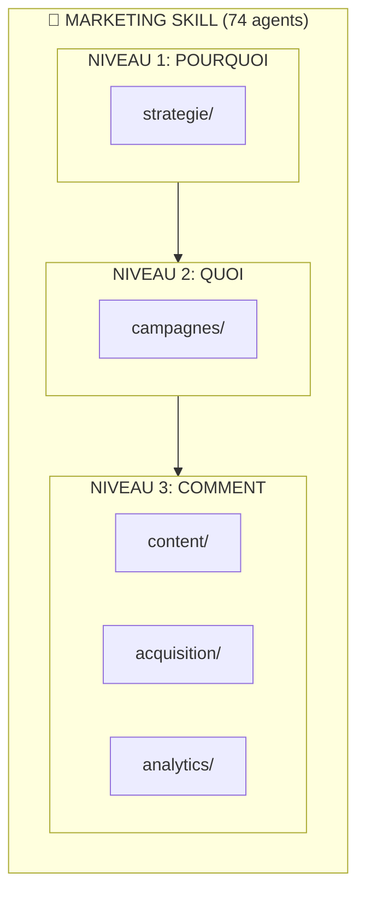
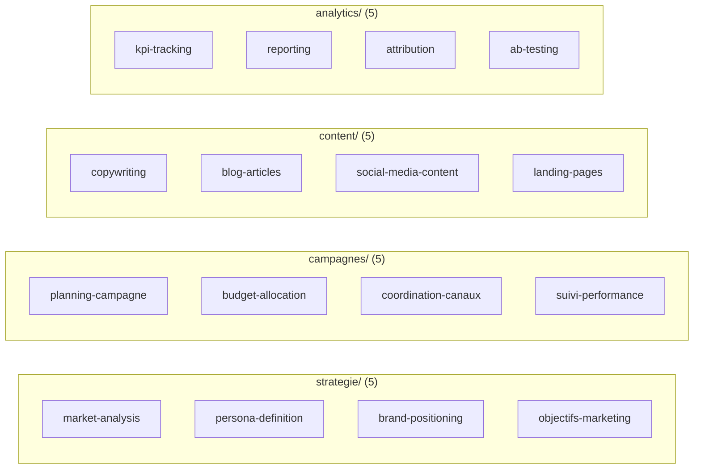
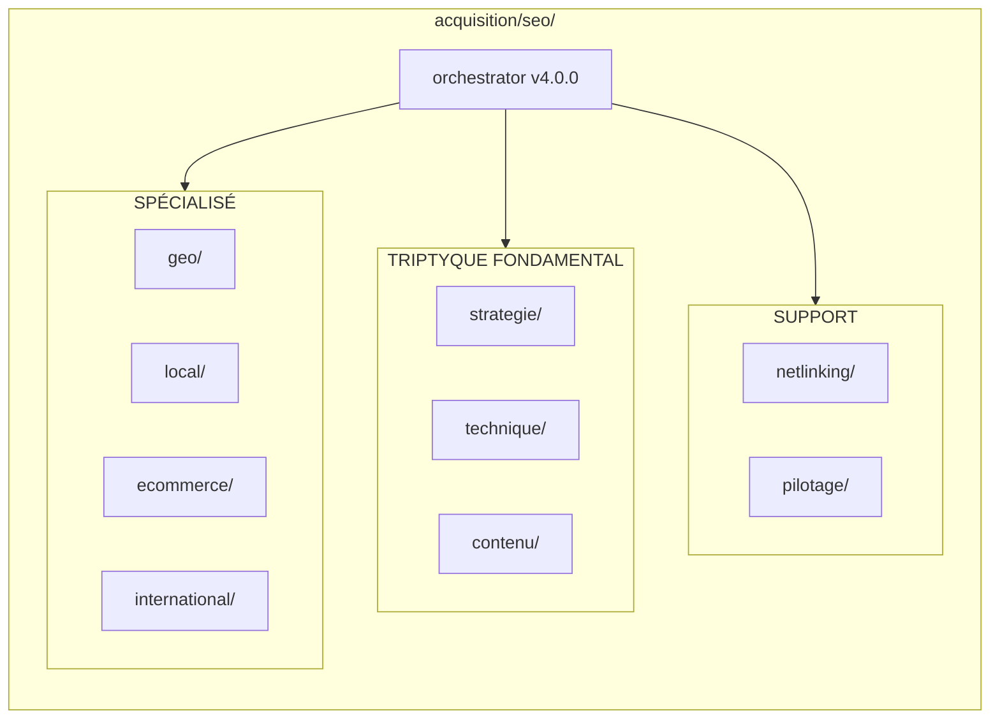
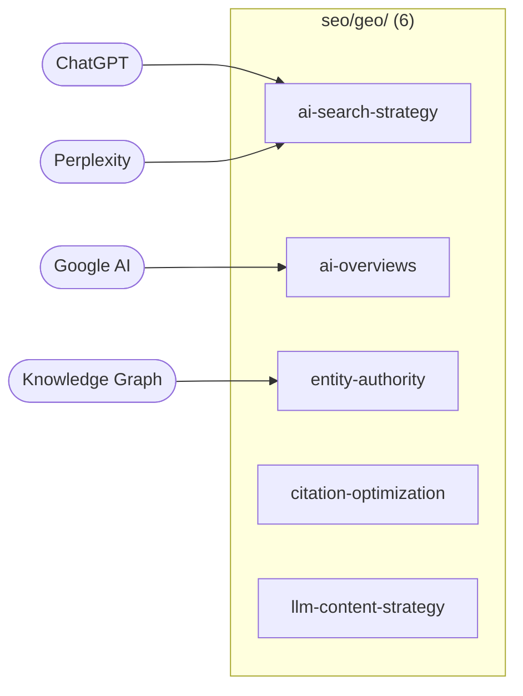
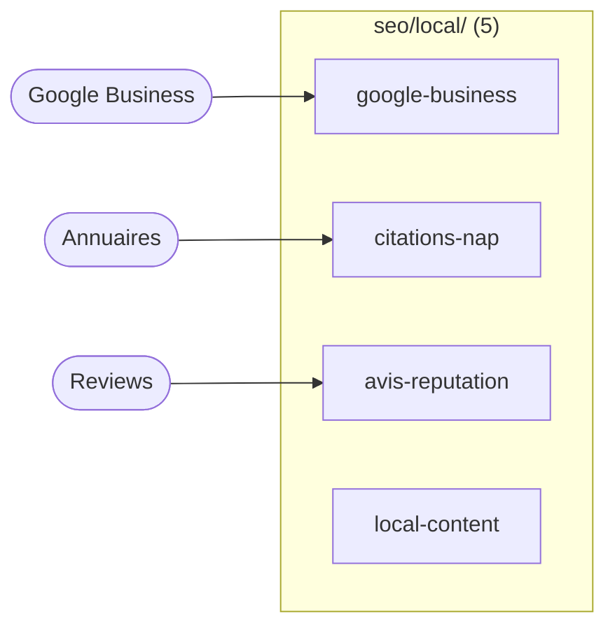
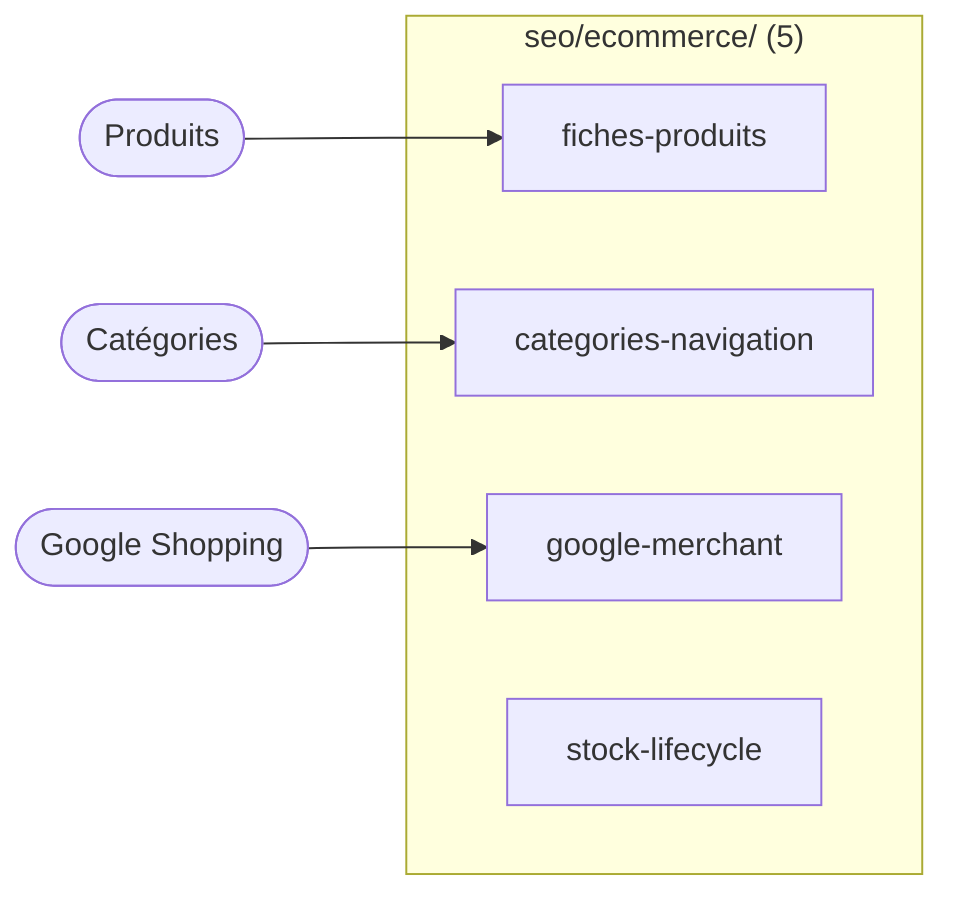
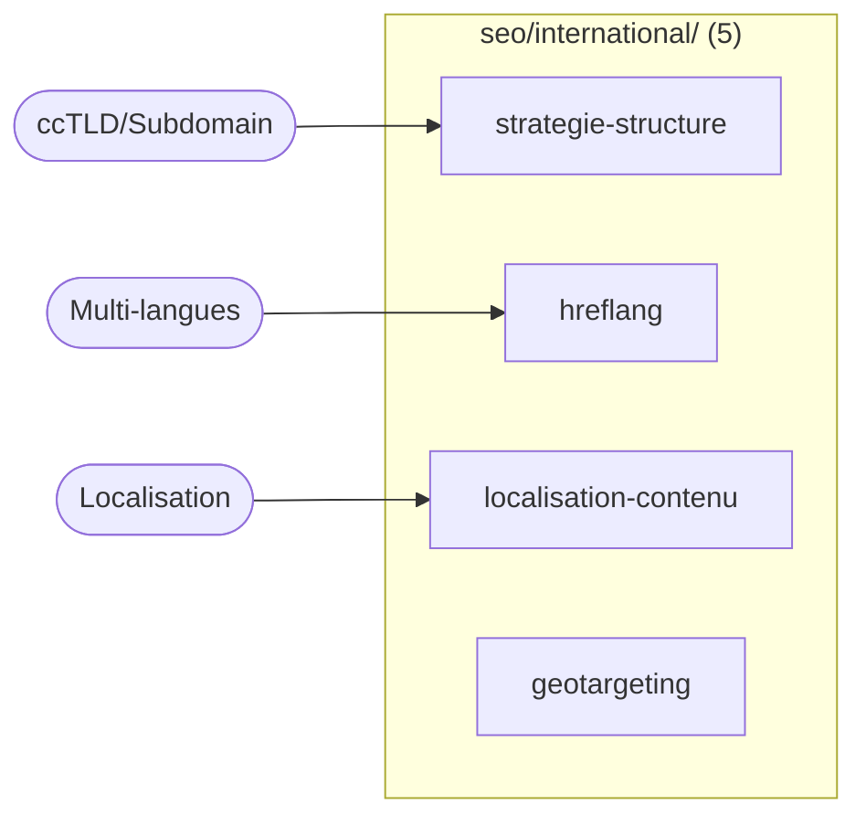
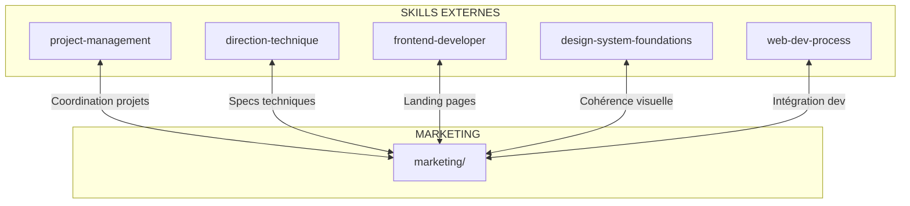
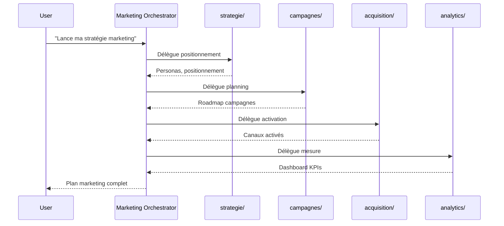
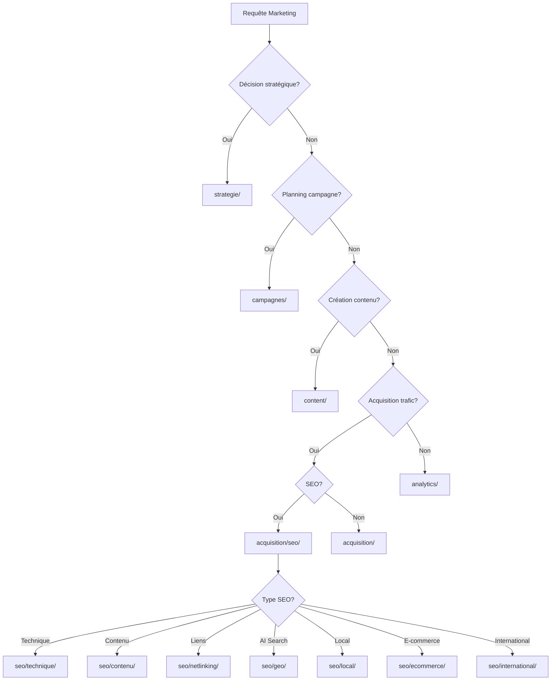

# Marketing Skill - Visual Map

Carte visuelle du skill marketing et de ses interactions.

## Architecture Globale



## Détail des Domaines



## Structure SEO (49 agents)



## Détail SEO - Domaines Spécialisés

### GEO (AI Search)



### Local SEO



### E-commerce SEO



### International SEO



## Composition avec Autres Skills



## Flux Utilisateur Typique



## Arbre de Décision Routing



## Statistiques du Skill

```
┌─────────────────────────────────────────────────────────────┐
│                    MARKETING SKILL v1.2.0                    │
├─────────────────────────────────────────────────────────────┤
│                                                             │
│  Total Agents: 74                                           │
│  ├── Base: 25 agents                                        │
│  │   ├── strategie/: 5                                      │
│  │   ├── campagnes/: 5                                      │
│  │   ├── content/: 5                                        │
│  │   ├── acquisition/ (base): 5                             │
│  │   └── analytics/: 5                                      │
│  │                                                          │
│  └── SEO: 49 agents                                         │
│      ├── strategie/: 5                                      │
│      ├── technique/: 6                                      │
│      ├── contenu/: 6                                        │
│      ├── netlinking/: 5                                     │
│      ├── pilotage/: 5                                       │
│      ├── geo/: 6                                            │
│      ├── local/: 5                                          │
│      ├── ecommerce/: 5                                      │
│      └── international/: 5                                  │
│                                                             │
│  Niveaux: 3 (POURQUOI / QUOI / COMMENT)                     │
│  Profondeur max: 4 niveaux (acquisition/seo/geo/agent)      │
│  Tests: 7 suites, 200+ assertions                           │
│                                                             │
└─────────────────────────────────────────────────────────────┘
```

## Légende

| Symbole | Signification |
|---------|---------------|
| 🎯 | Skill principal |
| 📁 | Domaine |
| 📄 | Agent |
| → | Délégation |
| ↔ | Interaction bidirectionnelle |
