# Template : Planning Projet

## Informations Projet

| Champ | Valeur |
|-------|--------|
| **Client** | [Nom du client] |
| **Projet** | [Nom du projet] |
| **Date création** | [JJ/MM/AAAA] |
| **Version** | v1.0 |

---

## Vue Gantt (Mermaid)

```mermaid
gantt
    title Planning Projet [Nom]
    dateFormat YYYY-MM-DD

    section Phase 1 - Cadrage
    Kick-off                 :milestone, m1, 2024-01-15, 0d
    Brief & Discovery        :a1, 2024-01-15, 5d
    Validation brief         :milestone, m2, after a1, 0d

    section Phase 2 - Conception
    Wireframes               :a2, after m2, 5d
    Maquettes UI             :a3, after a2, 10d
    Validation maquettes     :milestone, m3, after a3, 0d

    section Phase 3 - Développement
    Setup technique          :a4, after m3, 3d
    Développement Lot 1      :a5, after a4, 10d
    Développement Lot 2      :a6, after a5, 10d
    Développement Lot 3      :a7, after a6, 5d

    section Phase 4 - Recette
    Recette interne          :a8, after a7, 5d
    Recette client           :a9, after a8, 5d
    Corrections              :a10, after a9, 3d
    PV de recette            :milestone, m4, after a10, 0d

    section Phase 5 - MEP
    Mise en production       :a11, after m4, 2d
    Go Live                  :milestone, m5, after a11, 0d
```



---

## Jalons clés

| # | Jalon | Date prévue | Condition de validation |
|---|-------|-------------|------------------------|
| M1 | Kick-off | | Réunion effectuée |
| M2 | Brief validé | | Signature client |
| M3 | Maquettes validées | | Validation écrite |
| M4 | PV de recette | | Signature PV |
| M5 | Go Live | | Site en production |

---

## Dépendances critiques

| Tâche | Dépend de | Impact si retard |
|-------|-----------|------------------|
| | | 🔴 Élevé / 🟡 Moyen / 🟢 Faible |
| | | |

---

## Chemin critique

```
[Kick-off] → [Brief] → [Wireframes] → [Maquettes] → [Dev Lot 1] → [Recette] → [MEP]
```

**Durée totale chemin critique** : X jours ouvrés

---

## Ressources par phase

| Phase | Profils | Charge |
|-------|---------|--------|
| Cadrage | CDP, Client | X j/h |
| Conception | UX/UI | X j/h |
| Développement | Dev Front, Dev Back | X j/h |
| Recette | CDP, Client | X j/h |
| MEP | DevOps | X j/h |

---

## Hypothèses planning

1.
2.
3.

---

## Risques calendaire

| Risque | Probabilité | Impact | Mitigation |
|--------|-------------|--------|------------|
| | | | |

---

## Historique des versions

| Version | Date | Auteur | Modifications |
|---------|------|--------|---------------|
| v1.0 | | | Version initiale |
