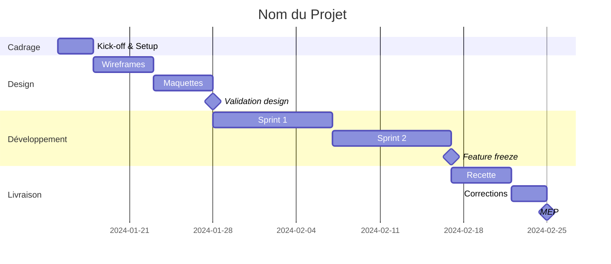

# Pilotage Projet

## Quand Utiliser
- Créer un planning projet
- Suivre l'avancement
- Générer des reportings
- Gérer les alertes et risques

## Planning Gantt

### Template Mermaid



### Jalons Obligatoires

| Jalon | Description | Condition |
|-------|-------------|-----------|
| M1 - Kick-off | Démarrage officiel | Brief validé |
| M2 - Design validé | Maquettes approuvées | PV design signé |
| M3 - Feature freeze | Plus de nouvelles features | Développement terminé |
| M4 - Recette validée | PV recette signé | Anomalies critiques corrigées |
| M5 - MEP | Mise en production | Checklist MEP OK |

### Calcul des Dates

```
Durée (jours ouvrés) = Charge JH / Capacité équipe par jour

Exemple :
- Charge : 40 JH
- Équipe : 2 devs × 0.8 = 1.6 JH/jour effectif
- Durée : 40 / 1.6 = 25 jours ouvrés ≈ 5 semaines
```

| Équipe | Capacité/semaine |
|--------|------------------|
| 1 dev | 4-5 JH |
| 2 devs | 8-10 JH |
| 3 devs | 12-15 JH |

## Template Planning

```markdown
# Planning - [Projet]

## Informations

| Champ | Valeur |
|-------|--------|
| Date de début | [Date] |
| Date de fin prévisionnelle | [Date] |
| Durée totale | X semaines |

## Jalons Clés

| # | Jalon | Date | Condition |
|---|-------|------|-----------|
| M1 | Kick-off | [Date] | Brief validé |
| M2 | Design validé | [Date] | Maquettes approuvées |
| M3 | Feature freeze | [Date] | Dev terminé |
| M4 | Recette validée | [Date] | PV signé |
| M5 | MEP | [Date] | Checklist OK |

## Dépendances Client

| Livrable attendu | Date limite | Bloque |
|------------------|-------------|--------|
| Contenus textes | [Date] | Intégration |
| Visuels | [Date] | Maquettes |
| Validation maquettes | [Date] | Développement |
| Accès hébergement | [Date] | MEP |

## Hypothèses

- Validations client sous 48h
- Pas de changement de périmètre
- Équipe disponible sur la période
```

## Reporting Hebdomadaire

### Template

```markdown
# Reporting - [Projet] - Semaine [XX]

## État Global

| Indicateur | Statut |
|------------|--------|
| Planning | 🟢 OK / 🟡 Vigilance / 🔴 Alerte |
| Budget | 🟢 OK / 🟡 Vigilance / 🔴 Alerte |
| Qualité | 🟢 OK / 🟡 Vigilance / 🔴 Alerte |

## Avancement

| Phase | Prévu | Réalisé | Écart |
|-------|-------|---------|-------|
| Cadrage | 100% | 100% | - |
| Design | 100% | 80% | -20% |
| Développement | 50% | 45% | -5% |

**Charge consommée** : XX JH / YY JH prévus (XX%)

## Réalisé cette semaine

- ✅ [Tâche 1 terminée]
- ✅ [Tâche 2 terminée]
- 🔄 [Tâche 3 en cours]

## Prévu semaine prochaine

- [ ] [Tâche A]
- [ ] [Tâche B]
- [ ] [Tâche C]

## Points d'attention

| Point | Impact | Action |
|-------|--------|--------|
| [Point 1] | [Impact] | [Action prévue] |

## Décisions à prendre

- [ ] [Décision 1] - Deadline : [Date]
```

## Gestion des Alertes

### Niveaux d'Alerte

| Niveau | Critères | Action |
|--------|----------|--------|
| 🟢 OK | Planning respecté, budget OK | Continuer |
| 🟡 Vigilance | Retard < 1 sem, budget +10% | Surveiller, informer |
| 🔴 Alerte | Retard > 1 sem, budget +20% | Escalade, plan d'action |

### Template Alerte

```markdown
# ⚠️ Alerte Projet - [Projet]

**Date** : [Date]
**Niveau** : 🟡 Vigilance / 🔴 Alerte

## Situation

[Description factuelle du problème]

## Impact

- **Planning** : Retard de X jours sur jalon [Y]
- **Budget** : Dépassement estimé de X JH
- **Qualité** : [Impact éventuel]

## Causes

1. [Cause 1]
2. [Cause 2]

## Actions Proposées

| Action | Responsable | Deadline |
|--------|-------------|----------|
| [Action 1] | @[Nom] | [Date] |
| [Action 2] | @[Nom] | [Date] |

## Décision Requise

[Ce qui doit être validé par le client/direction]
```

## Indicateurs de Suivi

| Indicateur | Formule | Cible |
|------------|---------|-------|
| SPI (Schedule Performance Index) | Réalisé / Prévu | ≥ 0.95 |
| CPI (Cost Performance Index) | Budget prévu / Budget réel | ≥ 0.95 |
| Burndown | JH restants vs temps | Linéaire |

## Checklist Pilotage

### Hebdomadaire
- [ ] Mise à jour du planning
- [ ] Point avec l'équipe
- [ ] Reporting envoyé au client
- [ ] Risques réévalués

### Par Jalon
- [ ] Revue de l'avancement
- [ ] Vérification du budget
- [ ] Communication client
- [ ] Ajustement du planning si nécessaire
