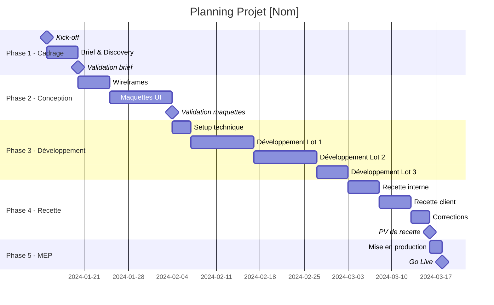

# Template : Planning Projet

## Informations Projet

| Champ | Valeur |
|-------|--------|
| **Client** | [Nom du client] |
| **Projet** | [Nom du projet] |
| **Date création** | [JJ/MM/AAAA] |
| **Version** | v1.0 |

---

## Vue Gantt (Mermaid)



---

## Jalons clés

| # | Jalon | Date prévue | Condition de validation |
|---|-------|-------------|------------------------|
| M1 | Kick-off | | Réunion effectuée |
| M2 | Brief validé | | Signature client |
| M3 | Maquettes validées | | Validation écrite |
| M4 | PV de recette | | Signature PV |
| M5 | Go Live | | Site en production |

---

## Dépendances critiques

| Tâche | Dépend de | Impact si retard |
|-------|-----------|------------------|
| | | 🔴 Élevé / 🟡 Moyen / 🟢 Faible |
| | | |

---

## Chemin critique

```
[Kick-off] → [Brief] → [Wireframes] → [Maquettes] → [Dev Lot 1] → [Recette] → [MEP]
```

**Durée totale chemin critique** : X jours ouvrés

---

## Ressources par phase

| Phase | Profils | Charge |
|-------|---------|--------|
| Cadrage | CDP, Client | X j/h |
| Conception | UX/UI | X j/h |
| Développement | Dev Front, Dev Back | X j/h |
| Recette | CDP, Client | X j/h |
| MEP | DevOps | X j/h |

---

## Hypothèses planning

1.
2.
3.

---

## Risques calendaire

| Risque | Probabilité | Impact | Mitigation |
|--------|-------------|--------|------------|
| | | | |

---

## Historique des versions

| Version | Date | Auteur | Modifications |
|---------|------|--------|---------------|
| v1.0 | | | Version initiale |
