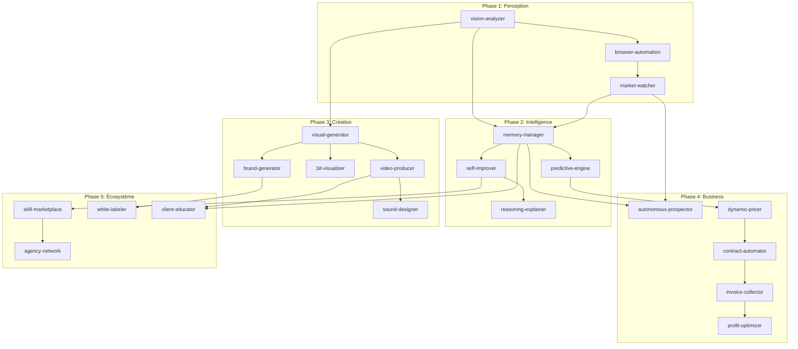

# ROADMAP VISION 2027 : Agence Web IA Autonome

> **Version** : 1.0.0
> **Date** : 2026-01-19
> **Objectif** : Transformer l'agence web IA en système totalement autonome
> **Horizon** : 18 mois (Q1 2026 → Q2 2027)

---

## Executive Summary

Cette roadmap définit la trajectoire d'évolution de l'agence web IA depuis son état actuel (v4.1 - 31 skills, 871 agents) vers une **agence sentiente et autonome** capable de :

- **Percevoir** : Voir, entendre, analyser le marché
- **Créer** : Générer tous types d'assets (visuels, vidéos, sons)
- **Commercer** : Se vendre, facturer, encaisser seule
- **Évoluer** : S'améliorer continuellement sans intervention
- **Collaborer** : Travailler avec d'autres agences IA

---

## Vue d'ensemble des Phases

```
2026                                              2027
Q1          Q2          Q3          Q4          Q1          Q2
│           │           │           │           │           │
▼           ▼           ▼           ▼           ▼           ▼
┌─────────────────────────────────────────────────────────────┐
│  PHASE 1: PERCEPTION    │  PHASE 2: INTELLIGENCE           │
│  "L'agence qui voit"    │  "L'agence qui apprend"          │
│  3 skills │ 120 agents  │  4 skills │ 80 agents            │
└─────────────────────────┴───────────────────────────────────┘
                          │
┌─────────────────────────┴───────────────────────────────────┐
│  PHASE 3: CRÉATION                │  PHASE 4: BUSINESS      │
│  "L'agence qui imagine"           │  "L'agence qui vend"    │
│  5 skills │ 150 agents            │  5 skills │ 100 agents  │
└───────────────────────────────────┴─────────────────────────┘
                                    │
                    ┌───────────────┴───────────────┐
                    │  PHASE 5: ÉCOSYSTÈME          │
                    │  "L'agence qui scale"         │
                    │  4 skills │ 60 agents         │
                    └───────────────────────────────┘
```

---

## PHASE 1 : PERCEPTION (Q1-Q2 2026)

### Objectif
Donner à l'agence la capacité de **percevoir** son environnement au-delà du texte.

### Prérequis
- Framework v4.1 stable ✅
- Intégration Claude multimodal ✅
- Infrastructure de stockage assets

### Skills à développer

#### 1.1 `vision-analyzer` (Priorité: CRITIQUE)

| Attribut | Valeur |
|----------|--------|
| **Niveau** | -1 (Perception) |
| **Agents estimés** | 45 |
| **Effort** | 3 semaines |
| **Dépendances** | Claude Vision API |

**Agents clés :**
```
vision-analyzer/
├── agents/
│   ├── intake/
│   │   ├── screenshot-parser.md        # Parse screenshots en éléments UI
│   │   ├── mockup-interpreter.md       # Interprète maquettes Figma/images
│   │   └── handwritten-decoder.md      # Décode croquis papier
│   ├── analysis/
│   │   ├── design-critic.md            # Critique UX/UI d'un design
│   │   ├── accessibility-scanner.md    # Détecte problèmes a11y visuels
│   │   ├── brand-consistency-checker.md # Vérifie cohérence visuelle
│   │   └── competitor-visual-analyzer.md # Analyse designs concurrents
│   ├── extraction/
│   │   ├── color-palette-extractor.md  # Extrait palettes couleurs
│   │   ├── typography-detector.md      # Identifie typos utilisées
│   │   ├── component-identifier.md     # Identifie composants UI
│   │   └── layout-mapper.md            # Map la structure de layout
│   └── generation/
│       ├── design-brief-generator.md   # Génère brief depuis image
│       ├── figma-spec-writer.md        # Écrit specs Figma depuis screenshot
│       └── css-from-visual.md          # Génère CSS depuis image
```

**Cas d'usage :**
- Client envoie screenshot d'un site concurrent → analyse complète
- Designer upload maquette → extraction specs techniques automatique
- Audit visuel automatique d'un site existant

**Métriques de succès :**
- [ ] Précision extraction couleurs > 95%
- [ ] Identification composants UI > 85%
- [ ] Temps d'analyse < 30 secondes

---

#### 1.2 `browser-automation` (Priorité: HAUTE)

| Attribut | Valeur |
|----------|--------|
| **Niveau** | -1 (Perception) |
| **Agents estimés** | 40 |
| **Effort** | 4 semaines |
| **Dépendances** | Playwright/Puppeteer, vision-analyzer |

**Agents clés :**
```
browser-automation/
├── agents/
│   ├── navigation/
│   │   ├── site-crawler.md             # Crawl intelligent de sites
│   │   ├── form-filler.md              # Remplit formulaires automatiquement
│   │   └── authentication-handler.md   # Gère login/sessions
│   ├── testing/
│   │   ├── visual-regression-tester.md # Tests de régression visuelle
│   │   ├── lighthouse-runner.md        # Audits Lighthouse automatisés
│   │   ├── cross-browser-tester.md     # Tests multi-navigateurs
│   │   └── responsive-checker.md       # Vérifie responsive design
│   ├── scraping/
│   │   ├── content-extractor.md        # Extrait contenu structuré
│   │   ├── price-monitor.md            # Surveille prix concurrents
│   │   └── review-collector.md         # Collecte avis clients
│   └── interaction/
│       ├── user-flow-recorder.md       # Enregistre parcours utilisateur
│       ├── a-b-test-runner.md          # Exécute tests A/B
│       └── heatmap-simulator.md        # Simule comportement utilisateur
```

**Métriques de succès :**
- [ ] Couverture crawl > 95% des pages
- [ ] Détection régression visuelle > 99%
- [ ] Temps audit Lighthouse < 2 minutes

---

#### 1.3 `market-watcher` (Priorité: MOYENNE)

| Attribut | Valeur |
|----------|--------|
| **Niveau** | -1 (Perception) |
| **Agents estimés** | 35 |
| **Effort** | 3 semaines |
| **Dépendances** | browser-automation, APIs externes |

**Agents clés :**
```
market-watcher/
├── agents/
│   ├── monitoring/
│   │   ├── competitor-tracker.md       # Suit changements concurrents
│   │   ├── tech-radar.md               # Veille technologique
│   │   ├── trend-spotter.md            # Détecte tendances émergentes
│   │   └── job-market-analyzer.md      # Analyse marché de l'emploi
│   ├── analysis/
│   │   ├── market-sizer.md             # Estime taille de marché
│   │   ├── positioning-mapper.md       # Map positionnement concurrents
│   │   └── pricing-benchmarker.md      # Benchmark prix du marché
│   └── alerts/
│       ├── opportunity-detector.md     # Détecte opportunités
│       ├── threat-warner.md            # Alerte sur menaces
│       └── news-curator.md             # Curate news pertinentes
```

**Métriques de succès :**
- [ ] Détection changement concurrent < 24h
- [ ] Précision tendances > 70%
- [ ] Couverture marché cible > 80%

---

### Livrables Phase 1

| Livrable | Date cible | Owner |
|----------|------------|-------|
| Skill vision-analyzer complet | Fin Q1 2026 | Direction Technique |
| Skill browser-automation complet | Mi Q2 2026 | Lead Dev |
| Skill market-watcher complet | Fin Q2 2026 | Direction Marketing |
| Intégration orchestrateur | Fin Q2 2026 | Direction Technique |
| Documentation & tests | Continu | QA |

---

## PHASE 2 : INTELLIGENCE (Q2-Q3 2026)

### Objectif
Donner à l'agence la capacité de **raisonner**, **mémoriser** et **s'améliorer**.

### Prérequis
- Phase 1 complète (perception fonctionnelle)
- Infrastructure de stockage vectoriel
- Système de métriques en place

### Skills à développer

#### 2.1 `memory-manager` (Priorité: CRITIQUE)

| Attribut | Valeur |
|----------|--------|
| **Niveau** | 0.5 (Intelligence) |
| **Agents estimés** | 25 |
| **Effort** | 4 semaines |
| **Dépendances** | Vector DB (Pinecone/Weaviate), state-manager |

**Agents clés :**
```
memory-manager/
├── agents/
│   ├── storage/
│   │   ├── conversation-archiver.md    # Archive conversations
│   │   ├── decision-logger.md          # Log décisions et contexte
│   │   ├── preference-tracker.md       # Track préférences clients
│   │   └── project-historian.md        # Historique complet projets
│   ├── retrieval/
│   │   ├── context-fetcher.md          # Récupère contexte pertinent
│   │   ├── similar-project-finder.md   # Trouve projets similaires
│   │   ├── client-profile-builder.md   # Construit profil client
│   │   └── lesson-retriever.md         # Récupère leçons apprises
│   └── synthesis/
│       ├── project-summarizer.md       # Résume projet en 30 sec
│       ├── relationship-mapper.md      # Map relations entre entités
│       └── knowledge-consolidator.md   # Consolide connaissances
```

**Impact attendu :**
- Pas de perte de contexte entre sessions
- Recommandations basées sur l'historique client
- Réutilisation intelligente des solutions passées

---

#### 2.2 `self-improver` (Priorité: CRITIQUE)

| Attribut | Valeur |
|----------|--------|
| **Niveau** | 0.5 (Intelligence) |
| **Agents estimés** | 20 |
| **Effort** | 5 semaines |
| **Dépendances** | memory-manager, learnings system |

**Agents clés :**
```
self-improver/
├── agents/
│   ├── analysis/
│   │   ├── failure-analyzer.md         # Analyse échecs et causes
│   │   ├── success-pattern-miner.md    # Extrait patterns de succès
│   │   ├── bottleneck-detector.md      # Détecte goulots
│   │   └── skill-gap-identifier.md     # Identifie skills manquants
│   ├── generation/
│   │   ├── pattern-proposer.md         # Propose nouveaux patterns
│   │   ├── agent-drafter.md            # Ébauche nouveaux agents
│   │   ├── workflow-optimizer.md       # Optimise workflows existants
│   │   └── prompt-refiner.md           # Améliore prompts agents
│   └── validation/
│       ├── improvement-tester.md       # Teste améliorations proposées
│       ├── regression-preventer.md     # Évite régressions
│       └── human-reviewer-notifier.md  # Notifie humain pour validation
```

**Impact attendu :**
- Amélioration continue sans intervention humaine
- Nouveaux agents générés automatiquement
- Réduction des erreurs répétées à zéro

---

#### 2.3 `reasoning-explainer` (Priorité: HAUTE)

| Attribut | Valeur |
|----------|--------|
| **Niveau** | 0.5 (Intelligence) |
| **Agents estimés** | 15 |
| **Effort** | 2 semaines |
| **Dépendances** | Tous les skills existants |

**Agents clés :**
```
reasoning-explainer/
├── agents/
│   ├── tracing/
│   │   ├── decision-tracer.md          # Trace chemin de décision
│   │   ├── confidence-scorer.md        # Score confiance décisions
│   │   └── alternative-lister.md       # Liste alternatives écartées
│   ├── explanation/
│   │   ├── technical-explainer.md      # Explique pour tech
│   │   ├── business-translator.md      # Traduit pour business
│   │   └── client-simplifier.md        # Simplifie pour client
│   └── reporting/
│       ├── decision-report-generator.md # Génère rapports décisions
│       └── audit-trail-builder.md      # Construit piste audit
```

---

#### 2.4 `predictive-engine` (Priorité: MOYENNE)

| Attribut | Valeur |
|----------|--------|
| **Niveau** | 0.5 (Intelligence) |
| **Agents estimés** | 20 |
| **Effort** | 4 semaines |
| **Dépendances** | memory-manager, state-manager |

**Agents clés :**
```
predictive-engine/
├── agents/
│   ├── prediction/
│   │   ├── deadline-risk-predictor.md  # Prédit risques deadline
│   │   ├── bug-probability-scorer.md   # Score probabilité bugs
│   │   ├── scope-creep-detector.md     # Détecte dérive scope
│   │   └── client-churn-predictor.md   # Prédit churn client
│   ├── prevention/
│   │   ├── early-warning-system.md     # Alertes précoces
│   │   ├── mitigation-suggester.md     # Suggère mitigations
│   │   └── resource-rebalancer.md      # Rééquilibre ressources
│   └── simulation/
│       ├── scenario-modeler.md         # Modélise scénarios
│       └── impact-estimator.md         # Estime impacts
```

---

### Livrables Phase 2

| Livrable | Date cible | Owner |
|----------|------------|-------|
| Infrastructure Vector DB | Début Q2 2026 | DevOps |
| Skill memory-manager | Mi Q2 2026 | Direction Technique |
| Skill self-improver | Fin Q2 2026 | Direction Technique |
| Skill reasoning-explainer | Mi Q3 2026 | Direction Technique |
| Skill predictive-engine | Fin Q3 2026 | Direction Technique |

---

## PHASE 3 : CRÉATION (Q3-Q4 2026)

### Objectif
Donner à l'agence la capacité de **créer** tous types d'assets, pas seulement du code.

### Prérequis
- Phase 2 complète (intelligence fonctionnelle)
- Intégrations APIs génération (DALL-E, Midjourney, Runway, etc.)
- Storage CDN pour assets lourds

### Skills à développer

#### 3.1 `visual-generator` (Priorité: HAUTE)

| Attribut | Valeur |
|----------|--------|
| **Niveau** | 3.5 (Création) |
| **Agents estimés** | 40 |
| **Effort** | 4 semaines |
| **Dépendances** | vision-analyzer, APIs génération images |

**Agents clés :**
```
visual-generator/
├── agents/
│   ├── branding/
│   │   ├── logo-generator.md           # Génère logos
│   │   ├── icon-set-creator.md         # Crée sets d'icônes
│   │   ├── color-palette-generator.md  # Génère palettes couleurs
│   │   └── brand-asset-packager.md     # Package assets marque
│   ├── ui/
│   │   ├── illustration-generator.md   # Génère illustrations
│   │   ├── hero-image-creator.md       # Crée images hero
│   │   ├── background-generator.md     # Génère backgrounds
│   │   └── placeholder-creator.md      # Crée placeholders réalistes
│   ├── marketing/
│   │   ├── social-post-designer.md     # Design posts sociaux
│   │   ├── ad-creative-generator.md    # Génère créatives pubs
│   │   ├── banner-creator.md           # Crée bannières
│   │   └── email-template-designer.md  # Design templates email
│   └── product/
│       ├── mockup-generator.md         # Génère mockups produit
│       ├── screenshot-beautifier.md    # Embellit screenshots
│       └── feature-illustrator.md      # Illustre features
```

---

#### 3.2 `video-producer` (Priorité: MOYENNE)

| Attribut | Valeur |
|----------|--------|
| **Niveau** | 3.5 (Création) |
| **Agents estimés** | 35 |
| **Effort** | 5 semaines |
| **Dépendances** | visual-generator, APIs vidéo (Runway, Pika) |

**Agents clés :**
```
video-producer/
├── agents/
│   ├── planning/
│   │   ├── storyboard-generator.md     # Génère storyboards
│   │   ├── script-writer.md            # Écrit scripts vidéo
│   │   └── shot-list-creator.md        # Crée shot lists
│   ├── production/
│   │   ├── explainer-video-creator.md  # Crée vidéos explicatives
│   │   ├── motion-graphics-generator.md # Génère motion design
│   │   ├── product-demo-maker.md       # Crée démos produit
│   │   └── social-reel-creator.md      # Crée reels/shorts
│   ├── editing/
│   │   ├── video-assembler.md          # Assemble séquences
│   │   ├── transition-applier.md       # Applique transitions
│   │   └── subtitle-generator.md       # Génère sous-titres
│   └── optimization/
│       ├── format-converter.md         # Convertit formats
│       ├── compression-optimizer.md    # Optimise compression
│       └── thumbnail-generator.md      # Génère thumbnails
```

---

#### 3.3 `sound-designer` (Priorité: BASSE)

| Attribut | Valeur |
|----------|--------|
| **Niveau** | 3.5 (Création) |
| **Agents estimés** | 20 |
| **Effort** | 3 semaines |
| **Dépendances** | APIs audio (ElevenLabs, Suno) |

**Agents clés :**
```
sound-designer/
├── agents/
│   ├── voice/
│   │   ├── voiceover-generator.md      # Génère voix-off
│   │   ├── podcast-intro-creator.md    # Crée intros podcast
│   │   └── ivr-message-generator.md    # Génère messages IVR
│   ├── music/
│   │   ├── jingle-composer.md          # Compose jingles
│   │   ├── background-music-selector.md # Sélectionne musiques
│   │   └── sound-logo-creator.md       # Crée logos sonores
│   └── effects/
│       ├── ui-sound-designer.md        # Design sons UI
│       ├── ambient-creator.md          # Crée ambiances
│       └── notification-sound-maker.md # Crée sons notif
```

---

#### 3.4 `3d-visualizer` (Priorité: BASSE)

| Attribut | Valeur |
|----------|--------|
| **Niveau** | 3.5 (Création) |
| **Agents estimés** | 25 |
| **Effort** | 4 semaines |
| **Dépendances** | APIs 3D, visual-generator |

**Agents clés :**
```
3d-visualizer/
├── agents/
│   ├── modeling/
│   │   ├── product-3d-modeler.md       # Modélise produits 3D
│   │   ├── scene-builder.md            # Construit scènes 3D
│   │   └── character-creator.md        # Crée personnages 3D
│   ├── rendering/
│   │   ├── photorealistic-renderer.md  # Rendus photoréalistes
│   │   ├── stylized-renderer.md        # Rendus stylisés
│   │   └── turntable-generator.md      # Génère turntables
│   └── interactive/
│       ├── 3d-configurator-builder.md  # Construit configurateurs
│       ├── ar-preview-creator.md       # Crée previews AR
│       └── virtual-tour-builder.md     # Construit tours virtuels
```

---

#### 3.5 `brand-generator` (Priorité: HAUTE)

| Attribut | Valeur |
|----------|--------|
| **Niveau** | 3.5 (Création) |
| **Agents estimés** | 30 |
| **Effort** | 4 semaines |
| **Dépendances** | visual-generator, direction-artistique |

**Agents clés :**
```
brand-generator/
├── agents/
│   ├── strategy/
│   │   ├── brand-name-generator.md     # Génère noms de marque
│   │   ├── tagline-creator.md          # Crée taglines
│   │   ├── positioning-definer.md      # Définit positionnement
│   │   └── brand-story-writer.md       # Écrit histoire marque
│   ├── identity/
│   │   ├── full-identity-generator.md  # Génère identité complète
│   │   ├── logo-suite-creator.md       # Crée suite de logos
│   │   ├── typography-selector.md      # Sélectionne typographies
│   │   └── imagery-style-definer.md    # Définit style images
│   ├── guidelines/
│   │   ├── brand-book-generator.md     # Génère brand book
│   │   ├── usage-rules-writer.md       # Écrit règles usage
│   │   └── template-creator.md         # Crée templates marque
│   └── application/
│       ├── business-card-designer.md   # Design cartes visite
│       ├── letterhead-creator.md       # Crée papeterie
│       └── social-kit-generator.md     # Génère kit réseaux sociaux
```

---

### Livrables Phase 3

| Livrable | Date cible | Owner |
|----------|------------|-------|
| Intégrations APIs génération | Début Q3 2026 | DevOps |
| Skill visual-generator | Mi Q3 2026 | Direction Artistique |
| Skill brand-generator | Fin Q3 2026 | Direction Artistique |
| Skill video-producer | Mi Q4 2026 | Direction Artistique |
| Skills sound-designer & 3d-visualizer | Fin Q4 2026 | Direction Artistique |

---

## PHASE 4 : BUSINESS (Q4 2026 - Q1 2027)

### Objectif
Donner à l'agence la capacité de **se vendre**, **facturer** et **gérer ses finances** de manière autonome.

### Prérequis
- Phases 1-3 complètes
- Intégrations CRM, facturation, paiement
- Compliance légale validée

### Skills à développer

#### 4.1 `autonomous-prospector` (Priorité: CRITIQUE)

| Attribut | Valeur |
|----------|--------|
| **Niveau** | 4 (Business) |
| **Agents estimés** | 30 |
| **Effort** | 5 semaines |
| **Dépendances** | market-watcher, memory-manager, CRM |

**Agents clés :**
```
autonomous-prospector/
├── agents/
│   ├── identification/
│   │   ├── ideal-client-profiler.md    # Profile client idéal
│   │   ├── lead-finder.md              # Trouve leads qualifiés
│   │   ├── company-researcher.md       # Recherche sur entreprises
│   │   └── decision-maker-identifier.md # Identifie décideurs
│   ├── outreach/
│   │   ├── cold-email-writer.md        # Écrit cold emails personnalisés
│   │   ├── linkedin-message-crafter.md # Craft messages LinkedIn
│   │   ├── follow-up-sequencer.md      # Séquence follow-ups
│   │   └── meeting-scheduler.md        # Planifie meetings
│   ├── qualification/
│   │   ├── budget-estimator.md         # Estime budget prospect
│   │   ├── fit-scorer.md               # Score adéquation
│   │   ├── urgency-detector.md         # Détecte urgence
│   │   └── competitor-checker.md       # Vérifie concurrence
│   └── conversion/
│       ├── proposal-generator.md       # Génère propositions
│       ├── objection-handler.md        # Gère objections
│       └── closing-assistant.md        # Aide au closing
```

---

#### 4.2 `dynamic-pricer` (Priorité: HAUTE)

| Attribut | Valeur |
|----------|--------|
| **Niveau** | 4 (Business) |
| **Agents estimés** | 15 |
| **Effort** | 3 semaines |
| **Dépendances** | market-watcher, memory-manager, predictive-engine |

**Agents clés :**
```
dynamic-pricer/
├── agents/
│   ├── analysis/
│   │   ├── complexity-scorer.md        # Score complexité projet
│   │   ├── effort-estimator.md         # Estime effort réel
│   │   ├── market-rate-fetcher.md      # Récupère taux marché
│   │   └── client-value-assessor.md    # Évalue valeur client
│   ├── pricing/
│   │   ├── price-calculator.md         # Calcule prix optimal
│   │   ├── discount-decider.md         # Décide remises
│   │   ├── upsell-identifier.md        # Identifie upsells
│   │   └── payment-terms-setter.md     # Définit modalités paiement
│   └── optimization/
│       ├── margin-optimizer.md         # Optimise marges
│       ├── capacity-adjuster.md        # Ajuste selon capacité
│       └── seasonal-adjuster.md        # Ajuste selon saison
```

---

#### 4.3 `contract-automator` (Priorité: HAUTE)

| Attribut | Valeur |
|----------|--------|
| **Niveau** | 4 (Business) |
| **Agents estimés** | 20 |
| **Effort** | 4 semaines |
| **Dépendances** | legal-compliance, dynamic-pricer |

**Agents clés :**
```
contract-automator/
├── agents/
│   ├── generation/
│   │   ├── contract-drafter.md         # Rédige contrats
│   │   ├── sow-generator.md            # Génère SOW
│   │   ├── nda-creator.md              # Crée NDAs
│   │   └── amendment-writer.md         # Écrit avenants
│   ├── negotiation/
│   │   ├── clause-negotiator.md        # Négocie clauses
│   │   ├── risk-highlighter.md         # Met en évidence risques
│   │   ├── alternative-proposer.md     # Propose alternatives
│   │   └── compromise-finder.md        # Trouve compromis
│   ├── execution/
│   │   ├── signature-collector.md      # Collecte signatures
│   │   ├── deadline-tracker.md         # Suit deadlines
│   │   └── obligation-monitor.md       # Surveille obligations
│   └── management/
│       ├── renewal-reminder.md         # Rappelle renouvellements
│       ├── expiry-handler.md           # Gère expirations
│       └── dispute-flagger.md          # Signale litiges
```

---

#### 4.4 `invoice-collector` (Priorité: HAUTE)

| Attribut | Valeur |
|----------|--------|
| **Niveau** | 4 (Business) |
| **Agents estimés** | 18 |
| **Effort** | 3 semaines |
| **Dépendances** | finance-analytics, contract-automator |

**Agents clés :**
```
invoice-collector/
├── agents/
│   ├── invoicing/
│   │   ├── invoice-generator.md        # Génère factures
│   │   ├── milestone-invoicer.md       # Facture jalons
│   │   ├── recurring-invoicer.md       # Facturation récurrente
│   │   └── credit-note-creator.md      # Crée avoirs
│   ├── collection/
│   │   ├── payment-reminder.md         # Relances paiement
│   │   ├── escalation-manager.md       # Gère escalades
│   │   ├── payment-plan-proposer.md    # Propose plans paiement
│   │   └── collection-agency-liaison.md # Liaison recouvrement
│   ├── reconciliation/
│   │   ├── payment-matcher.md          # Matche paiements
│   │   ├── discrepancy-resolver.md     # Résout écarts
│   │   └── aging-report-generator.md   # Génère rapports aging
│   └── optimization/
│       ├── dso-optimizer.md            # Optimise DSO
│       └── cash-flow-predictor.md      # Prédit cash flow
```

---

#### 4.5 `profit-optimizer` (Priorité: MOYENNE)

| Attribut | Valeur |
|----------|--------|
| **Niveau** | 4 (Business) |
| **Agents estimés** | 17 |
| **Effort** | 3 semaines |
| **Dépendances** | finance-analytics, tous skills business |

**Agents clés :**
```
profit-optimizer/
├── agents/
│   ├── analysis/
│   │   ├── profitability-analyzer.md   # Analyse rentabilité
│   │   ├── cost-breakdown-generator.md # Génère breakdown coûts
│   │   ├── revenue-stream-analyzer.md  # Analyse flux revenus
│   │   └── margin-calculator.md        # Calcule marges
│   ├── optimization/
│   │   ├── cost-cutter-suggester.md    # Suggère réductions coûts
│   │   ├── efficiency-improver.md      # Améliore efficacité
│   │   ├── pricing-adjuster.md         # Ajuste pricing
│   │   └── resource-optimizer.md       # Optimise ressources
│   └── strategy/
│       ├── growth-opportunity-finder.md # Trouve opportunités croissance
│       ├── risk-return-balancer.md     # Équilibre risque/retour
│       └── investment-prioritizer.md   # Priorise investissements
```

---

### Livrables Phase 4

| Livrable | Date cible | Owner |
|----------|------------|-------|
| Intégrations CRM/Facturation | Début Q4 2026 | DevOps |
| Skill autonomous-prospector | Mi Q4 2026 | Direction Commerciale |
| Skill dynamic-pricer | Fin Q4 2026 | Direction Commerciale |
| Skill contract-automator | Mi Q1 2027 | Direction Opérations |
| Skills invoice-collector & profit-optimizer | Fin Q1 2027 | Direction Opérations |

---

## PHASE 5 : ÉCOSYSTÈME (Q1-Q2 2027)

### Objectif
Permettre à l'agence de **scaler** via un écosystème ouvert et interconnecté.

### Prérequis
- Phases 1-4 complètes et stables
- Infrastructure multi-tenant
- Modèle économique validé

### Skills à développer

#### 5.1 `skill-marketplace` (Priorité: HAUTE)

| Attribut | Valeur |
|----------|--------|
| **Niveau** | 5 (Écosystème) |
| **Agents estimés** | 20 |
| **Effort** | 5 semaines |
| **Dépendances** | Tous skills, plateforme marketplace |

**Agents clés :**
```
skill-marketplace/
├── agents/
│   ├── publishing/
│   │   ├── skill-packager.md           # Package skills pour vente
│   │   ├── documentation-generator.md  # Génère doc marketplace
│   │   ├── pricing-recommender.md      # Recommande prix
│   │   └── listing-optimizer.md        # Optimise listings
│   ├── discovery/
│   │   ├── skill-searcher.md           # Recherche skills
│   │   ├── compatibility-checker.md    # Vérifie compatibilité
│   │   ├── review-analyzer.md          # Analyse reviews
│   │   └── recommendation-engine.md    # Recommande skills
│   ├── transaction/
│   │   ├── purchase-handler.md         # Gère achats
│   │   ├── license-manager.md          # Gère licences
│   │   └── revenue-share-calculator.md # Calcule partage revenus
│   └── quality/
│       ├── skill-validator.md          # Valide skills soumis
│       ├── security-scanner.md         # Scan sécurité
│       └── performance-benchmarker.md  # Benchmark performance
```

---

#### 5.2 `agency-network` (Priorité: MOYENNE)

| Attribut | Valeur |
|----------|--------|
| **Niveau** | 5 (Écosystème) |
| **Agents estimés** | 15 |
| **Effort** | 4 semaines |
| **Dépendances** | skill-marketplace, contract-automator |

**Agents clés :**
```
agency-network/
├── agents/
│   ├── discovery/
│   │   ├── agency-finder.md            # Trouve agences partenaires
│   │   ├── capability-matcher.md       # Matche capacités
│   │   └── reputation-checker.md       # Vérifie réputation
│   ├── collaboration/
│   │   ├── project-sharer.md           # Partage projets
│   │   ├── resource-borrower.md        # Emprunte ressources
│   │   ├── knowledge-exchanger.md      # Échange connaissances
│   │   └── joint-bid-coordinator.md    # Coordonne appels d'offres conjoints
│   └── management/
│       ├── partnership-manager.md      # Gère partenariats
│       ├── sla-enforcer.md             # Applique SLAs
│       └── dispute-mediator.md         # Médie conflits
```

---

#### 5.3 `white-labeler` (Priorité: BASSE)

| Attribut | Valeur |
|----------|--------|
| **Niveau** | 5 (Écosystème) |
| **Agents estimés** | 12 |
| **Effort** | 3 semaines |
| **Dépendances** | brand-generator, tous skills |

**Agents clés :**
```
white-labeler/
├── agents/
│   ├── branding/
│   │   ├── brand-applier.md            # Applique marque partenaire
│   │   ├── theme-customizer.md         # Personnalise thème
│   │   └── terminology-replacer.md     # Remplace terminologie
│   ├── configuration/
│   │   ├── feature-toggler.md          # Active/désactive features
│   │   ├── pricing-customizer.md       # Personnalise pricing
│   │   └── workflow-adapter.md         # Adapte workflows
│   └── deployment/
│       ├── instance-provisioner.md     # Provisionne instances
│       ├── data-isolator.md            # Isole données
│       └── update-propagator.md        # Propage mises à jour
```

---

#### 5.4 `client-educator` (Priorité: MOYENNE)

| Attribut | Valeur |
|----------|--------|
| **Niveau** | 5 (Écosystème) |
| **Agents estimés** | 13 |
| **Effort** | 3 semaines |
| **Dépendances** | video-producer, memory-manager |

**Agents clés :**
```
client-educator/
├── agents/
│   ├── onboarding/
│   │   ├── welcome-journey-creator.md  # Crée parcours accueil
│   │   ├── tool-tutorial-generator.md  # Génère tutoriels outils
│   │   └── quick-start-builder.md      # Construit quick starts
│   ├── training/
│   │   ├── course-generator.md         # Génère cours
│   │   ├── quiz-creator.md             # Crée quiz
│   │   ├── certification-manager.md    # Gère certifications
│   │   └── progress-tracker.md         # Suit progression
│   └── support/
│       ├── faq-auto-updater.md         # Met à jour FAQ auto
│       ├── contextual-help-provider.md # Fournit aide contextuelle
│       └── feedback-collector.md       # Collecte feedback
```

---

### Livrables Phase 5

| Livrable | Date cible | Owner |
|----------|------------|-------|
| Infrastructure multi-tenant | Début Q1 2027 | DevOps |
| Skill skill-marketplace | Mi Q1 2027 | Direction Technique |
| Skill agency-network | Fin Q1 2027 | Direction Opérations |
| Skill client-educator | Mi Q2 2027 | Direction Opérations |
| Skill white-labeler | Fin Q2 2027 | Direction Technique |

---

## Métriques de Succès Globales

### KPIs par Phase

| Phase | Métrique Clé | Objectif | Mesure |
|-------|--------------|----------|--------|
| **1. Perception** | Couverture analyse | 95% | % éléments détectés vs manuels |
| **2. Intelligence** | Taux auto-amélioration | 20%/mois | Nouveaux patterns générés auto |
| **3. Création** | Assets générés/projet | 50+ | Nombre moyen assets auto-générés |
| **4. Business** | Taux conversion leads | 15% | Leads → Clients signés |
| **5. Écosystème** | Revenus marketplace | 100k€/an | Ventes skills tiers |

### KPIs Agence Globaux

| Métrique | Baseline (v4.1) | Cible (v5.0) | Amélioration |
|----------|-----------------|--------------|--------------|
| Temps intake → devis | 48h | 2h | -96% |
| Coût acquisition client | 500€ | 50€ | -90% |
| Taux erreurs répétées | 15% | 0% | -100% |
| Projets simultanés | 5 | 50 | +900% |
| Marge nette | 30% | 60% | +100% |
| Satisfaction client (NPS) | 40 | 80 | +100% |

---

## Dépendances Critiques



---

## Risques et Mitigations

| Risque | Probabilité | Impact | Mitigation |
|--------|-------------|--------|------------|
| APIs génération instables | Haute | Moyen | Multi-provider fallback |
| Coûts API explosent | Moyenne | Haut | Caching agressif, modèles locaux |
| Qualité génération insuffisante | Moyenne | Haut | Human-in-the-loop critique |
| Compliance légale (RGPD, IA Act) | Haute | Critique | Legal review chaque phase |
| Adoption marché lente | Moyenne | Moyen | MVP rapides, feedback loops |
| Concurrence copie | Haute | Moyen | Innovation continue, moat data |

---

## Investissements Requis

### Infrastructure

| Composant | Coût estimé | Phase |
|-----------|-------------|-------|
| Vector DB (Pinecone/Weaviate) | 500€/mois | 2 |
| APIs génération (OpenAI, etc.) | 2000€/mois | 3 |
| CDN assets lourds | 300€/mois | 3 |
| Multi-tenant infra | 1500€/mois | 5 |
| **Total mensuel cible** | **~5000€/mois** | |

### Intégrations Externes

| Intégration | Priorité | Phase |
|-------------|----------|-------|
| Figma API | Haute | 1 |
| Playwright/Puppeteer | Haute | 1 |
| OpenAI Vision | Critique | 1 |
| Pinecone/Weaviate | Critique | 2 |
| DALL-E/Midjourney | Haute | 3 |
| Runway/Pika (vidéo) | Moyenne | 3 |
| ElevenLabs (voix) | Basse | 3 |
| Stripe/GoCardless | Haute | 4 |
| HubSpot/Pipedrive | Haute | 4 |
| DocuSign | Haute | 4 |

---

## Gouvernance

### Comité de Pilotage

- **Fréquence** : Bi-mensuel
- **Participants** : Directions (Tech, Artistique, Marketing, Commerciale, Opérations)
- **Livrables** : Dashboard avancement, décisions go/no-go

### Revues de Phase

- **Fréquence** : Fin de chaque phase
- **Critères** : Métriques atteintes, dette technique acceptable, feedback utilisateurs
- **Décision** : Passage phase suivante ou itération

### Human-in-the-Loop

| Décision | Niveau supervision |
|----------|-------------------|
| Nouveau client > 50k€ | Validation humaine |
| Contrat modifié | Validation humaine |
| Nouveau pattern self-generated | Review humaine |
| Publication marketplace | Validation humaine |
| Prospection cold email | Supervision passive |
| Génération assets standards | Autonome |

---

## Conclusion

Cette roadmap transforme l'agence web IA d'un **framework d'orchestration** (v4.1) en une **entité autonome sentiente** (v5.0) capable de :

1. **Percevoir** son environnement (vision, browser, marché)
2. **Raisonner** et expliquer ses décisions
3. **Apprendre** et s'améliorer continuellement
4. **Créer** tous types d'assets
5. **Vendre** et gérer son business
6. **Scaler** via un écosystème ouvert

**Horizon total** : 18 mois
**Skills ajoutés** : 21 nouveaux skills
**Agents ajoutés** : ~510 nouveaux agents
**Total cible** : 52 skills, ~1380 agents

---

*Document vivant - Dernière mise à jour : 2026-01-19*
