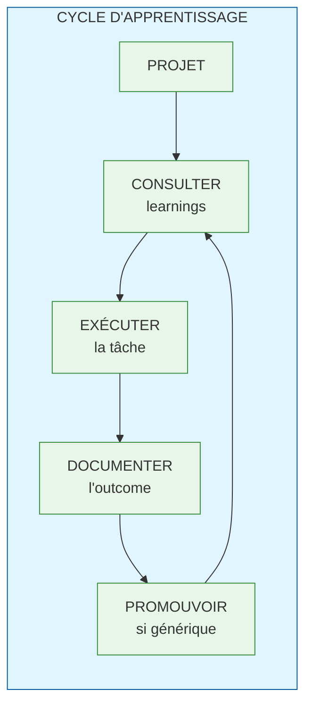
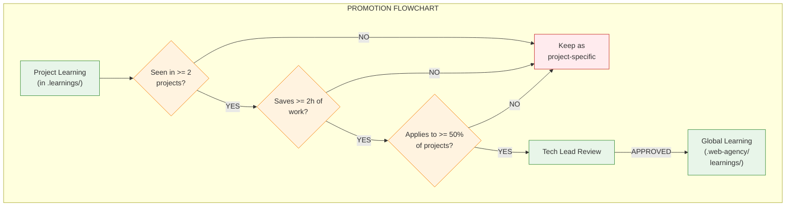

# Learning Loop - Guide d'Utilisation

> **Version** : 1.1.0
> **Date** : 2025-12-25

## Quick Start (5 minutes)

1. **Read** `patterns/INDEX.md` - See available solutions
2. **Search** for your use case in patterns and anti-patterns
3. **Copy** template from `templates/` if creating new documentation
4. **Run** `npm test` to validate your changes

```bash
# Install and validate
cd .web-agency/learnings
npm install
npm test

# Check metrics
npm run metrics
```

---

## Philosophie

Le Learning Loop est un système d'apprentissage continu qui permet aux agents techniques de :

1. **Capitaliser** sur les succès et erreurs passés
2. **Éviter** de reproduire les mêmes erreurs
3. **Réutiliser** les patterns qui fonctionnent
4. **Améliorer** continuellement la qualité des livrables



---

## Structure

### Apprentissage Global (ce dossier)

```
.web-agency/learnings/
├── LEARNING-GUIDE.md           # Ce fichier
├── patterns/                   # Solutions réutilisables
│   └── INDEX.md
├── anti-patterns/              # Erreurs à éviter
│   └── INDEX.md
├── decisions/                  # Décisions archétypales
│   └── INDEX.md
├── metrics/                    # Métriques de succès
│   └── success-criteria.md
└── templates/                  # Templates pour documenter
    ├── pattern.md
    ├── anti-pattern.md
    ├── decision.md
    └── issue.md
```

### Apprentissage Projet (à la racine du projet client)

```
.learnings/
├── context.md                  # Contexte projet (stack, contraintes)
├── decisions/                  # Décisions spécifiques au projet
├── issues/                     # Problèmes rencontrés
├── successes/                  # Réussites à capitaliser
└── retrospectives/             # Retours de sprint/projet
```

---

## Workflow pour les Agents

### 1. AVANT de commencer une tâche

```markdown
## Checklist Pré-Exécution

- [ ] Consulter `patterns/INDEX.md` pour des solutions existantes
- [ ] Consulter `anti-patterns/INDEX.md` pour les pièges à éviter
- [ ] Consulter `decisions/INDEX.md` pour des décisions similaires
- [ ] Si projet existant : consulter `.learnings/context.md`
- [ ] Si projet existant : consulter `.learnings/issues/` récents
```

**Si un pattern existe** : L'utiliser ou justifier l'écart dans `.learnings/decisions/`

**Si un anti-pattern existe** : Vérifier qu'on ne le reproduit pas

### 2. APRÈS avoir terminé une tâche

```markdown
## Checklist Post-Exécution

- [ ] Problème rencontré ? → Documenter dans `.learnings/issues/`
- [ ] Solution innovante ? → Documenter dans `.learnings/successes/`
- [ ] Décision importante ? → Documenter dans `.learnings/decisions/`
- [ ] Suffisamment générique ? → Marquer `candidate_for_global: true`
```

### 3. PROMOTION vers le global

Un learning projet devient global quand :

| Critère | Seuil |
|---------|-------|
| Occurrence | Rencontré dans >= 2 projets |
| Impact | Économie >= 2h de travail |
| Généricité | Applicable à >= 50% des projets |



---

## Comment Documenter

### Pattern (solution réutilisable)

```markdown
---
id: pattern-XXX
category: [setup|development|deployment|testing|security]
tags: [tag1, tag2]
created: YYYY-MM-DD
validated: true|false
usage_count: N
---

# Pattern: [Nom du Pattern]

## Contexte d'application
Quand utiliser ce pattern...

## Solution
Description détaillée...

## Bénéfices
- Bénéfice 1
- Bénéfice 2

## Exemple
Code ou configuration...

## Projets l'ayant utilisé
- Projet A (date) - résultat

## Voir aussi
- Liens vers patterns/anti-patterns liés
```

### Anti-Pattern (erreur à éviter)

```markdown
---
id: antipattern-XXX
severity: low|medium|high|critical
tags: [tag1, tag2]
first_occurrence: YYYY-MM-DD
occurrence_count: N
---

# Anti-Pattern: [Nom]

## Symptôme
Comment on détecte ce problème...

## Pourquoi c'est un problème
Conséquences...

## Solution
Comment corriger...

## Prévention
Comment éviter à l'avenir...

## Occurrences
- Projet X (date) - impact
```

### Decision (choix archétypal)

```markdown
---
id: decision-XXX
category: [architecture|tooling|process|security]
tags: [tag1, tag2]
created: YYYY-MM-DD
---

# Decision: [Quand choisir X vs Y]

## Contexte
Situation où cette décision se pose...

## Options

### Option A: [Nom]
- Avantages: ...
- Inconvénients: ...
- Quand choisir: ...

### Option B: [Nom]
- Avantages: ...
- Inconvénients: ...
- Quand choisir: ...

## Arbre de décision

Si condition1 → Option A
Si condition2 → Option B
Par défaut → Option A

## Exemples réels
- Projet X → choix A parce que...
```

### Issue Projet (problème spécifique)

```markdown
---
id: issue-XXX
project: [nom-projet]
date: YYYY-MM-DD
status: open|investigating|resolved
resolution_time: Xh
root_cause: [configuration|code|environment|external]
candidate_for_global: true|false
---

# Issue: [Titre court]

## Contexte
Description du contexte...

## Problème
Description du problème...

## Investigation
1. Étape 1
2. Étape 2
3. ...

## Solution
Ce qui a fonctionné...

## Apprentissage
Ce qu'on a appris...

## Action préventive
Comment éviter à l'avenir...
```

---

## Conventions de Nommage

### Fichiers

| Type | Format | Exemple |
|------|--------|---------|
| Pattern | `[domain]-[action].md` | `wp-setup-optimal.md` |
| Anti-pattern | `[symptom]-[cause].md` | `env-hardcoded.md` |
| Decision | `when-[option1]-vs-[option2].md` | `when-wpenv-vs-docker.md` |
| Issue | `NNN-[short-desc].md` | `001-cors-staging.md` |

### Tags

Tags recommandés :

```
# Domaines
wordpress, gutenberg, react, node, php, javascript

# Phases
setup, development, testing, deployment, maintenance

# Préoccupations
security, performance, accessibility, seo, i18n

# Outils
wpenv, docker, github-actions, gitlab-ci, composer, npm
```

---

## Métriques

### Indicateurs suivis

| Métrique | Description | Cible |
|----------|-------------|-------|
| `pattern_usage_rate` | % de tâches utilisant un pattern existant | > 60% |
| `antipattern_repeat_rate` | % d'erreurs répétées | < 10% |
| `avg_resolution_time` | Temps moyen de résolution des issues | En baisse |
| `promotion_rate` | % d'issues projet promues en global | 10-20% |

### Revue périodique

**Hebdomadaire** :
- Nouveaux issues créés
- Issues résolus
- Candidats à promotion

**Mensuelle** :
- Patterns les plus utilisés
- Anti-patterns les plus évités
- Métriques globales

**Trimestrielle** :
- Revue complète des learnings
- Archivage des obsolètes
- Mise à jour des décisions

---

## Intégration CI/CD

### Validation en CI

```yaml
# .github/workflows/validate-learnings.yml
- name: Validate learnings format
  run: node tests/validate-learnings.test.js

- name: Check learning hooks in agents
  run: node tests/validate-learning-hooks.test.js
```

### Hooks Git (Phase 2 - NOT YET IMPLEMENTED)

> **⚠️ STATUS: NOT IMPLEMENTED**
>
> Git hooks are planned for a future iteration. Currently, validation is performed
> exclusively through CI pipeline and manual test runs.

**Current validation method:**
```bash
cd .web-agency/learnings
npm test                    # Run all validation tests
npm run test:learnings      # Validate file formats only
npm run test:hooks          # Check agent integration
```

**Planned hooks for future implementation:**

| Hook | Fonction | Priorité | Status |
|------|----------|----------|--------|
| `pre-commit` | Valider le format des learnings | Moyenne | 📝 Planned |
| `post-merge` | Rappeler de consulter les nouveaux learnings | Basse | 📝 Planned |

**Why not implemented yet:**
- CI validation provides equivalent protection
- Git hooks require manual setup per developer
- Focus is on establishing patterns first, automation second

---

## FAQ

### Q: Dois-je documenter chaque petit problème ?

**R**: Non. Documentez si :
- Le problème a pris > 30min à résoudre
- Le problème pourrait se reproduire
- La solution n'est pas évidente

### Q: Quand promouvoir un learning vers le global ?

**R**: Quand il remplit les critères de promotion (voir section 3) ET après validation humaine.

### Q: Qui valide les promotions ?

**R**: Le tech lead ou le développeur senior du projet concerné.

### Q: Comment gérer les learnings obsolètes ?

**R**: Marquer `deprecated: true` avec une note expliquant pourquoi, puis archiver après 3 mois.

---

## Ressources

- [ADR-005: Frontières de Responsabilités](../orchestration-framework/docs/adr/005-skill-responsibility-boundaries.md)
- [Analyse SRP](../../docs/analysis/SRP-ANALYSIS.md)
- [Améliorations Agents Techniques](../../docs/analysis/TECHNICAL-AGENTS-IMPROVEMENTS.md)
