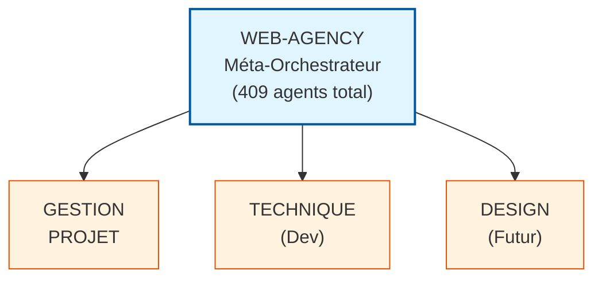
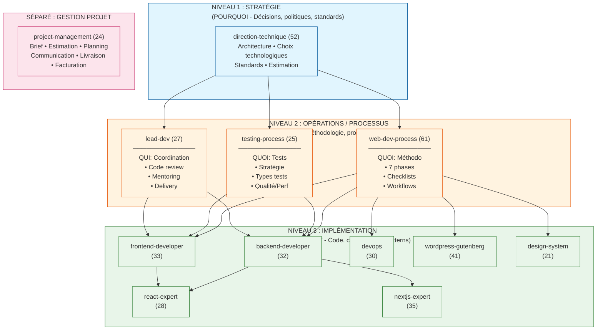
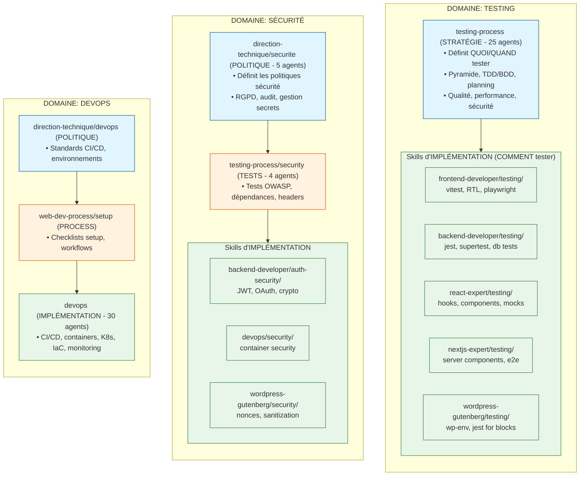
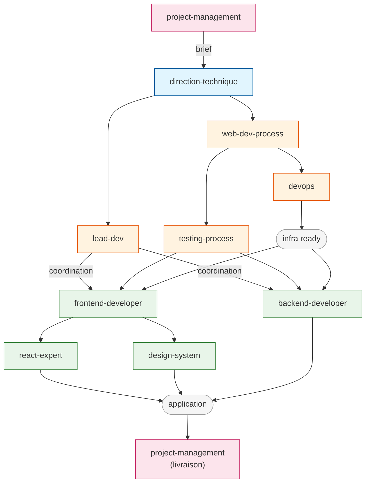
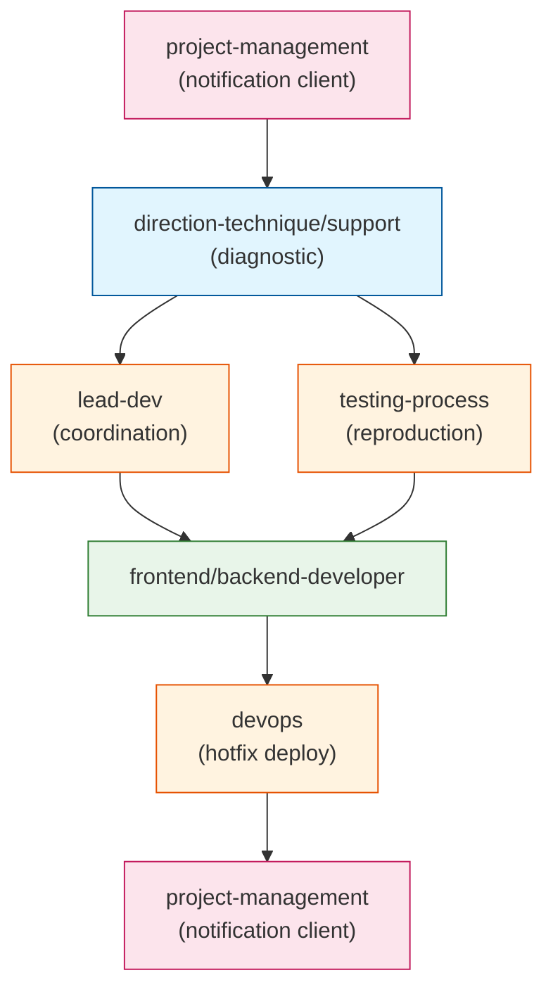
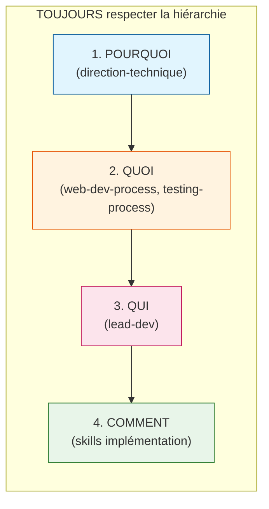
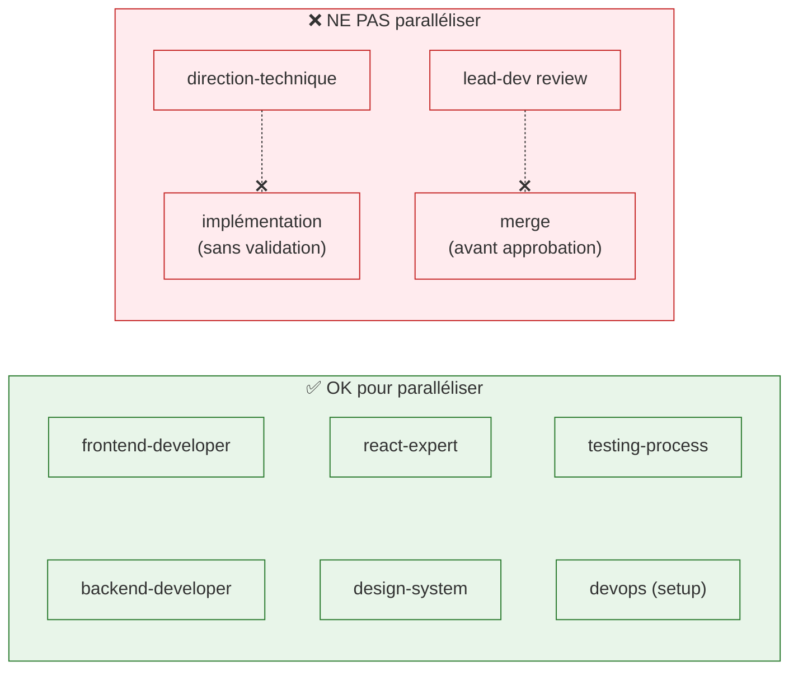

# Skill Dependency Graph

Ce document visualise les relations et dépendances entre les 12 skills de web-agency.

## Vue d'Ensemble



## Hiérarchie des Skills (3 Niveaux)



## Graphe des Dépendances

### Dépendances Directes

```
direction-technique
├── web-dev-process       [suit les politiques tech]
├── testing-process       [suit les standards qualité]
├── lead-dev              [applique les décisions]
├── frontend-developer    [implémente les specs]
├── backend-developer     [implémente les specs]
├── devops                [déploie selon les standards]
├── wordpress-gutenberg   [implémente les specs WP]
└── design-system         [applique les guidelines]

web-dev-process
├── testing-process       [s'intègre dans les phases]
├── frontend-developer    [phase implementation]
├── backend-developer     [phase implementation]
├── devops                [phase setup/deployment]
└── wordpress-gutenberg   [phase implementation]

lead-dev
├── frontend-developer    [code review, mentoring]
├── backend-developer     [code review, mentoring]
├── devops                [review infra]
└── wordpress-gutenberg   [code review]

frontend-developer
├── react-expert          [spécialisation React]
├── nextjs-expert         [spécialisation Next.js]
└── design-system         [consomme les tokens/composants]

backend-developer
├── devops                [collaboration déploiement]
└── nextjs-expert         [Server Components, API Routes]

project-management
├── direction-technique   [estimation technique]
└── [tous les skills]     [coordination projet]
```

### Relations par Domaine Technique



## Matrice de Collaboration

| Skill Source | → Collabore avec | Type de Relation |
|--------------|------------------|------------------|
| direction-technique | tous | dépendance descendante |
| web-dev-process | testing-process | complémentaire |
| web-dev-process | lead-dev | synchronisation |
| lead-dev | frontend-developer | review, mentoring |
| lead-dev | backend-developer | review, mentoring |
| frontend-developer | react-expert | spécialisation |
| frontend-developer | nextjs-expert | spécialisation |
| frontend-developer | design-system | consommation |
| backend-developer | devops | déploiement |
| backend-developer | nextjs-expert | Server Components |
| testing-process | tous skills techniques | méthodologie |
| project-management | tous | coordination |

## Flux de Travail Typiques

### Nouveau Projet Web



### Bug Fix Critique



## Bonnes Pratiques

### Composition Verticale (Haut → Bas)



### Composition Horizontale (Parallèle)



## Références

- [ADR-005 : Frontières de responsabilités](../docs/adr/005-skill-responsibility-boundaries.md)
- [ADR-006 : Hiérarchie lead-dev/web-dev-process](../docs/adr/006-hierarchy-clarification.md)
- [Règles de routage](./routing.md)
- [Composition des skills](./composition.md)
