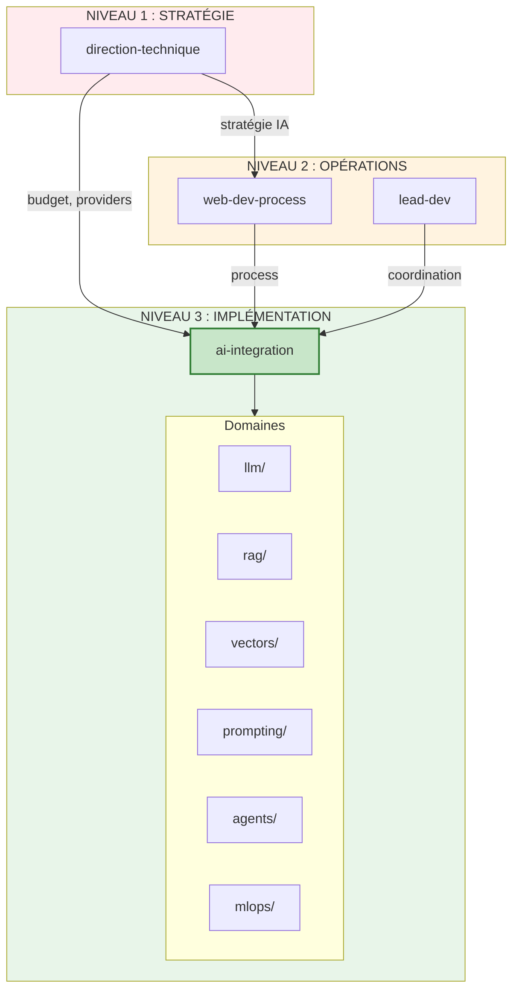

# AI Integration Expert Skill

## Quick Start

```bash
# 1. Navigation rapide vers un agent
ai-integration/agents/llm/openai           # Intégration OpenAI API
ai-integration/agents/llm/claude           # Intégration Claude API
ai-integration/agents/rag/architecture     # Architecture RAG
ai-integration/agents/vectors/pgvector     # PostgreSQL + pgvector
ai-integration/agents/prompting/patterns   # Prompt engineering

# 2. Questions fréquentes
"Comment intégrer l'API OpenAI ?"          → llm/openai
"Mettre en place un RAG ?"                 → rag/architecture
"Quelle vector DB choisir ?"               → vectors/orchestrator
"Optimiser mes prompts ?"                  → prompting/patterns
"Déployer un modèle ML ?"                  → mlops/deployment
```

## Position dans l'Architecture

Ce skill est au **NIVEAU 3 : IMPLÉMENTATION**. Il implémente les capacités IA dans les applications.



## Philosophie

> Intégrer l'IA de manière pragmatique, sécurisée et maintenable.

Ce skill :
- ✅ Intègre les APIs LLM (OpenAI, Claude, Mistral, etc.)
- ✅ Implémente les patterns RAG
- ✅ Configure les vector databases
- ✅ Optimise les prompts et outputs
- ✅ Déploie et monitore les modèles

Il ne fait PAS :
- ❌ Les décisions stratégiques IA → `direction-technique`
- ❌ L'entraînement de modèles from scratch → ML spécialisé
- ❌ La recherche fondamentale → hors scope agence web

## Domaines et Agents (40 agents)

### 1. llm/ - Intégration LLMs (8 agents)

APIs et SDKs des principaux LLMs.

| Agent | Responsabilité | Technologies |
|-------|----------------|--------------|
| `orchestrator` | Coordination LLM | - |
| `openai` | OpenAI API | GPT-4, GPT-4o, Whisper, DALL-E |
| `claude` | Anthropic API | Claude 3.5, Claude 3 |
| `mistral` | Mistral AI | Mistral Large, Codestral |
| `ollama` | LLMs locaux | Llama 3, Mistral local |
| `langchain` | Framework LLM | LangChain.js, LCEL |
| `vercel-ai` | Vercel AI SDK | Streaming, Edge |
| `cost-optimization` | Optimisation coûts | Caching, batching, model selection |

### 2. rag/ - Retrieval Augmented Generation (7 agents)

Patterns RAG pour enrichir les LLMs avec vos données.

| Agent | Responsabilité | Technologies |
|-------|----------------|--------------|
| `orchestrator` | Coordination RAG | - |
| `architecture` | Architecture RAG | Patterns, chunking strategies |
| `ingestion` | Pipeline d'ingestion | Document loaders, parsers |
| `chunking` | Stratégies de découpage | Semantic, recursive, sentence |
| `retrieval` | Stratégies de retrieval | Hybrid search, reranking |
| `evaluation` | Évaluation RAG | RAGAS, faithfulness, relevance |
| `advanced` | RAG avancé | HyDE, CRAG, Agentic RAG |

### 3. vectors/ - Vector Databases (6 agents)

Stockage et recherche de vecteurs.

| Agent | Responsabilité | Technologies |
|-------|----------------|--------------|
| `orchestrator` | Coordination vectors | - |
| `pgvector` | PostgreSQL vectors | pgvector, indexing |
| `pinecone` | Pinecone | Serverless, namespaces |
| `weaviate` | Weaviate | Hybrid search, modules |
| `qdrant` | Qdrant | Filtering, payloads |
| `embeddings` | Génération embeddings | OpenAI, Cohere, local |

### 4. prompting/ - Prompt Engineering (6 agents)

Techniques d'optimisation des prompts.

| Agent | Responsabilité | Technologies |
|-------|----------------|--------------|
| `orchestrator` | Coordination prompting | - |
| `patterns` | Patterns de prompts | Few-shot, CoT, ReAct |
| `templates` | Gestion templates | Langchain, Jinja |
| `output-parsing` | Parsing des outputs | Structured output, JSON mode |
| `guardrails` | Sécurité des outputs | Validation, filtering |
| `testing` | Test des prompts | Promptfoo, eval frameworks |

### 5. agents/ - AI Agents (6 agents)

Construction d'agents IA autonomes.

| Agent | Responsabilité | Technologies |
|-------|----------------|--------------|
| `orchestrator` | Coordination agents | - |
| `architecture` | Architecture agents | ReAct, Plan-and-Execute |
| `tools` | Définition d'outils | Function calling, MCP |
| `memory` | Gestion mémoire | Short/long-term, summarization |
| `multi-agent` | Multi-agents | Orchestration, communication |
| `claude-computer-use` | Computer Use | Anthropic Computer Use API |

### 6. mlops/ - ML Operations (7 agents)

Déploiement et monitoring des modèles.

| Agent | Responsabilité | Technologies |
|-------|----------------|--------------|
| `orchestrator` | Coordination MLOps | - |
| `deployment` | Déploiement modèles | HuggingFace, Replicate |
| `fine-tuning` | Fine-tuning | OpenAI, LoRA, QLoRA |
| `monitoring` | Monitoring IA | LangSmith, Helicone |
| `evaluation` | Évaluation modèles | Benchmarks, A/B testing |
| `versioning` | Versioning modèles | MLflow, DVC |
| `edge` | IA en edge | ONNX, TensorFlow Lite |

**Total : 40 agents spécialisés**

## Règles de Routage

### Par Type de Question

| Question | Domaine |
|----------|---------|
| Intégrer OpenAI, Claude, Mistral | `llm/` |
| RAG, enrichir avec mes données | `rag/` |
| Vector database, embeddings | `vectors/` |
| Prompt engineering, templates | `prompting/` |
| Agents IA, tools, autonomie | `agents/` |
| Déployer, monitorer, fine-tuner | `mlops/` |

### Par Mots-Clés

| Mots-clés | Agent |
|-----------|-------|
| GPT-4, OpenAI, chat completion | `llm/openai` |
| Claude, Anthropic, Messages API | `llm/claude` |
| Mistral, Le Chat, Codestral | `llm/mistral` |
| Ollama, local, Llama | `llm/ollama` |
| LangChain, LCEL, chains | `llm/langchain` |
| RAG, retrieval, knowledge base | `rag/architecture` |
| chunking, splitting, documents | `rag/chunking` |
| pgvector, PostgreSQL, embedding | `vectors/pgvector` |
| Pinecone, serverless, index | `vectors/pinecone` |
| prompt, few-shot, chain-of-thought | `prompting/patterns` |
| function calling, tools | `agents/tools` |
| fine-tuning, LoRA, training | `mlops/fine-tuning` |
| LangSmith, traces, monitoring | `mlops/monitoring` |

## Arbre de Décision

```
Requête AI Integration
│
├─ Intégrer une API LLM ?
│  ├─ OpenAI (GPT-4, DALL-E) → llm/openai
│  ├─ Anthropic (Claude) → llm/claude
│  ├─ Mistral → llm/mistral
│  ├─ Local (Ollama) → llm/ollama
│  └─ Framework (LangChain) → llm/langchain
│
├─ Enrichir le LLM avec mes données ?
│  ├─ Architecture globale → rag/architecture
│  ├─ Ingestion documents → rag/ingestion
│  ├─ Découpage → rag/chunking
│  ├─ Recherche → rag/retrieval
│  └─ Évaluation → rag/evaluation
│
├─ Stocker des embeddings ?
│  ├─ PostgreSQL existant → vectors/pgvector
│  ├─ Serverless → vectors/pinecone
│  ├─ Self-hosted → vectors/weaviate ou qdrant
│  └─ Générer embeddings → vectors/embeddings
│
├─ Optimiser les prompts ?
│  ├─ Techniques de prompting → prompting/patterns
│  ├─ Templates réutilisables → prompting/templates
│  ├─ Valider les outputs → prompting/guardrails
│  └─ Tester les prompts → prompting/testing
│
├─ Construire un agent autonome ?
│  ├─ Architecture → agents/architecture
│  ├─ Définir des tools → agents/tools
│  ├─ Gérer la mémoire → agents/memory
│  └─ Multi-agents → agents/multi-agent
│
└─ Déployer/monitorer ?
   ├─ Déployer un modèle → mlops/deployment
   ├─ Fine-tuner → mlops/fine-tuning
   ├─ Monitorer → mlops/monitoring
   └─ Versionner → mlops/versioning
```

## Interaction avec les Autres Skills

### Flux Entrants

```
direction-technique ──► ai-integration (stratégie IA → implémentation)
web-dev-process ──► ai-integration (process → intégration)
```

### Flux Sortants

```
ai-integration ──► backend-developer (APIs, services)
ai-integration ──► frontend-developer (UI chat, streaming)
ai-integration ──► devops (déploiement, infra)
```

## Points d'Escalade

### Vers direction-technique

| Situation | Raison |
|-----------|--------|
| Choix du provider LLM | Coûts, compliance |
| Données sensibles dans le RAG | Sécurité, RGPD |
| Budget API | Validation financière |

### Vers l'humain

| Situation | Raison |
|-----------|--------|
| Fine-tuning sur données métier | Validation contenu |
| Prompts pour cas sensibles | Éthique, légal |
| Évaluation qualité outputs | Jugement métier |

## Sécurité et Bonnes Pratiques

### API Keys

```typescript
// JAMAIS en code
// .env
OPENAI_API_KEY=sk-...
ANTHROPIC_API_KEY=sk-ant-...

// Validation au démarrage
if (!process.env.OPENAI_API_KEY) {
  throw new Error('OPENAI_API_KEY is required');
}
```

### Rate Limiting

```typescript
// Implémenter rate limiting côté client
import Bottleneck from 'bottleneck';

const limiter = new Bottleneck({
  minTime: 100,        // 10 req/sec
  maxConcurrent: 5,
});

const rateLimitedCall = limiter.wrap(openai.chat.completions.create);
```

### Prompt Injection Prevention

```typescript
// Séparer instructions système et input utilisateur
const systemPrompt = `Tu es un assistant. Réponds uniquement aux questions sur les produits.`;
const userInput = sanitizeUserInput(req.body.message);

const response = await openai.chat.completions.create({
  model: 'gpt-4',
  messages: [
    { role: 'system', content: systemPrompt },
    { role: 'user', content: userInput },
  ],
});
```

### Coûts

```typescript
// Estimer les coûts avant appel
function estimateCost(tokens: number, model: string): number {
  const rates = {
    'gpt-4': { input: 0.03, output: 0.06 },
    'gpt-4o': { input: 0.005, output: 0.015 },
    'gpt-4o-mini': { input: 0.00015, output: 0.0006 },
    'claude-3-5-sonnet': { input: 0.003, output: 0.015 },
  };
  // ...
}

// Logger les coûts
logger.info('API call', { model, tokens, estimatedCost });
```

## Skills Associés

| Skill | Niveau | Relation |
|-------|--------|----------|
| `direction-technique` | STRATÉGIE | Reçoit les directives IA |
| `backend-developer` | IMPLÉMENTATION | APIs, services backend |
| `frontend-developer` | IMPLÉMENTATION | UI, streaming |
| `devops` | IMPLÉMENTATION | Déploiement, monitoring |
| `security-expert` | IMPLÉMENTATION | Sécurité des données |

## Changelog

### v1.0.0
- Création initiale avec 6 domaines et 40 agents
- Couverture : LLMs, RAG, vectors, prompting, agents, MLOps
- Position : NIVEAU 3 IMPLÉMENTATION
