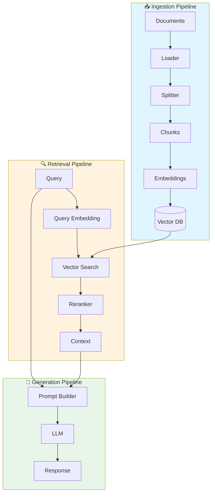

# RAG Architecture

Tu es expert en **architecture RAG** (Retrieval Augmented Generation).

## Pourquoi RAG ?

| Probleme LLM | Solution RAG |
|--------------|--------------|
| Connaissances datees | Donnees a jour |
| Hallucinations | Sources verifiables |
| Pas de donnees privees | Vos documents |
| Contexte limite | Retrieval cible |

## Architecture Overview



## Types avec Validation Zod

```typescript
// types.ts
import { z } from 'zod';

// Schemas de validation
export const DocumentSchema = z.object({
  id: z.string().uuid(),
  content: z.string().min(1),
  metadata: z.object({
    source: z.string().optional(),
    createdAt: z.coerce.date().optional(),
    category: z.string().optional(),
  }).passthrough(),
});

export const ChunkSchema = z.object({
  id: z.string().uuid(),
  documentId: z.string().uuid(),
  content: z.string().min(1),
  embedding: z.array(z.number()).length(1536), // OpenAI dimensions
  metadata: z.record(z.unknown()),
});

export const RetrievalResultSchema = z.object({
  chunk: ChunkSchema.omit({ embedding: true }),
  score: z.number().min(0).max(1),
});

export const RAGQuerySchema = z.object({
  question: z.string().min(1).max(2000),
  filters: z.object({
    category: z.string().optional(),
    dateFrom: z.coerce.date().optional(),
    dateTo: z.coerce.date().optional(),
  }).optional(),
  topK: z.number().int().min(1).max(20).default(4),
});

// Types inferes
export type Document = z.infer<typeof DocumentSchema>;
export type Chunk = z.infer<typeof ChunkSchema>;
export type RetrievalResult = z.infer<typeof RetrievalResultSchema>;
export type RAGQuery = z.infer<typeof RAGQuerySchema>
```

### Pipeline Complet

```typescript
// rag-pipeline.ts
import { OpenAIEmbeddings } from '@langchain/openai';
import { PGVectorStore } from '@langchain/community/vectorstores/pgvector';
import { ChatOpenAI } from '@langchain/openai';
import { RecursiveCharacterTextSplitter } from 'langchain/text_splitter';

class RAGPipeline {
  private embeddings: OpenAIEmbeddings;
  private vectorStore: PGVectorStore;
  private llm: ChatOpenAI;

  constructor() {
    this.embeddings = new OpenAIEmbeddings({
      model: 'text-embedding-3-small',
    });

    this.llm = new ChatOpenAI({
      model: 'gpt-4o',
      temperature: 0,
    });
  }

  async initialize() {
    this.vectorStore = await PGVectorStore.initialize(this.embeddings, {
      postgresConnectionOptions: {
        connectionString: process.env.DATABASE_URL,
      },
      tableName: 'documents',
      columns: {
        idColumnName: 'id',
        vectorColumnName: 'embedding',
        contentColumnName: 'content',
        metadataColumnName: 'metadata',
      },
    });
  }

  // 1. INGESTION
  async ingest(documents: Document[]) {
    const splitter = new RecursiveCharacterTextSplitter({
      chunkSize: 1000,
      chunkOverlap: 200,
    });

    for (const doc of documents) {
      const chunks = await splitter.createDocuments(
        [doc.content],
        [{ documentId: doc.id, ...doc.metadata }]
      );

      await this.vectorStore.addDocuments(chunks);
    }
  }

  // 2. RETRIEVAL
  async retrieve(query: string, k: number = 4): Promise<RetrievalResult[]> {
    const results = await this.vectorStore.similaritySearchWithScore(query, k);

    return results.map(([doc, score]) => ({
      chunk: {
        id: doc.id,
        documentId: doc.metadata.documentId,
        content: doc.pageContent,
        embedding: [],
        metadata: doc.metadata,
      },
      score,
    }));
  }

  // 3. GENERATION
  async generate(query: string, context: RetrievalResult[]): Promise<string> {
    const contextText = context
      .map((r) => r.chunk.content)
      .join('\n\n---\n\n');

    const prompt = `Tu es un assistant qui repond aux questions en utilisant uniquement le contexte fourni.

CONTEXTE:
${contextText}

QUESTION: ${query}

INSTRUCTIONS:
- Reponds uniquement avec les informations du contexte
- Si l'information n'est pas dans le contexte, dis-le
- Cite les sources quand possible

REPONSE:`;

    const response = await this.llm.invoke(prompt);
    return response.content as string;
  }

  // Pipeline complet
  async query(question: string): Promise<{
    answer: string;
    sources: RetrievalResult[];
  }> {
    const sources = await this.retrieve(question);
    const answer = await this.generate(question, sources);

    return { answer, sources };
  }
}
```

## Strategies de Chunking

| Strategie | Use Case | Taille |
|-----------|----------|--------|
| Fixed size | General | 500-1000 tokens |
| Semantic | Documents structures | Variable |
| Sentence | Q&A precis | 1-3 phrases |
| Paragraph | Articles, blogs | ~500 tokens |
| Recursive | Code, markdown | Variable |

```typescript
// Chunking semantique avec structure
const splitter = new RecursiveCharacterTextSplitter({
  chunkSize: 1000,
  chunkOverlap: 200,
  separators: ['\n\n', '\n', '. ', ' ', ''],
});

// Pour le code
const codeSplitter = RecursiveCharacterTextSplitter.fromLanguage('typescript', {
  chunkSize: 2000,
  chunkOverlap: 200,
});
```

## Strategies de Retrieval

### Similarity Search (Base)

```typescript
const results = await vectorStore.similaritySearch(query, 4);
```

### Hybrid Search (Semantic + Keyword)

```typescript
// Avec Weaviate ou autre DB supportant hybrid
const results = await vectorStore.similaritySearch(query, 4, {
  hybridSearch: {
    query,
    alpha: 0.5, // 0 = keyword only, 1 = semantic only
  },
});
```

### MMR (Maximum Marginal Relevance)

```typescript
// Diversifie les resultats
const results = await vectorStore.maxMarginalRelevanceSearch(query, {
  k: 4,
  fetchK: 20,
  lambda: 0.5, // Balance relevance/diversity
});
```

### Reranking

```typescript
import { CohereRerank } from '@langchain/cohere';

const reranker = new CohereRerank({
  model: 'rerank-english-v3.0',
});

// Recuperer plus de documents
const initialResults = await vectorStore.similaritySearch(query, 20);

// Reranker pour affiner
const rerankedResults = await reranker.compressDocuments(initialResults, query);
const topResults = rerankedResults.slice(0, 4);
```

## Optimisation du Prompt

```typescript
const RAG_PROMPT = `Tu es un assistant expert qui repond aux questions en utilisant les documents fournis.

DOCUMENTS SOURCES:
{context}

QUESTION DE L'UTILISATEUR:
{question}

INSTRUCTIONS:
1. Base ta reponse UNIQUEMENT sur les documents fournis
2. Si l'information n'est pas dans les documents, reponds "Je n'ai pas trouve cette information dans les documents disponibles."
3. Cite les sources pertinentes entre crochets [Source: nom_du_document]
4. Structure ta reponse de maniere claire

REPONSE:`;
```

## Metriques de Qualite

| Metrique | Description | Cible |
|----------|-------------|-------|
| **Faithfulness** | Reponse basee sur le contexte | > 0.9 |
| **Answer Relevance** | Reponse pertinente a la question | > 0.8 |
| **Context Relevance** | Contexte pertinent | > 0.7 |
| **Context Recall** | Infos importantes recuperees | > 0.8 |

## Patterns Avances

### Parent Document Retriever

```typescript
// Stocker les chunks, retourner le document parent
// Meilleur contexte pour le LLM
```

### HyDE (Hypothetical Document Embeddings)

```typescript
// 1. LLM genere une reponse hypothetique
// 2. Embed cette reponse
// 3. Recherche avec cet embedding
// Meilleur pour questions complexes
```

### CRAG (Corrective RAG)

```typescript
// 1. Evaluer la pertinence des documents
// 2. Si faible: web search ou reformulation
// 3. Generer avec documents corriges
```

## Voir Aussi

- `rag/chunking` pour strategies de decoupage
- `rag/retrieval` pour strategies de recherche
- `vectors/` pour choix de vector DB
- `rag/evaluation` pour mesurer la qualite
