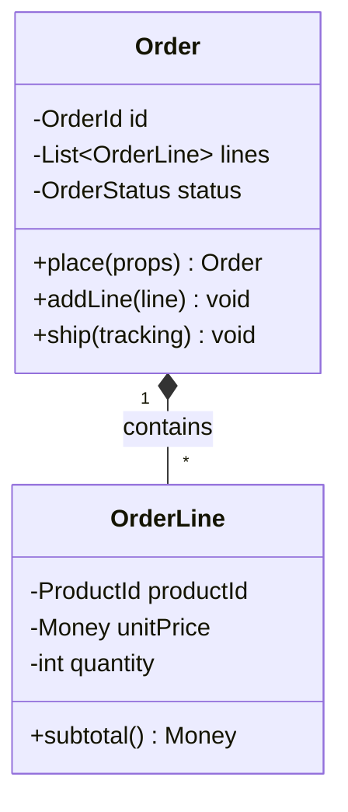

# ADR-001: Utilisation de Mermaid pour les Diagrammes

## Métadonnées

| Champ | Valeur |
|-------|--------|
| **Statut** | 🟢 Accepté |
| **Date** | 2026-01-17 |
| **Décideurs** | DDD Skill Team |
| **Scope** | Skill DDD |

## Contexte

Le skill DDD contient de nombreux diagrammes pour illustrer :
- Les architectures (Clean Architecture, Hexagonal)
- Les relations entre Bounded Contexts (Context Maps)
- Les flux de données (Event Storming, Sagas)
- Les structures de code (Aggregates, Value Objects)

Actuellement, certains diagrammes sont en ASCII art et d'autres en Mermaid, ce qui crée une incohérence.

Les contraintes principales sont :
- Lisibilité dans les fichiers Markdown
- Rendu correct sur GitHub/GitLab
- Maintenabilité et facilité d'édition
- Support des diagrammes de classes, séquences et flux

## Options Considérées

### Option 1: ASCII Art

**Description**: Diagrammes textuels avec caractères ASCII

**Avantages**:
- ✅ Fonctionne partout sans rendu spécial
- ✅ Visible directement dans n'importe quel éditeur

**Inconvénients**:
- ❌ Difficile à maintenir (alignement manuel)
- ❌ Limité pour les diagrammes complexes
- ❌ Pas de standardisation

---

### Option 2: Mermaid

**Description**: Langage de diagrammes déclaratif, rendu natif par GitHub/GitLab

**Avantages**:
- ✅ Syntaxe déclarative simple
- ✅ Rendu natif sur GitHub, GitLab, VS Code
- ✅ Supporte classDiagram, sequenceDiagram, flowchart, etc.
- ✅ Facile à modifier (pas d'alignement manuel)

**Inconvénients**:
- ❌ Nécessite un rendu pour visualisation
- ❌ Syntaxe à apprendre

---

### Option 3: PlantUML

**Description**: Langage UML complet avec serveur de rendu

**Avantages**:
- ✅ Support UML complet
- ✅ Plus de types de diagrammes

**Inconvénients**:
- ❌ Pas de rendu natif GitHub (nécessite extension)
- ❌ Syntaxe plus verbeuse
- ❌ Nécessite serveur pour rendu

## Décision

Nous avons choisi **Mermaid**.

### Justification

1. **Rendu natif GitHub/GitLab** : Les diagrammes s'affichent automatiquement
2. **Syntaxe simple** : Facile à apprendre et maintenir
3. **Support IDE** : VS Code, JetBrains ont des extensions de preview
4. **Types suffisants** : classDiagram, flowchart, sequenceDiagram couvrent nos besoins

## Conséquences

### Positives

- ✅ Cohérence visuelle dans tout le skill
- ✅ Diagrammes maintenables et lisibles
- ✅ Rendu automatique sur les plateformes Git

### Négatives

- ⚠️ Migration des diagrammes ASCII existants (effort ponctuel)

## Standards à Respecter

### Types de Diagrammes par Usage

| Besoin | Type Mermaid |
|--------|--------------|
| Structure de classes (Aggregates, VO) | `classDiagram` |
| Flux de processus (Event Storming) | `flowchart` |
| Séquences d'événements (Sagas) | `sequenceDiagram` |
| Relations entre contextes | `flowchart` ou `graph` |
| États (OrderStatus) | `stateDiagram-v2` |

### Exemple de Style

### Conventions de Nommage

- Classes en PascalCase
- Méthodes en camelCase
- Attributs préfixés par `-` (privé) ou `+` (public)
- Relations avec cardinalités explicites

## Références

- [Mermaid Documentation](https://mermaid.js.org/)
- [GitHub Mermaid Support](https://github.blog/2022-02-14-include-diagrams-markdown-files-mermaid/)

---

## Historique

| Date | Changement | Auteur |
|------|------------|--------|
| 2026-01-17 | Création et acceptation | DDD Skill Team |
