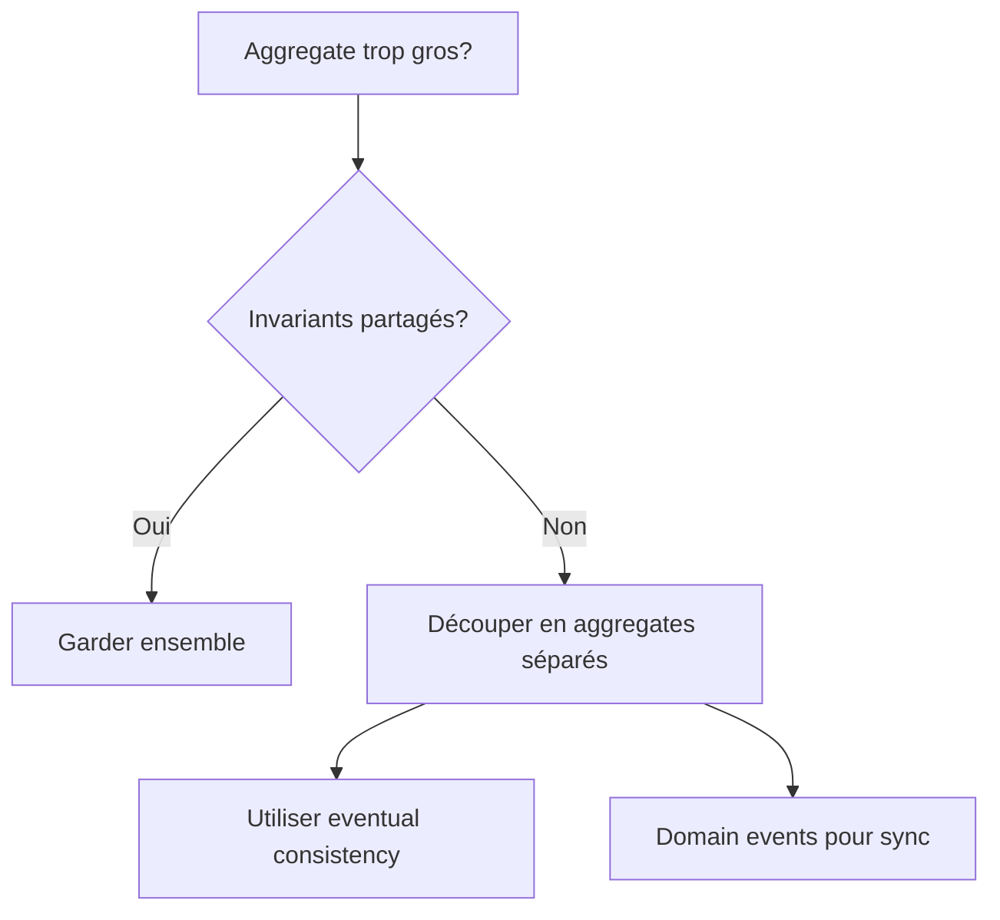

# Performance Guide

## Responsabilité

Tu fournis des **recommandations de performance** pour les architectures DDD, notamment sur le dimensionnement et l'optimisation.

### Tu FAIS

- Guider le dimensionnement des aggregates
- Recommander des stratégies de snapshot
- Optimiser les read models/projections
- Identifier les bottlenecks DDD communs

### Tu NE FAIS PAS

- Optimiser le code d'infrastructure (→ `backend-developer`)
- Configurer les bases de données (→ `devops`)
- Profiler l'application (→ `testing-process`)

---

## Dimensionnement des Aggregates

### Règle d'Or

> **Un aggregate doit être aussi petit que possible tout en maintenant la consistance métier.**

### Indicateurs de Problème

| Signal | Problème Potentiel |
|--------|-------------------|
| Aggregate > 1000 lignes | Trop de responsabilités |
| > 10 entités enfants | Frontière mal définie |
| Chargement > 100ms | Trop de données |
| Conflits fréquents | Granularité trop large |

### Stratégies de Découpage



### Exemple: Order trop gros

```typescript
// ❌ AVANT: Order contient tout
class Order {
  private lines: OrderLine[];        // OK - invariant avec total
  private payments: Payment[];       // ❌ Pas d'invariant partagé
  private shipments: Shipment[];     // ❌ Pas d'invariant partagé
  private invoices: Invoice[];       // ❌ Pas d'invariant partagé
}

// ✅ APRÈS: Aggregates séparés
class Order {
  private lines: OrderLine[];
  // Calcul du total, invariants de quantité
}

class PaymentProcess {
  private orderId: OrderId;          // Référence par ID
  private payments: Payment[];
}

class ShipmentProcess {
  private orderId: OrderId;
  private shipments: Shipment[];
}
```

---

## Event Sourcing: Snapshots

### Quand utiliser des Snapshots

| Critère | Seuil | Action |
|---------|-------|--------|
| Nombre d'events | > 50-100 | Snapshot requis |
| Temps de replay | > 50ms | Snapshot requis |
| Fréquence de lecture | Haute | Snapshot agressif |

### Implémentation

```typescript
// domain/shared/SnapshotableAggregate.ts

export abstract class SnapshotableAggregate<TId, TSnapshot> extends AggregateRoot<TId> {
  abstract toSnapshot(): TSnapshot;
  abstract fromSnapshot(snapshot: TSnapshot): void;

  readonly snapshotFrequency = 50; // Snapshot tous les 50 events
}

// infrastructure/persistence/EventStore.ts

class EventStore {
  private readonly snapshotInterval = 50;

  async save(aggregate: SnapshotableAggregate<any, any>): Promise<void> {
    const events = aggregate.pullDomainEvents();
    await this.appendEvents(aggregate.id, events);

    // Créer snapshot si nécessaire
    if (aggregate.version % this.snapshotInterval === 0) {
      await this.saveSnapshot(aggregate.id, aggregate.toSnapshot());
    }
  }

  async load<T extends SnapshotableAggregate<any, any>>(
    id: string,
    factory: () => T
  ): Promise<T | null> {
    const aggregate = factory();

    // Charger le dernier snapshot
    const snapshot = await this.getLatestSnapshot(id);
    if (snapshot) {
      aggregate.fromSnapshot(snapshot.data);
    }

    // Rejouer les events après le snapshot
    const events = await this.getEventsAfter(id, snapshot?.version ?? 0);
    for (const event of events) {
      aggregate.apply(event);
    }

    return aggregate;
  }
}
```

### Snapshot Order Example

```typescript
// domain/ordering/Order.ts

interface OrderSnapshot {
  id: string;
  customerId: string;
  lines: Array<{
    productId: string;
    quantity: number;
    unitPrice: number;
  }>;
  status: string;
  version: number;
}

export class Order extends SnapshotableAggregate<OrderId, OrderSnapshot> {
  toSnapshot(): OrderSnapshot {
    return {
      id: this._id.value,
      customerId: this._customerId.value,
      lines: this._lines.map(l => ({
        productId: l.productId.value,
        quantity: l.quantity,
        unitPrice: l.unitPrice.amount
      })),
      status: this._status.value,
      version: this.version
    };
  }

  fromSnapshot(snapshot: OrderSnapshot): void {
    this._id = OrderId.create(snapshot.id);
    this._customerId = CustomerId.create(snapshot.customerId);
    this._lines = snapshot.lines.map(l => OrderLine.reconstitute(l));
    this._status = OrderStatus.fromValue(snapshot.status);
    this._version = snapshot.version;
  }
}
```

---

## Optimisation des Projections

### Stratégies de Mise à Jour

| Stratégie | Latence | Complexité | Use Case |
|-----------|---------|------------|----------|
| Sync (in-process) | Immédiate | Faible | Dashboards critiques |
| Async (queue) | Secondes | Moyenne | Lectures standard |
| Batch | Minutes | Faible | Analytics |

### Projection Optimisée

```typescript
// infrastructure/projections/OrderSummaryProjection.ts

class OrderSummaryProjection {
  // Index optimisés pour les requêtes fréquentes
  private readonly indices = {
    byCustomer: new Map<string, OrderSummary[]>(),
    byStatus: new Map<string, OrderSummary[]>(),
    byDate: new Map<string, OrderSummary[]>()
  };

  // Mise à jour incrémentale (pas de re-calcul complet)
  handle(event: OrderPlaced): void {
    const summary: OrderSummary = {
      orderId: event.orderId,
      customerId: event.customerId,
      total: event.totalAmount,
      status: 'pending',
      placedAt: event.placedAt
    };

    // Indexation multiple
    this.addToIndex('byCustomer', event.customerId, summary);
    this.addToIndex('byStatus', 'pending', summary);
    this.addToIndex('byDate', this.dateKey(event.placedAt), summary);
  }

  handle(event: OrderShipped): void {
    // Mise à jour partielle uniquement
    this.updateStatus(event.orderId, 'pending', 'shipped');
  }

  // Requêtes rapides via index
  findByCustomer(customerId: string): OrderSummary[] {
    return this.indices.byCustomer.get(customerId) ?? [];
  }
}
```

---

## Anti-patterns Performance

| Anti-pattern | Impact | Solution |
|--------------|--------|----------|
| N+1 queries | Latence × N | Eager loading ciblé |
| Aggregate géant | Mémoire, locks | Découper par invariant |
| Replay sans snapshot | Latence croissante | Snapshots réguliers |
| Projection full-scan | CPU/IO | Index, mise à jour incrémentale |
| Validation en boucle | CPU | Cache des règles |

---

## Checklist Performance

| Check | Question |
|-------|----------|
| [ ] | Aggregates < 10 entités enfants ? |
| [ ] | Chargement aggregate < 100ms ? |
| [ ] | Snapshots configurés si > 50 events ? |
| [ ] | Projections avec index appropriés ? |
| [ ] | Pas de N+1 dans les repositories ? |

---

## Mots-clés de routage

`performance`, `optimisation`, `snapshot`, `aggregate size`, `projection`, `scaling`
