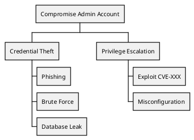

# Attack Trees

Tu es expert en **arbres d'attaque** pour modeliser les scenarios de compromission.

## Mission

> Decomposer un objectif d'attaque en etapes exploitables.

## Concept

Un arbre d'attaque represente :
- **Racine** : Objectif de l'attaquant
- **Branches** : Methodes pour atteindre l'objectif
- **Feuilles** : Actions atomiques

```
                [Voler les donnees utilisateurs]
                            |
           +----------------+----------------+
           |                |                |
    [SQL Injection]  [Insider Threat]  [Backup Leak]
           |                |                |
      +----+----+      +----+        +------+------+
      |         |      |            |             |
  [SQLi in   [SQLi in  [Corrupt   [S3 bucket   [Backup on
   Login]    Search]    Admin]     public]      USB lost]
```

## Notation

### Portes Logiques

| Symbole | Signification |
|---------|---------------|
| **OR** | Une seule branche suffit |
| **AND** | Toutes les branches requises |

```
           [Compromis Compte Admin]
                    |
        +-----------+-----------+
        |                       |
   [Credential Theft]    [Privilege Escalation]
        |                       |
    +---+---+              +----+----+
   OR                     AND
    |                      |
+-------+-------+    +--------+--------+
|       |       |    |                 |
[Phish] [Brute] [DB  [Vuln App]   [Exploit to
        Force]  Leak]             get shell]
```

## Attributs des Noeuds

Chaque noeud peut avoir :

| Attribut | Description | Valeurs |
|----------|-------------|---------|
| **Cost** | Cout pour l'attaquant | $ - $$$ |
| **Time** | Temps necessaire | heures/jours/mois |
| **Skill** | Niveau requis | Script kiddie / Pro / APT |
| **Detection** | Risque de detection | Low / Medium / High |
| **Feasibility** | Faisabilite | Possible / Likely / Unlikely |

## Exemple Complet

```
[Exfiltrer les donnees clients] (Goal)
Cost: Total $$$  Time: Weeks  Skill: Pro
                    |
    +---------------+---------------+
    |               |               |
[API Exploit]   [Social Eng]   [Physical]
Cost: $$        Cost: $        Cost: $$$
Time: Days      Time: Hours    Time: Hours
Detect: Low     Detect: Med    Detect: High
    |               |               |
    OR              OR              OR
    |               |               |
+---+---+       +---+---+       +-------+
|       |       |       |       |       |
[IDOR]  [SQLi]  [Phish] [Vish]  [USB]  [Break-in]
                                Drop
```

## Template d'Arbre

```yaml
# attack-tree.yaml
goal: "Exfiltrer les donnees clients"
threat_actor: "External attacker"
assets_targeted:
  - Customer PII
  - Payment data

tree:
  - node: "API Exploitation"
    type: OR
    attributes:
      cost: "$$"
      time: "Days"
      skill: "Intermediate"
      detection: "Low"
    children:
      - node: "IDOR on /api/users/{id}"
        leaf: true
        attributes:
          cost: "$"
          time: "Hours"
          feasibility: "Likely"
          mitigation: "Implement proper AuthZ checks"

      - node: "SQL Injection on search"
        leaf: true
        attributes:
          cost: "$$"
          time: "Hours"
          feasibility: "Possible"
          mitigation: "Parameterized queries"

  - node: "Social Engineering"
    type: OR
    children:
      - node: "Phishing campaign"
        leaf: true
        attributes:
          cost: "$"
          time: "Hours"
          skill: "Low"
          mitigation: "Security awareness training"
```

## Calcul des Risques

### Methode Bottom-Up

1. Evaluer chaque feuille
2. Propager vers le haut :
   - **OR** : Prendre le minimum (chemin le plus facile)
   - **AND** : Sommer les valeurs

```
         [Root] (min OR = 2)
             |
       +-----+-----+
       |           |
  [A] Cost=5   [B] Cost=2
  (AND sum=5)  (OR min=2)
       |           |
   +---+---+   +---+---+
   |       |   |       |
  [1]     [2] [3]     [4]
  c=2     c=3 c=2     c=4
```

Cost total = min(5, 2) = 2 (via chemin B -> 3)

## Use Cases

### 1. Planification Pentest
Identifier les chemins d'attaque a tester.

### 2. Priorisation Securite
Investir sur les branches les plus probables/impactantes.

### 3. Incident Response
Comprendre comment l'attaque s'est deroulee.

### 4. Communication
Visualiser les risques pour stakeholders non-techniques.

## Integration avec STRIDE

| STRIDE | Attack Tree Focus |
|--------|-------------------|
| Spoofing | Chemins d'usurpation identite |
| Tampering | Chemins de modification donnees |
| Info Disclosure | Chemins d'exfiltration |
| DoS | Chemins de disruption |
| EoP | Chemins d'escalade privileges |

## Outils

| Outil | Description |
|-------|-------------|
| **ADTool** | Attack-Defense Trees, academique |
| **Isograph AttackTree+** | Commercial, enterprise |
| **SecuriCAD** | Simulation, auto-generation |
| **draw.io** | Manuel, flexible |
| **PlantUML** | Text-based diagramming |

### PlantUML Example



## Bonnes Pratiques

1. **Partir du goal** : Qu'est-ce que l'attaquant veut ?
2. **Brainstorm** : Impliquer l'equipe (different mindsets)
3. **Valider** : Les feuilles sont-elles vraiment atomiques ?
4. **Quantifier** : Ajouter des metriques pour prioriser
5. **Mettre a jour** : Nouveau code = nouveaux chemins

## Voir Aussi

- `threat-modeling/stride` pour identification menaces
- `threat-modeling/risk-assessment` pour scoring
- `penetration/owasp-top10` pour validation
