# GitLab CI/CD

Configuration GitLab CI pour le process de développement web.

## Installation

```bash
# Copier le fichier à la racine du projet
cp .web-agency/skills/web-dev-process/workflows/gitlab/.gitlab-ci.yml .
```

## Pipeline Structure

```mermaid
flowchart LR
    subgraph VALIDATE["validate"]
        V1["• lint"]
        V2["• typecheck"]
        V3["• commitlint"]
    end

    subgraph TEST["test"]
        T1["• unit"]
        T2["• e2e"]
    end

    subgraph BUILD["build"]
        B1["• build"]
    end

    subgraph SECURITY["security"]
        S1["• audit"]
        S2["• sast"]
        S3["• secrets"]
    end

    subgraph DEPLOY["deploy"]
        D1["• review"]
        D2["• staging"]
        D3["• production"]
    end

    VALIDATE --> TEST --> BUILD --> SECURITY --> DEPLOY

    classDef stage fill:#e3f2fd,stroke:#1976d2
    classDef security fill:#fff3e0,stroke:#f57c00
    classDef deploy fill:#e8f5e9,stroke:#388e3c

    class VALIDATE,TEST,BUILD stage
    class SECURITY security
    class DEPLOY deploy
```



## Stages

### validate
- **lint** : ESLint
- **typecheck** : TypeScript
- **commitlint** : Validation des commits (MR uniquement)

### test
- **test:unit** : Tests unitaires avec couverture
- **test:e2e** : Tests end-to-end Playwright

### build
- **build** : Build de l'application

### security
- **audit** : Audit npm des dépendances
- **sast** : Analyse statique avec Semgrep
- **secret_detection** : Détection de secrets avec Gitleaks

### deploy
- **deploy:review** : Environnement temporaire par MR
- **deploy:staging** : Déploiement auto sur main
- **deploy:production** : Déploiement manuel sur tag

## Variables CI/CD

Configurer dans Settings > CI/CD > Variables :

| Variable | Description | Protected | Masked |
|----------|-------------|-----------|--------|
| `DEPLOY_TOKEN` | Token de déploiement | ✅ | ✅ |
| `NPM_TOKEN` | Token npm (si publication) | ✅ | ✅ |

## Environnements

| Environnement | Trigger | URL |
|---------------|---------|-----|
| review/* | Merge Request | `$SLUG.review.example.com` |
| staging | Push main | `staging.example.com` |
| production | Tag manuel | `www.example.com` |

## Personnalisation

### Changer la version Node.js

```yaml
variables:
  NODE_VERSION: "22"  # Au lieu de "20"
```

### Désactiver un job

```yaml
test:e2e:
  rules:
    - when: never  # Désactivé
```

### Ajouter des variables d'environnement

```yaml
build:
  variables:
    VITE_API_URL: "https://api.example.com"
```

## Intégration avec GitLab

### Merge Request Pipelines

Le pipeline s'exécute automatiquement sur chaque MR avec :
- Validation (lint, typecheck)
- Tests
- Build
- Environnement de review

### Protected Branches

Configurer les branches protégées dans Settings > Repository :
- `main` : Requiert MR, pipeline vert

### Environments

Visualiser les déploiements dans Operations > Environments.
