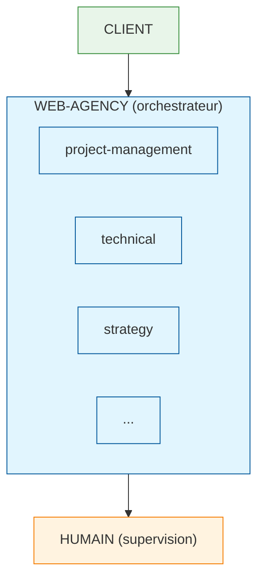

# Web Agency Framework

Framework agnostique de gestion d'une agence web automatisée.

> **Note**: Ce framework est indépendant de tout système d'IA spécifique. Les instructions sont stockées dans `.web-agency/` au format Markdown avec frontmatter YAML.

## Philosophie

> **Les skills exécutent, web-agency orchestre, les humains supervisent.**



## Skills Disponibles

### Niveau 0 : Entrée

| Skill | Description | Agents | Statut |
|-------|-------------|--------|--------|
| [client-intake](.web-agency/skills/client-intake/) | Réception et qualification des demandes | 23 | 🟢 Actif |

### Niveau 1 : Orchestration

| Composant | Description | Agents | Statut |
|-----------|-------------|--------|--------|
| [task-orchestrator](.web-agency/orchestration-framework/task-orchestrator/) | Gestion des tâches et priorisation | 16 | 🟢 Actif |
| [orchestration-framework](.web-agency/orchestration-framework/) | Routing, workflows, escalade | - | 🟢 Actif |

> **Note** : Ces composants ne sont pas des skills métier mais la couche d'orchestration qui coordonne les skills.

### Niveau 2 : Stratégie (POURQUOI)

| Skill | Description | Agents | Statut |
|-------|-------------|--------|--------|
| [direction-technique](.web-agency/skills/direction-technique/) | Stratégie technique, architecture | 52 | 🟢 Actif |
| [direction-marketing](.web-agency/skills/direction-marketing/) | Stratégie marketing, positionnement | 25 | 🟢 Actif |
| [direction-artistique](.web-agency/skills/direction-artistique/) | Stratégie design, branding | 25 | 🟢 Actif |

### Niveau 3 : Opérations

| Skill | Description | Agents | Statut |
|-------|-------------|--------|--------|
| [project-management](.web-agency/skills/project-management/) | Gestion de projet & relation client | 24 | 🟢 Actif |
| [lead-dev](.web-agency/skills/lead-dev/) | Coordination technique | 27 | 🟢 Actif |
| [web-dev-process](.web-agency/skills/web-dev-process/) | Process de développement (7 phases) | 61 | 🟢 Actif |
| [testing-process](.web-agency/skills/testing-process/) | Stratégie et process de test | 25 | 🟢 Actif |

### Niveau 4 : Implémentation

| Skill | Description | Agents | Statut |
|-------|-------------|--------|--------|
| [frontend-developer](.web-agency/skills/frontend-developer/) | Développement front-end moderne | 33 | 🟢 Actif |
| [backend-developer](.web-agency/skills/backend-developer/) | Backend - APIs, databases, architecture | 32 | 🟢 Actif |
| [devops](.web-agency/skills/devops/) | CI/CD, containers, infrastructure | 30 | 🟢 Actif |
| [wordpress-gutenberg-expert](.web-agency/skills/wordpress-gutenberg-expert/) | WordPress & Gutenberg | 41 | 🟢 Actif |
| [react-expert](.web-agency/skills/react-expert/) | Expert React | 28 | 🟢 Actif |
| [nextjs-expert](.web-agency/skills/nextjs-expert/) | Expert Next.js | 35 | 🟢 Actif |
| [design-system-foundations](.web-agency/skills/design-system-foundations/) | Design System - Atomic Design | 21 | 🟢 Actif |
| [marketing](.web-agency/skills/marketing/) | Marketing digital complet | 115 | 🟢 Actif |
| [content-management](.web-agency/skills/content-management/) | Gestion de contenu éditorial | 17 | 🟢 Actif |

### Niveau 4 : Fonctions Support

| Skill | Description | Agents | Statut |
|-------|-------------|--------|--------|
| [ux-ui-design](.web-agency/skills/ux-ui-design/) | Design UX/UI | 22 | 🟢 Actif |
| [legal-compliance](.web-agency/skills/legal-compliance/) | Juridique et conformité | 16 | 🟢 Actif |
| [support-client](.web-agency/skills/support-client/) | Support client | 16 | 🟢 Actif |
| [commercial-crm](.web-agency/skills/commercial-crm/) | Commercial et CRM | 17 | 🟢 Actif |
| [finance-analytics](.web-agency/skills/finance-analytics/) | Finance et analytics | 17 | 🟢 Actif |

**Total : 24 skills, 757 agents**

## Architecture

```
.
├── .web-agency/                   # Framework agnostique (instructions métier)
│   ├── orchestration-framework/   # Règles de routage et workflows (pas un skill)
│   ├── skills/                    # 24 skills, 757 agents
│   │   ├── client-intake/         # Niveau 0: Entrée
│   │   ├── task-orchestrator/     # Niveau 1: Orchestration
│   │   ├── direction-technique/   # Niveau 2: Stratégie
│   │   ├── direction-marketing/   # Niveau 2: Stratégie
│   │   ├── direction-artistique/  # Niveau 2: Stratégie
│   │   ├── project-management/    # Niveau 3: Opérations
│   │   ├── lead-dev/
│   │   ├── web-dev-process/
│   │   ├── testing-process/
│   │   ├── frontend-developer/    # Niveau 4: Implémentation
│   │   ├── backend-developer/
│   │   ├── devops/
│   │   ├── wordpress-gutenberg-expert/
│   │   ├── react-expert/
│   │   ├── nextjs-expert/
│   │   ├── design-system-foundations/
│   │   ├── marketing/
│   │   ├── content-management/
│   │   ├── ux-ui-design/          # Niveau 4: Support
│   │   ├── legal-compliance/
│   │   ├── support-client/
│   │   ├── commercial-crm/
│   │   └── finance-analytics/
│   └── learnings/                 # Learning loop system
│
└── .claude/                       # Interface Claude (commandes uniquement)
    └── commands/                  # 23 commandes référençant .web-agency/
```

## Hiérarchie des Skills

```
NIVEAU 0: ENTRÉE
└── client-intake (23)              # Réception des demandes

NIVEAU 1: ORCHESTRATION
└── task-orchestrator (16)          # Gestion des tâches
    (Règles dans .web-agency/orchestration-framework/)

NIVEAU 2: STRATÉGIE (POURQUOI)
├── direction-technique (52)        # Stratégie technique
├── direction-marketing (25)        # Stratégie marketing
└── direction-artistique (25)       # Stratégie design

NIVEAU 3: OPÉRATIONS (QUOI)
├── project-management (24)         # Gestion de projet
├── lead-dev (27)                   # Coordination technique
├── web-dev-process (61)            # Process de développement
└── testing-process (25)            # Process de test

NIVEAU 4: IMPLÉMENTATION (COMMENT)
├── frontend-developer (33)
├── backend-developer (32)
├── devops (30)
├── wordpress-gutenberg-expert (41)
├── react-expert (28)
├── nextjs-expert (35)
├── design-system-foundations (21)
├── marketing (115)
└── content-management (17)

NIVEAU 4: SUPPORT
├── ux-ui-design (22)
├── legal-compliance (16)
├── support-client (16)
├── commercial-crm (17)
└── finance-analytics (17)
```

### Workflow type : Nouveau projet

```
1. client-intake       → Réception, qualification
2. direction-technique → Architecture, estimation
3. project-management  → Brief, planning
4. ux-ui-design        → Maquettes, design
   └── design-system-foundations → Tokens, composants
5. lead-dev            → Coordination technique
   └── web-dev-process → Setup, dev, test, deploy
   └── testing-process → Tests, QA
6. devops              → CI/CD, déploiement
7. marketing           → Lancement, acquisition
```

## Installation

```bash
# Cloner le repository
git clone https://github.com/truchot/claude-skills-test.git

# Les skills sont automatiquement disponibles dans Claude Code
```

## Utilisation

### Exemples de requêtes

```
# Orchestration
"J'ai un nouveau projet de site e-commerce WordPress"
→ web-agency compose : project-management + wordpress-gutenberg-expert

# Gestion de projet
"Aide-moi à rédiger un brief client"
→ project-management/avant-projet

# Direction technique
"Quelle stack pour ce projet ?"
→ direction-technique/avant-projet/selection-stack

# WordPress
"Comment créer un block Gutenberg ?"
→ wordpress-gutenberg-expert/gutenberg-blocks

# Design System
"Crée une palette de couleurs WCAG AA"
→ design-system-foundations/foundations/colors

# Backend
"Comment concevoir une API REST ?"
→ backend-developer/api/rest-design
```

## Tests

```bash
# Tests par skill
cd .web-agency/orchestration-framework/tests && bash run-tests.sh
cd .web-agency/skills/web-dev-process/tests && bash run-tests.sh
cd .web-agency/skills/wordpress-gutenberg-expert/tests && bash run-tests.sh
cd .web-agency/skills/frontend-developer/tests && node validate-skill.test.js
cd .web-agency/skills/react-expert/tests && node validate-skill.test.js
cd .web-agency/skills/backend-developer/tests && bash run-tests.sh
```

## Principes de Conception

1. **Modularité** : Chaque skill est autonome et réutilisable
2. **Composition** : Les skills se combinent pour des workflows complexes
3. **Supervision humaine** : Validation humaine à chaque étape
4. **Single Responsibility** : Un agent = une responsabilité
5. **Traçabilité** : Historique des décisions

## Version

**v4.1.0** - 24 skills, 757 agents

Voir [CHANGELOG](.web-agency/skills/CHANGELOG.md) pour l'historique complet.

## Licence

MIT - Voir [LICENSE](LICENSE)

## Ressources

- [Documentation Claude Code](https://docs.anthropic.com/claude-code)
- [WordPress Developer Resources](https://developer.wordpress.org/)
- [Atomic Design by Brad Frost](https://atomicdesign.bradfrost.com/)
