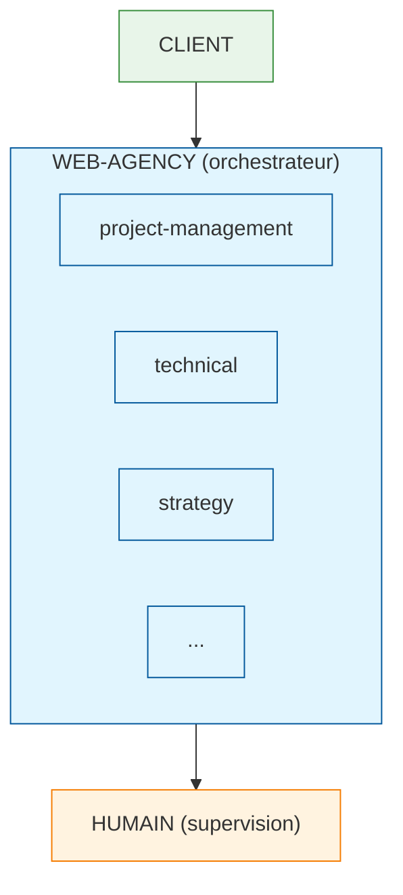

# Web Agency Framework

Framework agnostique de gestion d'une agence web automatisée.

> **Note**: Ce framework est indépendant de tout système d'IA spécifique. Les instructions sont stockées dans `.web-agency/` au format Markdown avec frontmatter YAML.

## Philosophie

> **Les skills exécutent, web-agency orchestre, les humains supervisent.**


```mermaid
flowchart TB
    CLIENT["CLIENT"]

    subgraph WA["WEB-AGENCY (orchestrateur)"]
        PM["project-management"]
        TECH["technical"]
        STRAT["strategy"]
        MORE["..."]
    end

    HUMAIN["HUMAIN (supervision)"]

    CLIENT --> WA
    WA --> HUMAIN

    classDef client fill:#e8f5e9,stroke:#388e3c
    classDef orchestrator fill:#e1f5fe,stroke:#01579b
    classDef human fill:#fff3e0,stroke:#f57c00

    class CLIENT client
    class WA,PM,TECH,STRAT,MORE orchestrator
    class HUMAIN human
```

## Skills Disponibles

### Niveau 0 : Entrée

| Skill | Description | Agents | Statut |
|-------|-------------|--------|--------|
| [client-intake](.web-agency/skills/client-intake/) | Réception et qualification des demandes | 29 | 🟢 Actif |

### Niveau 1 : Orchestration

| Composant | Description | Agents | Statut |
|-----------|-------------|--------|--------|
| [task-orchestrator](.web-agency/orchestration-framework/task-orchestrator/) | Gestion des tâches et priorisation | 20 | 🟢 Actif |
| [orchestration-framework](.web-agency/orchestration-framework/) | Routing, workflows, escalade | - | 🟢 Actif |

> **Note** : Ces composants ne sont pas des skills métier mais la couche d'orchestration qui coordonne les skills.

### Niveau 2 : Stratégie (POURQUOI)

| Skill | Description | Agents | Statut |
|-------|-------------|--------|--------|
| [direction-technique](.web-agency/skills/direction-technique/) | Stratégie technique, architecture | 61 | 🟢 Actif |
| [direction-marketing](.web-agency/skills/direction-marketing/) | Stratégie marketing, positionnement | 29 | 🟢 Actif |
| [direction-artistique](.web-agency/skills/direction-artistique/) | Stratégie design, branding | 26 | 🟢 Actif |
| [direction-commerciale](.web-agency/skills/direction-commerciale/) | Stratégie commerciale, business dev | 29 | 🟢 Actif |
| [direction-operations](.web-agency/skills/direction-operations/) | Stratégie opérationnelle | 29 | 🟢 Actif |

### Niveau 3 : Opérations

| Skill | Description | Agents | Statut |
|-------|-------------|--------|--------|
| [project-management](.web-agency/skills/project-management/) | Gestion de projet & relation client | 39 | 🟢 Actif |
| [lead-dev](.web-agency/skills/lead-dev/) | Coordination technique | 29 | 🟢 Actif |
| [web-dev-process](.web-agency/skills/web-dev-process/) | Process de développement (7 phases) | 74 | 🟢 Actif |
| [testing-process](.web-agency/skills/testing-process/) | Stratégie et process de test | 27 | 🟢 Actif |

### Niveau 4 : Implémentation

| Skill | Description | Agents | Statut |
|-------|-------------|--------|--------|
| [frontend-developer](.web-agency/skills/frontend-developer/) | Développement front-end moderne | 34 | 🟢 Actif |
| [backend-developer](.web-agency/skills/backend-developer/) | Backend - APIs, databases, architecture | 38 | 🟢 Actif |
| [devops](.web-agency/skills/devops/) | CI/CD, containers, infrastructure | 32 | 🟢 Actif |
| [wordpress-gutenberg-expert](.web-agency/skills/wordpress-gutenberg-expert/) | WordPress & Gutenberg | 58 | 🟢 Actif |
| [react-expert](.web-agency/skills/react-expert/) | Expert React | 29 | 🟢 Actif |
| [nextjs-expert](.web-agency/skills/nextjs-expert/) | Expert Next.js | 37 | 🟢 Actif |
| [design-system-foundations](.web-agency/skills/design-system-foundations/) | Design System - Atomic Design | 30 | 🟢 Actif |
| [ddd](.web-agency/skills/ddd/) | Domain-Driven Design | 34 | 🟢 Actif |
| [security-expert](.web-agency/skills/security-expert/) | Sécurité applicative - OWASP, AppSec | 26 | 🟢 Actif |
| [ai-integration](.web-agency/skills/ai-integration/) | Intégration IA/ML - LLMs, RAG, vectors | 14 | 🟢 Actif |
| [legacy-modernization](.web-agency/skills/legacy-modernization/) | Modernisation legacy - Strangler Fig | 10 | 🟢 Actif |
| [seo-expert](.web-agency/skills/seo-expert/) | SEO technique et stratégique | 48 | 🟢 Actif |
| [content-marketing](.web-agency/skills/content-marketing/) | Marketing de contenu | 13 | 🟢 Actif |
| [marketing-analytics](.web-agency/skills/marketing-analytics/) | Analytics et data marketing | 32 | 🟢 Actif |
| [marketing-ops](.web-agency/skills/marketing-ops/) | Opérations marketing, automation | 18 | 🟢 Actif |
| [paid-media](.web-agency/skills/paid-media/) | Publicité payante, acquisition | 25 | 🟢 Actif |
| [content-management](.web-agency/skills/content-management/) | Gestion de contenu éditorial | 25 | 🟢 Actif |

### Niveau 4 : Fonctions Support

| Skill | Description | Agents | Statut |
|-------|-------------|--------|--------|
| [ux-ui-design](.web-agency/skills/ux-ui-design/) | Design UX/UI | 28 | 🟢 Actif |
| [legal-compliance](.web-agency/skills/legal-compliance/) | Juridique et conformité | 17 | 🟢 Actif |
| [support-client](.web-agency/skills/support-client/) | Support client | 17 | 🟢 Actif |
| [commercial-crm](.web-agency/skills/commercial-crm/) | Commercial et CRM | 19 | 🟢 Actif |
| [finance-analytics](.web-agency/skills/finance-analytics/) | Finance et analytics | 18 | 🟢 Actif |
| [customer-success](.web-agency/skills/customer-success/) | Suivi client et satisfaction | 27 | 🟢 Actif |

**Total : 33 skills métier (1 001 agents) + orchestration-framework (20 agents task-orchestrator) = 1 021 agents**

## Architecture

```
.
├── .web-agency/                   # Framework agnostique (instructions métier)
│   ├── orchestration-framework/   # Règles de routage et workflows
│   │   └── task-orchestrator/     # Niveau 1: Orchestration (20 agents)
│   ├── skills/                    # 33 skills métier, 1 001 agents
│   │   ├── client-intake/         # Niveau 0: Entrée
│   │   ├── direction-technique/   # Niveau 2: Stratégie
│   │   ├── direction-marketing/   # Niveau 2: Stratégie
│   │   ├── direction-artistique/  # Niveau 2: Stratégie
│   │   ├── direction-commerciale/ # Niveau 2: Stratégie
│   │   ├── direction-operations/  # Niveau 2: Stratégie
│   │   ├── project-management/    # Niveau 3: Opérations
│   │   ├── lead-dev/
│   │   ├── web-dev-process/
│   │   ├── testing-process/
│   │   ├── frontend-developer/    # Niveau 4: Implémentation
│   │   ├── backend-developer/
│   │   ├── devops/
│   │   ├── wordpress-gutenberg-expert/
│   │   ├── react-expert/
│   │   ├── nextjs-expert/
│   │   ├── design-system-foundations/
│   │   ├── ddd/
│   │   ├── security-expert/
│   │   ├── ai-integration/
│   │   ├── legacy-modernization/
│   │   ├── seo-expert/
│   │   ├── content-marketing/
│   │   ├── marketing-analytics/
│   │   ├── marketing-ops/
│   │   ├── paid-media/
│   │   ├── content-management/
│   │   ├── ux-ui-design/          # Niveau 4: Support
│   │   ├── legal-compliance/
│   │   ├── support-client/
│   │   ├── commercial-crm/
│   │   ├── finance-analytics/
│   │   └── customer-success/
│   └── learnings/                 # Learning loop system
│
└── .claude/                       # Interface Claude (commandes uniquement)
    └── commands/                  # 23 commandes référençant .web-agency/
```

## Hiérarchie des Skills

```
NIVEAU 0: ENTRÉE
└── client-intake (29)              # Réception des demandes

NIVEAU 1: ORCHESTRATION
└── task-orchestrator (20)          # Gestion des tâches
    (Règles dans .web-agency/orchestration-framework/)

NIVEAU 2: STRATÉGIE (POURQUOI)
├── direction-technique (61)        # Stratégie technique
├── direction-marketing (29)        # Stratégie marketing
├── direction-artistique (26)       # Stratégie design
├── direction-commerciale (29)      # Stratégie commerciale
└── direction-operations (29)       # Stratégie opérationnelle

NIVEAU 3: OPÉRATIONS (QUOI)
├── project-management (39)         # Gestion de projet
├── lead-dev (29)                   # Coordination technique
├── web-dev-process (74)            # Process de développement
└── testing-process (27)            # Process de test

NIVEAU 4: IMPLÉMENTATION (COMMENT)
├── frontend-developer (34)
├── backend-developer (38)
├── devops (32)
├── wordpress-gutenberg-expert (58)
├── react-expert (29)
├── nextjs-expert (37)
├── design-system-foundations (30)
├── ddd (34)
├── security-expert (26)
├── ai-integration (14)
├── legacy-modernization (10)
├── seo-expert (48)
├── content-marketing (13)
├── marketing-analytics (32)
├── marketing-ops (18)
├── paid-media (25)
└── content-management (25)

NIVEAU 4: SUPPORT
├── ux-ui-design (28)
├── legal-compliance (17)
├── support-client (17)
├── commercial-crm (19)
├── finance-analytics (18)
└── customer-success (27)
```

### Workflow type : Nouveau projet

```
1. client-intake       → Réception, qualification
2. direction-technique → Architecture, estimation
3. project-management  → Brief, planning
4. ux-ui-design        → Maquettes, design
   └── design-system-foundations → Tokens, composants
5. lead-dev            → Coordination technique
   └── web-dev-process → Setup, dev, test, deploy
   └── testing-process → Tests, QA
6. devops              → CI/CD, déploiement
7. marketing           → Lancement, acquisition
```

## Installation

```bash
# Cloner le repository
git clone https://github.com/truchot/claude-skills-test.git

# Les skills sont automatiquement disponibles dans Claude Code
```

## Utilisation

### Exemples de requêtes

```
# Orchestration
"J'ai un nouveau projet de site e-commerce WordPress"
→ web-agency compose : project-management + wordpress-gutenberg-expert

# Gestion de projet
"Aide-moi à rédiger un brief client"
→ project-management/avant-projet

# Direction technique
"Quelle stack pour ce projet ?"
→ direction-technique/avant-projet/selection-stack

# WordPress
"Comment créer un block Gutenberg ?"
→ wordpress-gutenberg-expert/gutenberg-blocks

# Design System
"Crée une palette de couleurs WCAG AA"
→ design-system-foundations/foundations/colors

# Backend
"Comment concevoir une API REST ?"
→ backend-developer/api/rest-design
```

## Tests

```bash
# Tests par skill
cd .web-agency/orchestration-framework/tests && bash run-tests.sh
cd .web-agency/skills/web-dev-process/tests && bash run-tests.sh
cd .web-agency/skills/wordpress-gutenberg-expert/tests && bash run-tests.sh
cd .web-agency/skills/frontend-developer/tests && node validate-skill.test.js
cd .web-agency/skills/react-expert/tests && node validate-skill.test.js
cd .web-agency/skills/backend-developer/tests && bash run-tests.sh
```

## Principes de Conception

1. **Modularité** : Chaque skill est autonome et réutilisable
2. **Composition** : Les skills se combinent pour des workflows complexes
3. **Supervision humaine** : Validation humaine à chaque étape
4. **Single Responsibility** : Un agent = une responsabilité
5. **Traçabilité** : Historique des décisions

## Version

**v4.4.0** - 33 skills métier + orchestration-framework (1 021 agents total)

Voir [CHANGELOG](.web-agency/orchestration-framework/CHANGELOG.md) pour l'historique complet.

## Licence

MIT - Voir [LICENSE](LICENSE)

## Ressources

- [Documentation Claude Code](https://docs.anthropic.com/claude-code)
- [WordPress Developer Resources](https://developer.wordpress.org/)
- [Atomic Design by Brad Frost](https://atomicdesign.bradfrost.com/)
