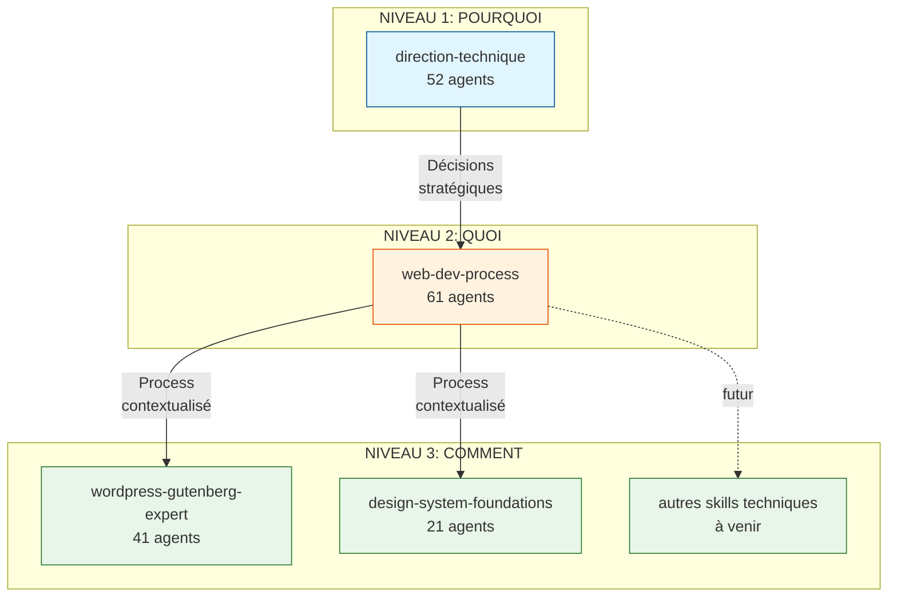
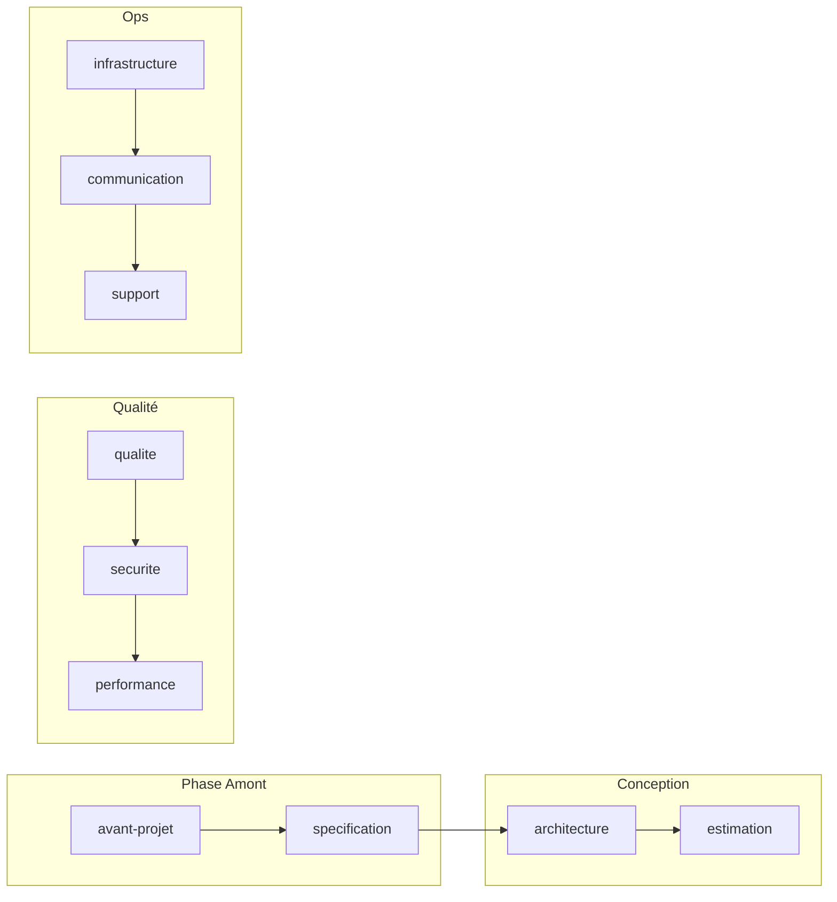
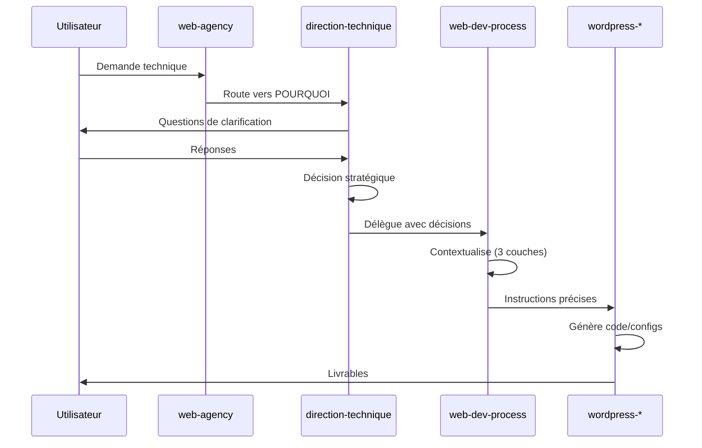

# Architecture des Skills Techniques

## Vue d'ensemble



## Hiérarchie POURQUOI / QUOI / COMMENT

```
┌─────────────────────────────────────────────────────────────────────────────┐
│                    NIVEAU 1 : POURQUOI                                       │
│                   (direction-technique)                                      │
│                                                                              │
│  Rôle : QUESTIONNER et CLARIFIER le besoin                                  │
│                                                                              │
│  → Poser un MAXIMUM de questions pour comprendre le contexte                │
│  → Identifier les objectifs réels derrière la demande                       │
│  → Valider les hypothèses avant de déléguer                                 │
│  → Prendre les décisions stratégiques                                       │
│                                                                              │
│  Output : Décisions documentées, ADRs, Politiques validées                  │
│  Code : ❌ JAMAIS (voir SRP-ANALYSIS.md)                                    │
└─────────────────────────────────────────────────────────────────────────────┘
                                    │
                      (besoin clarifié, décisions prises)
                                    │
                                    ▼
┌─────────────────────────────────────────────────────────────────────────────┐
│                       NIVEAU 2 : QUOI                                        │
│                    (web-dev-process)                                         │
│                                                                              │
│  Rôle : CONTEXTUALISER en 3 couches                                         │
│                                                                              │
│  1. GLOBAL "Métier"     → Quel process métier standard appliquer ?          │
│  2. AGENCE "Spécifique" → Quelles particularités de l'agence ?              │
│  3. PROJET "Exception"  → Quelles exceptions projet outrepassent ?          │
│                                                                              │
│  Output : Process adapté, Templates contextualisés, Checklists              │
│  Code : ❌ JAMAIS                                                            │
└─────────────────────────────────────────────────────────────────────────────┘
                                    │
                      (process identifié, contexte établi)
                                    │
                                    ▼
┌─────────────────────────────────────────────────────────────────────────────┐
│                      NIVEAU 3 : COMMENT                                      │
│                (wordpress-gutenberg-expert, etc.)                            │
│                                                                              │
│  Rôle : EXÉCUTER avec spécifications                                        │
│                                                                              │
│  → Dans quel environnement ?                                                │
│  → Avec quelles spécifications techniques ?                                 │
│  → Quels critères d'acceptance ?                                            │
│  → Qu'est-ce qu'il y a à produire concrètement ?                            │
│                                                                              │
│  Output : Code, Configs, Scripts, Livrables testables                       │
│  Code : ✅ OUI - C'est ici qu'on implémente                                  │
└─────────────────────────────────────────────────────────────────────────────┘
```

## Structure des Domaines (direction-technique)



### Détail par Domaine

| Domaine | Agents | Responsabilité |
|---------|--------|----------------|
| `avant-projet` | 5 | Cadrage technique initial |
| `specification` | 5 | Rédaction specs techniques |
| `architecture` | 6 | Conception et validation |
| `estimation` | 5 | Chiffrage et planning |
| `qualite` | 6 | Standards et code review |
| `securite` | 5 | OWASP, RGPD, secrets |
| `performance` | 5 | Optimisation et monitoring |
| `infrastructure` | 5 | CI/CD et déploiement |
| `communication` | 5 | Documentation et handoff |
| `support` | 5 | Debug et veille techno |

## Flux de Données



## Références

- [ADR-005: Frontières entre Skills](../.web-agency/skills/web-agency/docs/adr/005-skill-responsibility-boundaries.md)
- [SRP Analysis](./analysis/SRP-ANALYSIS.md)
- [Migration Guide](./analysis/MIGRATION.md)
- [Quick Start](./QUICK_START.md)
