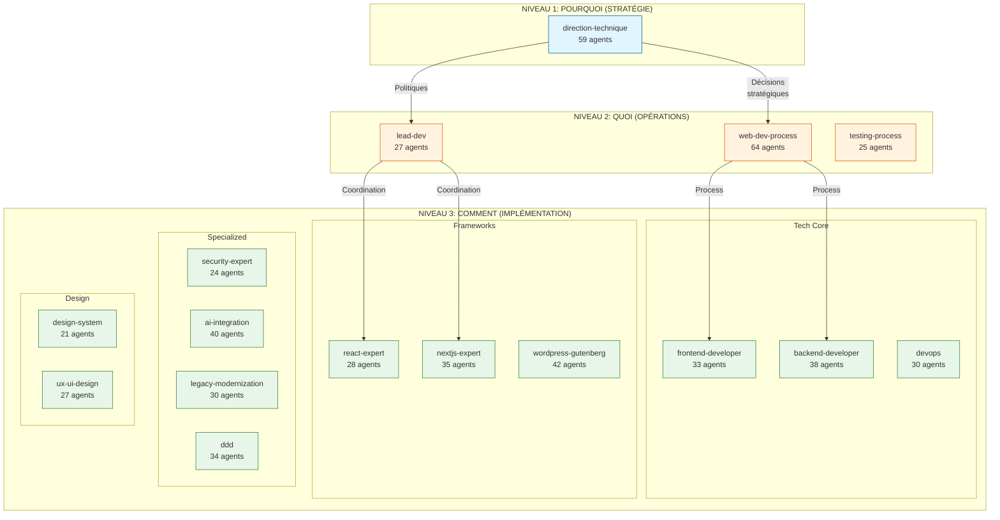

# Architecture des Skills Techniques

> Version 4.3.0 - 26 skills métier, ~965 agents

## Vue d'ensemble

## Statistiques

| Métrique | Valeur |
|----------|--------|
| **Total Skills Métier** | 26 |
| **Total Agents** | ~965 |
| **Niveau 2 (Stratégie)** | 3 skills (direction-*) |
| **Niveau 3 (Opérations)** | 4 skills |
| **Niveau 4 (Implémentation)** | 13 skills |
| **Niveau 4 (Support)** | 5 skills |
| **+ Orchestration** | task-orchestrator (16 agents) |

## Hiérarchie POURQUOI / QUOI / COMMENT

## Structure des Domaines (direction-technique)

### Détail par Domaine

| Domaine | Agents | Responsabilité |
|---------|--------|----------------|
| `avant-projet` | 5 | Cadrage technique initial |
| `specification` | 5 | Rédaction specs techniques |
| `architecture` | 6 | Conception et validation |
| `estimation` | 5 | Chiffrage et planning |
| `qualite` | 6 | Standards et code review |
| `securite` | 5 | OWASP, RGPD, secrets |
| `performance` | 5 | Optimisation et monitoring |
| `infrastructure` | 5 | CI/CD et déploiement |
| `communication` | 5 | Documentation et handoff |
| `support` | 5 | Debug et veille techno |

## Flux de Données

## Références

- [ADR-005: Frontières entre Skills](../.web-agency/orchestration-framework/docs/adr/005-skill-responsibility-boundaries.md)
- [SRP Analysis](./analysis/SRP-ANALYSIS.md)
- [Migration Guide](./analysis/MIGRATION.md)
- [Quick Start](./QUICK_START.md)
