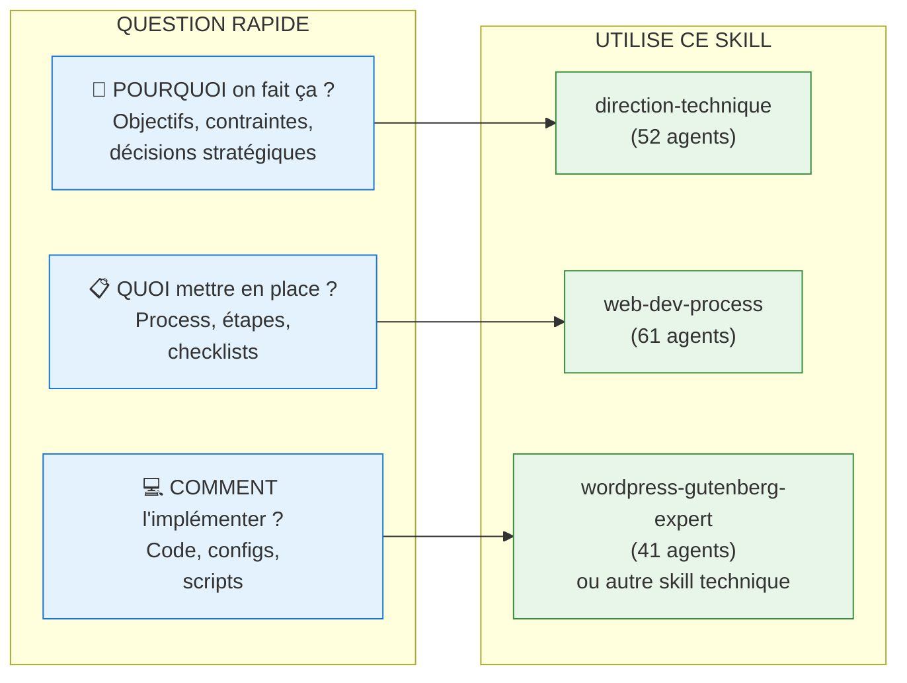

# Quick Start - Skills Techniques

Guide rapide pour comprendre et utiliser les skills techniques.

## Quel Skill Utiliser ?



## Exemples Concrets

| Je veux... | Skill | Agent |
|------------|-------|-------|
| Choisir une stack technique | `direction-technique` | `avant-projet/selection-stack` |
| Configurer CI/CD | `direction-technique` | `infrastructure/strategie-cicd` |
| Créer un block Gutenberg | `wordpress-gutenberg-expert` | `agents/blocks/*` |
| Faire une code review | `direction-technique` | `qualite/code-review` |
| Débugger un problème | `direction-technique` | `support/troubleshooting` |
| Setup env local WP | `wordpress-gutenberg-expert` | `agents/wp-env/*` |

## Le Modèle en 3 Niveaux

### Niveau 1 : POURQUOI (direction-technique)

**Ce qu'il fait :**
- Pose des questions pour clarifier le besoin
- Prend des décisions stratégiques
- Documente les ADRs (Architecture Decision Records)

**Ce qu'il NE fait PAS :**
- Écrire du code
- Configurer des outils
- Générer des fichiers

**Exemple de sortie :**
```markdown
## Décision : Stack Frontend

Après analyse :
- ✅ React + TypeScript (équipe formée)
- ❌ Vue.js (pas d'expertise interne)
- ❌ Angular (trop lourd pour le besoin)

Critères de succès : Build < 30s, Bundle < 200KB
```

### Niveau 2 : QUOI (web-dev-process)

**Ce qu'il fait :**
- Identifie le process standard applicable
- Adapte aux conventions de l'agence
- Gère les exceptions projet

**Les 3 couches :**
1. **Métier** : Process universel standard
2. **Agence** : Conventions et outils de l'agence
3. **Projet** : Exceptions spécifiques au projet

**Exemple de sortie :**
```markdown
## Process : Setup CI/CD

### Couche Métier
→ Process standard : Lint → Test → Build → Deploy

### Couche Agence
→ GitHub Actions obligatoire
→ Environments : staging + prod

### Couche Projet
→ Exception : Tests E2E désactivés (pas de budget)
```

### Niveau 3 : COMMENT (wordpress-*, design-system-*)

**Ce qu'il fait :**
- Génère du code fonctionnel
- Crée des configurations
- Produit des livrables testables

**Exemple de sortie :**
```yaml
# .github/workflows/ci.yml
name: CI
on: [push, pull_request]
jobs:
  build:
    runs-on: ubuntu-latest
    steps:
      - uses: actions/checkout@v4
      - run: npm ci
      - run: npm run lint
      - run: npm run build
```

## Règle d'Or

> **POURQUOI et QUOI ne contiennent JAMAIS de code.**
> Seul COMMENT produit des livrables techniques.

Cette règle (SRP - Single Responsibility Principle) garantit :
- Séparation des préoccupations
- Réutilisabilité des décisions
- Maintenance simplifiée

## Commandes de Test

```bash
# Dans .web-agency/skills/direction-technique/
npm test           # Tous les tests (dont SRP)
npm run test:srp   # Validation SRP uniquement
```

## Ressources

- [Architecture complète](./ARCHITECTURE.md)
- [ADR-005 : Frontières entre skills](../.web-agency/orchestration-framework/docs/adr/005-skill-responsibility-boundaries.md)
- [Guide de migration v3.0](./analysis/MIGRATION.md)
- [Analyse SRP](./analysis/SRP-ANALYSIS.md)
