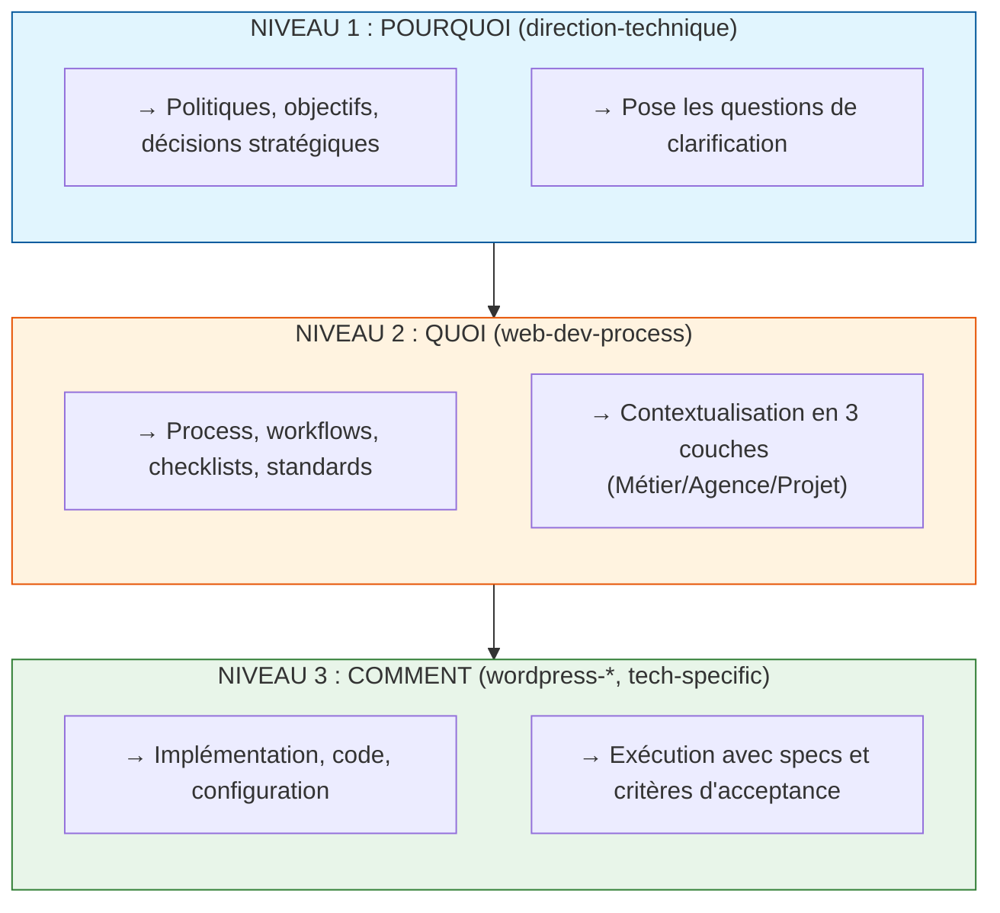

# Guide de Migration - Refactoring POURQUOI/QUOI/COMMENT

Ce document décrit les changements apportés lors du refactoring SRP (Single Responsibility Principle) utilisant le modèle POURQUOI/QUOI/COMMENT.

## Résumé des Changements

### Architecture à 3 Niveaux



---

## Fichiers Modifiés

### Niveau POURQUOI (direction-technique)

| Fichier | Changement | Impact |
|---------|------------|--------|
| `securite/securite-applicative.md` | **Code supprimé** (~250 lignes TS/PHP) | Ne contient plus que les politiques OWASP et standards |
| `infrastructure/environnements.md` | **Code supprimé** (Docker, TypeScript) | Ne contient plus que les politiques d'environnement |
| `qualite/code-review.md` | Frontmatter aligné | `name: code-review` (était `code-review-policy`) |
| `specification/modelisation-donnees.md` | **Code supprimé** (SQL, migrations) | Ne contient plus que les critères de décision |

### Niveau QUOI (web-dev-process)

| Fichier | Changement | Impact |
|---------|------------|--------|
| `SKILL.md` | Clarification du rôle | Explicite : QUOI seulement (pas POURQUOI) |
| `agents/design/data-modeling.md` | **Refactoré** | 3 couches : Métier/Agence/Projet |

---

## Nouveaux Fichiers Créés

### Agents de Clarification (POURQUOI)

| Fichier | Rôle |
|---------|------|
| `direction-technique/specification/clarification-donnees.md` | Framework de questions pour besoins data |
| `direction-technique/specification/clarification-composant.md` | Framework de questions pour UI/composants |

### Agents de Mapping (QUOI)

| Fichier | Rôle |
|---------|------|
| `web-dev-process/agents/design/wordpress-data-mapping.md` | Mapping entités métier → structures WordPress |
| `web-dev-process/agents/design/gutenberg-block-mapping.md` | Mapping composants UI → blocks Gutenberg |

### Workflows

| Fichier | Rôle |
|---------|------|
| `web-agency/workflows/setup-local-wordpress.md` | Workflow complet setup local WordPress |

### Templates

| Fichier | Rôle |
|---------|------|
| `web-agency/templates/agent-pourquoi.md` | Template pour créer agents POURQUOI |
| `web-agency/templates/agent-quoi.md` | Template pour créer agents QUOI |
| `web-agency/templates/agent-comment.md` | Template pour créer agents COMMENT |

### Documentation

| Fichier | Rôle |
|---------|------|
| `web-agency/docs/adr/005-skill-responsibility-boundaries.md` | ADR v2.0 du modèle |
| `docs/analysis/SRP-ANALYSIS.md` | Analyse de conformité |

---

## Breaking Changes

### 1. Code Déplacé

Le code d'implémentation a été **supprimé** des agents POURQUOI. Si vous utilisiez ces agents pour du code :

| Ancien Emplacement | Nouveau Emplacement |
|--------------------|---------------------|
| `securite-applicative.md` (code TypeScript CSRF, bcrypt) | `wordpress-gutenberg-expert/agents/wp-core/security-validation` (WP) ou agents setup du niveau COMMENT |
| `environnements.md` (Docker, Makefile) | `web-dev-process/agents/setup/docker.md` |
| `modelisation-donnees.md` (SQL, migrations) | `wordpress-gutenberg-expert/agents/data-modeling/*` |

### 2. Références à Mettre à Jour

Si vos workflows référencent ces agents pour du code, mettez à jour :

```markdown
# Avant (incorrect)
Pour implémenter CSRF : voir `direction-technique/securite/securite-applicative.md`

# Après (correct)
Pour les politiques CSRF : voir `direction-technique/securite/securite-applicative.md`
Pour l'implémentation CSRF : voir `wordpress-gutenberg-expert/agents/wp-core/security-validation`
```

---

## Comment Utiliser le Nouveau Modèle

### Exemple : Créer un CPT Formation

```
1. POURQUOI (clarification-donnees.md)
   → Questions : Quelles entités ? Quels attributs ? Relations ?
   → Output : Décisions documentées

2. QUOI (wordpress-data-mapping.md)
   → Mapping : Formation → register_post_type('formation')
   → Contextualisé : Métier → Agence → Projet

3. COMMENT (wordpress-gutenberg-expert/agents/*)
   → Code : register_post_type() avec specs exactes
   → Tests, critères d'acceptance
```

### Exemple : Créer un Slider de Cards

```
1. POURQUOI (clarification-composant.md)
   → Questions : Source ? Contenu cards ? Interactions ?
   → Output : Synthèse composant

2. QUOI (gutenberg-block-mapping.md)
   → Mapping : Slider → Block dynamique + Swiper.js
   → Contextualisé : Métier → Agence → Projet

3. COMMENT (wordpress-gutenberg-expert/agents/blocks/*)
   → Code : block.json, edit.js, render.php, view.js
   → Tests, critères d'acceptance
```

---

## Checklist de Migration

### Pour les Workflows Existants

- [ ] Vérifier que les références aux agents POURQUOI ne s'attendent pas à du code
- [ ] Ajouter les étapes de clarification (POURQUOI) si manquantes
- [ ] Ajouter les étapes de mapping (QUOI) si manquantes
- [ ] S'assurer que le code est délégué au niveau COMMENT

### Pour les Nouveaux Agents

- [ ] Utiliser le template approprié (`templates/agent-*.md`)
- [ ] Respecter la séparation POURQUOI/QUOI/COMMENT
- [ ] Ajouter les références croisées vers les autres niveaux
- [ ] Documenter dans le frontmatter le niveau (`Niveau POURQUOI/QUOI/COMMENT`)

---

## Référence Rapide

| Question | Niveau | Skill |
|----------|--------|-------|
| "Pourquoi fait-on ça ?" | POURQUOI | `direction-technique` |
| "Quelle est la politique ?" | POURQUOI | `direction-technique` |
| "Quel process suivre ?" | QUOI | `web-dev-process` |
| "Quelles sont les étapes ?" | QUOI | `web-dev-process` |
| "Comment coder ça ?" | COMMENT | `wordpress-*`, `react-*`, etc. |
| "Quel code utiliser ?" | COMMENT | Skills technologiques |

---

## Fichiers Refactorés (Phase 1)

Les fichiers suivants ont été refactorés pour respecter le SRP :

| Fichier | Avant | Après |
|---------|-------|-------|
| `securite/securite-applicative.md` | ~250 lignes TS/PHP | Politiques OWASP uniquement |
| `architecture/architecture-systeme.md` | Docker/K8s YAML | Politiques et critères de décision |
| `performance/optimisation-frontend.md` | Code TS/CSS/HTML | Objectifs et standards Core Web Vitals |
| `performance/optimisation-backend.md` | Code SQL/TS | Objectifs et politiques de performance |
| `infrastructure/environnements.md` | Docker/TypeScript | Politiques d'environnement |
| `specification/modelisation-donnees.md` | SQL/migrations | Critères de décision |

---

## Fichiers Refactorés (Phase 2) ✅

Tous les fichiers ont été refactorés pour respecter le SRP. Phase 2 terminée.

### Fichiers Refactorés

| Fichier | Code Supprimé | Contenu Préservé |
|---------|---------------|------------------|
| `architecture/patterns-design.md` | 9 blocks TypeScript | Critères de choix, principes SOLID |
| `securite/conformite-rgpd.md` | 5 blocks TypeScript | Politiques RGPD, droits, procédures |
| `securite/gestion-secrets.md` | 4 blocks TS/PHP | Politiques de rotation, stockage |
| `specification/specification-api.md` | Code JS + bash | Standards REST, versioning |
| `specification/specification-technique.md` | 1 block SQL | Standards de spécification |
| `qualite/conventions-code.md` | 2 blocks TS/PHP | Conventions de nommage, structure |
| `performance/monitoring-perf.md` | 6 blocks TS/YAML/PromQL | Golden Signals, seuils d'alerte |
| `infrastructure/strategie-deploiement.md` | 7 blocks TS/K8s/Bash | Stratégies, critères de choix |
| `infrastructure/architecture-infra.md` | 3 blocks HCL/TS/K8s | Patterns, bonnes pratiques |
| `architecture/architecture-applicative.md` | Template TypeScript | Critères de choix, standards |

### Validation

Exécutez le script de validation pour vérifier la conformité :

```bash
cd .web-agency/skills/direction-technique
npm run test:srp
```

Résultat attendu : **36 passed, 0 failed**

---

## Notices de Dépréciation

### Code Déplacé - Références

Si vous utilisiez les agents POURQUOI pour du code d'implémentation, voici les nouvelles références :

| Ancien Usage | Nouveau Emplacement | Notes |
|--------------|---------------------|-------|
| Code CSRF dans `securite-applicative.md` | `wordpress-gutenberg-expert/agents/wp-core/security-validation` | Spécifique WordPress |
| Code bcrypt/hashage | `web-dev-process/agents/testing/security` | Process générique |
| Config Docker | `web-dev-process/agents/setup/docker` | Process de setup |
| Manifests K8s | Skills DevOps spécialisés | À créer si nécessaire |
| Requêtes SQL | `wordpress-gutenberg-expert/agents/data-modeling/*` | Spécifique WordPress |
| Code TypeScript backend | Skills Node.js spécialisés | À créer si nécessaire |

### Pattern de Migration

Pour chaque fichier POURQUOI contenant du code :

1. **Identifier le code** : Repérer les blocks ```typescript```, ```php```, etc.
2. **Extraire les politiques** : Garder uniquement les règles, critères, objectifs
3. **Créer les références** : Pointer vers les agents QUOI/COMMENT appropriés
4. **Valider** : Exécuter `npm run test:srp`

---

## Support

Pour toute question sur cette migration :

1. Consulter `docs/adr/005-skill-responsibility-boundaries.md`
2. Consulter `docs/analysis/SRP-ANALYSIS.md`
3. Utiliser les templates dans `web-agency/templates/`
4. Exécuter `npm run test:srp` pour valider la conformité
