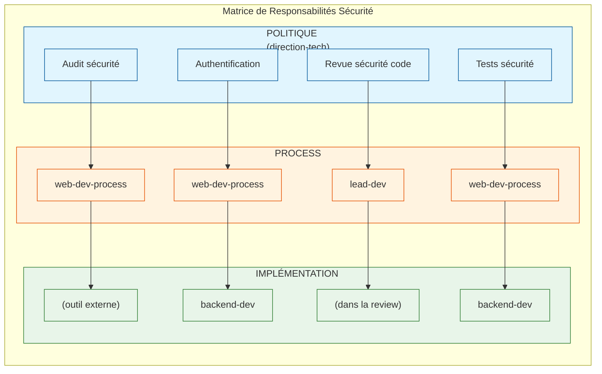

# Revue Critique du Découpage des Concerns

> **Date** : 2025-12-27
> **Auteur** : Claude Code
> **Version** : 1.0.0

## Executive Summary

Cette analyse identifie **7 problèmes majeurs** dans le découpage actuel des skills et propose des recommandations concrètes pour clarifier les responsabilités.

---

## 1. Chevauchements de Responsabilités Identifiés

### 1.1 Code Review : 3 endroits différents

| Skill | Agents | Focus déclaré |
|-------|--------|---------------|
| `direction-technique/qualite/code-review` | 1 | Process de code review (politique) |
| `lead-dev/code-review/*` | 6 | Revue de code opérationnelle |
| `web-dev-process/development/code-review` | 1 | Pratiques de revue de code |

**Problème** : Un développeur cherchant de l'aide sur une code review ne sait pas vers quel skill se tourner.

**Recommandation** :
- `direction-technique` → **Politique** uniquement (qui review, quand, critères d'approbation)
- `web-dev-process` → **Process** (checklist, étapes, workflow)
- `lead-dev` → **Exécution** (faire la review, donner du feedback)

### 1.2 Performance : 5 endroits différents

| Skill | Agent(s) | Focus |
|-------|----------|-------|
| `direction-technique/performance/*` | 5 | Stratégie performance |
| `frontend-developer/performance/*` | 3 | Core Web Vitals, bundle |
| `nextjs-expert/optimization/*` | 5 | next/image, next/font |
| `backend-developer/performance/*` | 5 | Caching, profiling |
| `web-dev-process/testing/performance` | 1 | Tests de performance |

**Problème** : Fragmentation excessive. Les frontières ne sont pas claires.

**Recommandation** :
- Consolider autour de 3 niveaux clairs :
  1. **Politique** (direction-technique) : budgets, SLOs, décisions
  2. **Process** (web-dev-process) : comment mesurer, quand auditer
  3. **Implémentation** (skills techniques) : code d'optimisation

### 1.3 Sécurité : 4 endroits différents

| Skill | Agent(s) | Focus |
|-------|----------|-------|
| `direction-technique/securite/*` | 5 | Politique sécurité |
| `backend-developer/auth-security/*` | 5 | Implémentation auth |
| `web-dev-process/testing/security/*` | 2 | Tests de sécurité |
| `lead-dev/code-review/security-review` | 1 | Revue sécurité |

**Recommandation** : Créer une matrice claire :



| Concern | POLITIQUE | PROCESS | IMPLÉMENTATION |
|---------|-----------|---------|----------------|
| Audit sécurité | direction-tech | web-dev-process | (outil externe) |
| Authentification | direction-tech | web-dev-process | backend-dev |
| Revue sécurité code | direction-tech | lead-dev | (dans la review) |
| Tests sécurité | direction-tech | web-dev-process | backend-dev |

### 1.4 CI/CD & Déploiement : 4 endroits différents

| Skill | Agent(s) | Focus |
|-------|----------|-------|
| `direction-technique/infrastructure/*` | 5 | Stratégie infra/CI |
| `web-dev-process/setup/cicd/*` | 3 | Principes CI/CD |
| `web-dev-process/deployment/*` | 4 | Process déploiement |
| `backend-developer/devops/*` | 6 | Implémentation DevOps |
| `nextjs-expert/deployment/*` | 5 | Deploy Next.js |
| `lead-dev/delivery/*` | 6 | Process release |

**Problème** : C'est le domaine le plus fragmenté avec le moins de clarté.

---

## 2. Incohérence de la Hiérarchie

### 2.1 Position floue de lead-dev

Le diagramme actuel montre :

```
NIVEAU 1 : POURQUOI (direction-technique)
NIVEAU INTERMÉDIAIRE : COORDINATION (lead-dev)  ← Problème ici
NIVEAU 2 : QUOI (web-dev-process)
NIVEAU 3 : COMMENT (frontend-dev, backend-dev)
```

**Problème** : Si lead-dev est "intermédiaire", alors web-dev-process devrait être au niveau 3. Or web-dev-process est explicitement niveau 2.

**Recommandation** : Clarifier la hiérarchie :

```
NIVEAU 0 : ORCHESTRATION (web-agency)
NIVEAU 1 : STRATÉGIE (direction-technique)
NIVEAU 2 : PROCESSUS (web-dev-process) + COORDINATION (lead-dev)
NIVEAU 3 : IMPLÉMENTATION (frontend-dev, backend-dev, react-expert, etc.)
```

### 2.2 Délégation ambiguë

- `frontend-developer` délègue vers `react-expert`, `nextjs-expert`, `wordpress-gutenberg-expert`
- Mais ces skills sont au même niveau (COMMENT)

**Question** : Si ce sont des délégations, pourquoi ne pas les intégrer directement ?

**Recommandation** : Deux options :
1. **Fusion** : Intégrer react-expert et nextjs-expert dans frontend-developer comme sous-domaines
2. **Clarification** : Renommer la relation "référence croisée" plutôt que "délégation"

---

## 3. Incohérence Structurelle

### 3.1 Pattern de structure non uniforme

| Skill | Structure | Problème |
|-------|-----------|----------|
| `backend-developer` | `agents/{domain}/` | ✅ Cohérent |
| `direction-technique` | `agents/{domain}/` | ✅ Cohérent |
| `frontend-developer` | `agents/{domain}/` | ✅ Cohérent |
| `nextjs-expert` | `{domain}/` (pas de `agents/`) | ❌ Incohérent |
| `lead-dev` | `{domain}/` (pas de `agents/`) | ❌ Incohérent |
| `react-expert` | `{domain}/` (pas de `agents/`) | ❌ Incohérent |

**Recommandation** : Uniformiser sur un seul pattern. Le pattern avec `agents/` est plus explicite.

### 3.2 Nommage des skills non homogène

| Pattern | Exemples |
|---------|----------|
| `{role}-{expertise}` | frontend-developer, backend-developer |
| `{techno}-expert` | react-expert, nextjs-expert |
| `{nom-composé}` | direction-technique, lead-dev, web-dev-process |
| `{simple}` | strategy, design, content, marketing |

**Recommandation** : Adopter une convention unique.

---

## 4. Skills Fantômes (Planned mais non implémentés)

Les skills suivants sont référencés mais non implémentés :

| Skill | Statut | Impact |
|-------|--------|--------|
| `strategy` | Planned | Référencé dans web-agency |
| `design` | Planned | Référencé dans web-agency |
| `content` | Planned | Référencé dans web-agency |
| `marketing` | Planned | Référencé dans web-agency |

**Problème** : Ces skills sont listés dans l'orchestrateur mais ne peuvent pas être invoqués.

**Recommandation** :
- Soit les implémenter
- Soit les retirer des références et de l'orchestrateur

---

## 5. Redondance Conceptuelle

### 5.1 Testing dans trop de skills

| Skill | Agents Testing |
|-------|----------------|
| `frontend-developer/testing/*` | 4 agents |
| `react-expert/testing/*` | 4 agents |
| `nextjs-expert/testing/*` | 5 agents |
| `backend-developer/testing/*` | 5 agents |
| `web-dev-process/testing/*` | 8 agents |

**Total** : 26 agents sur le testing !

**Recommandation** :
- `web-dev-process/testing` → Principes et stratégie (QUOI tester)
- Skills techniques → Seulement le code de test spécifique à la techno

### 5.2 Documentation dispersée

| Skill | Agents Documentation |
|-------|---------------------|
| `direction-technique/communication/documentation-technique` | 1 |
| `web-dev-process/development/documentation/*` | 3 |
| Chaque skill a son SKILL.md | 15 |

**Recommandation** : Centraliser la doctrine sur la documentation dans un seul endroit.

---

## 6. Problèmes de Routage

### 6.1 Mots-clés ambigus

| Mot-clé | Skills qui le revendiquent |
|---------|---------------------------|
| "architecture" | direction-technique, web-dev-process, backend-developer |
| "performance" | direction-technique, frontend-developer, backend-developer, nextjs-expert |
| "deploy" | direction-technique, web-dev-process, lead-dev, backend-developer, nextjs-expert |
| "test" | Tous les skills techniques |
| "security" | direction-technique, backend-developer, web-dev-process, lead-dev |

**Problème** : Impossible de router sans contexte additionnel.

### 6.2 Pas de règle de priorité globale

Chaque skill définit ses propres règles de routage, mais il n'existe pas de règle globale pour arbitrer entre skills.

**Recommandation** : Créer une matrice de routage globale dans `web-agency`.

---

## 7. Recommandations Synthétiques

### 7.1 Court terme (Quick Wins)

| Action | Effort | Impact |
|--------|--------|--------|
| Uniformiser la structure des dossiers (`agents/`) | Faible | Moyen |
| Documenter la matrice de routage globale | Moyen | Élevé |
| Supprimer les skills "planned" des références | Faible | Faible |

### 7.2 Moyen terme (Refactoring ciblé)

| Action | Effort | Impact |
|--------|--------|--------|
| Créer un skill `testing-process` dédié | Moyen | Élevé |
| Consolider le CI/CD/Deploy dans un seul chemin | Élevé | Élevé |
| Clarifier la hiérarchie lead-dev / web-dev-process | Moyen | Élevé |

### 7.3 Long terme (Vision)

| Action | Effort | Impact |
|--------|--------|--------|
| Fusionner react-expert et nextjs-expert dans frontend-developer | Élevé | Moyen |
| Créer un skill `devops` autonome | Élevé | Élevé |
| Implémenter les skills manquants (strategy, design, etc.) | Très élevé | Élevé |

---

## 8. Proposition de Nouvelle Architecture

### 8.1 Hiérarchie clarifiée

```
┌─────────────────────────────────────────────────────────────────────────────┐
│ NIVEAU 0 : ORCHESTRATION                                                     │
│   web-agency → Routage vers le bon skill                                    │
├─────────────────────────────────────────────────────────────────────────────┤
│ NIVEAU 1 : STRATÉGIE (POURQUOI)                                             │
│   direction-technique → Décisions, politiques, standards                     │
├─────────────────────────────────────────────────────────────────────────────┤
│ NIVEAU 2 : PROCESSUS & COORDINATION (QUOI + QUI)                            │
│   web-dev-process → Workflows, checklists, phases                           │
│   lead-dev → Coordination équipe, reviews, delivery                         │
│   project-management → Gestion projet, client                               │
├─────────────────────────────────────────────────────────────────────────────┤
│ NIVEAU 3 : IMPLÉMENTATION (COMMENT)                                         │
│   ┌─────────────────────────────────────────────────────────────────────┐   │
│   │ FRONTEND                      │ BACKEND        │ DESIGN             │   │
│   │ ├── foundations (HTML/CSS)    │ ├── api        │ ├── foundations    │   │
│   │ ├── javascript                │ ├── database   │ ├── atoms          │   │
│   │ ├── react (absorbé)           │ ├── auth       │ ├── molecules      │   │
│   │ ├── nextjs (absorbé)          │ ├── architecture│├── templates      │   │
│   │ ├── vue                       │ ├── performance │                    │   │
│   │ ├── wordpress (réf croisée)   │ ├── testing    │                    │   │
│   │ └── styling                   │ └── devops     │                    │   │
│   └─────────────────────────────────────────────────────────────────────┘   │
├─────────────────────────────────────────────────────────────────────────────┤
│ NIVEAU 4 : SPÉCIALISATIONS (SI NÉCESSAIRE)                                  │
│   wordpress-gutenberg-expert → Trop spécifique pour être absorbé            │
└─────────────────────────────────────────────────────────────────────────────┘
```

### 8.2 Matrice de responsabilité (RACI simplifié)

| Concern | Décide | Définit Process | Exécute |
|---------|--------|-----------------|---------|
| Stack technique | direction-technique | - | - |
| Code review | direction-technique | web-dev-process | lead-dev |
| Testing | direction-technique | web-dev-process | skills techniques |
| CI/CD | direction-technique | web-dev-process | backend-developer |
| Performance | direction-technique | web-dev-process | skills techniques |
| Sécurité | direction-technique | web-dev-process | backend-developer |
| Deploy | direction-technique | lead-dev | skills techniques |

---

## 9. Prochaines Étapes

1. **Valider** cette analyse avec l'équipe
2. **Prioriser** les actions à mener
3. **Créer** des tickets pour chaque action
4. **Mettre à jour** les SKILL.md concernés
5. **Tester** les nouveaux routages

---

## Annexe : Métriques Actuelles

| Métrique | Valeur |
|----------|--------|
| Nombre total de skills | 15 |
| Skills actifs | 11 |
| Skills planned | 4 |
| Nombre total d'agents | ~360 |
| Agents avec chevauchement | ~50 (estimation) |
| Tests de validation | 60+ |
