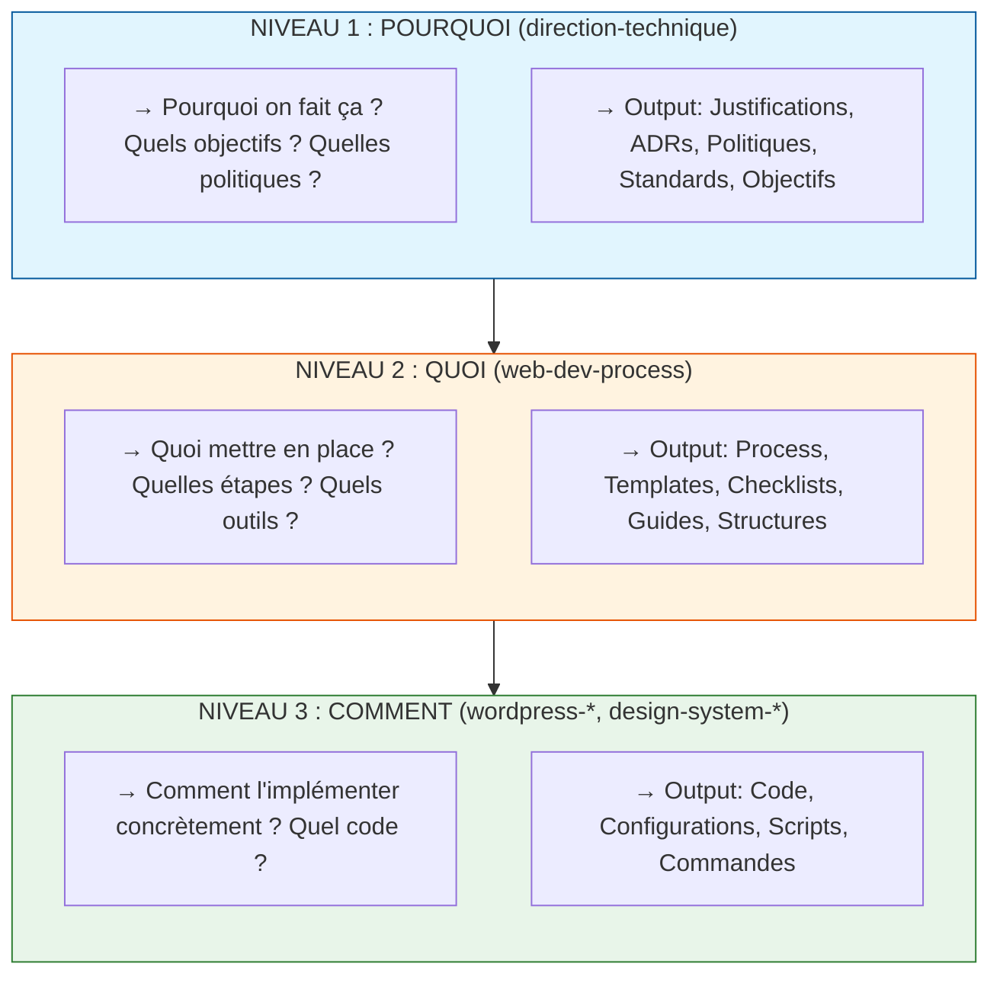

# Analyse SRP (Single Responsibility Principle) des Skills

**Date** : 2024-12-23
**Version** : 2.0
**Auteur** : Claude (Analyse automatisée)

---

## 🔴 NOUVELLE ANALYSE v2.0 : Prisme POURQUOI / QUOI / COMMENT

Cette section analyse chaque skill à travers la grille de lecture établie par ADR-005.

### Rappel du Framework



---

### ⚠️ VIOLATIONS CRITIQUES IDENTIFIÉES

#### 1. direction-technique (Niveau POURQUOI) - Contient du COMMENT

| Agent | Contenu problématique | Devrait contenir |
|-------|----------------------|------------------|
| `securite/securite-applicative.md` | ~250 lignes de CODE TypeScript, PHP (validation, CSRF, sanitization) | POURQUOI la sécurité est critique, QUELS objectifs OWASP viser |
| `architecture/architecture-systeme.md` | Configs Docker-compose YAML, Kubernetes YAML | POURQUOI cette topologie, QUELS SLA viser |
| `performance/optimisation-frontend.md` | Probablement du code d'optimisation | POURQUOI optimiser (Core Web Vitals), QUELS seuils définir |
| `performance/optimisation-backend.md` | Probablement du code d'optimisation | POURQUOI la latence compte, QUELS SLOs définir |

**Exemple concret - `securite-applicative.md` :**
```typescript
// ACTUELLEMENT PRÉSENT (niveau COMMENT) ❌
const passwordSchema = z.string()
  .min(12, 'Minimum 12 caractères')
  .regex(/[A-Z]/, 'Au moins une majuscule');

// DEVRAIT ÊTRE (niveau POURQUOI) ✅
## Politique de Mot de Passe

| Critère | Standard | Justification |
|---------|----------|---------------|
| Longueur min | 12 caractères | NIST SP 800-63B recommandation |
| Complexité | Majuscule + minuscule + chiffre | Entropie suffisante |

→ Implémentation : Voir `web-dev-process/testing/security`
```

#### 2. web-dev-process (Niveau QUOI) - Contient du COMMENT

| Agent | Contenu problématique | Devrait contenir |
|-------|----------------------|------------------|
| `testing/security.md` | ~50 lignes de CODE TypeScript (tests injection, auth) | QUOI tester (OWASP Top 10), QUELS outils utiliser |

**Exemple concret - `testing/security.md` :**
```typescript
// ACTUELLEMENT PRÉSENT (niveau COMMENT) ❌
const payloads = [
  "'; DROP TABLE users; --",
  '<script>alert("XSS")</script>',
];

// DEVRAIT ÊTRE (niveau QUOI) ✅
## Tests de Sécurité à Implémenter

| Catégorie OWASP | Test | Outil recommandé |
|-----------------|------|------------------|
| A03 - Injection | Payloads SQL/XSS | Semgrep, OWASP ZAP |
| A07 - Auth | Rate limiting | Custom tests |

→ Code concret : Voir `wordpress-*/testing/` ou créer agent spécifique
```

#### 3. Incohérence dans web-dev-process/SKILL.md

**Problème :**
Le SKILL.md de web-dev-process déclare :
> "Ce skill définit le **QUOI** et le **POURQUOI** de chaque phase"

Mais selon ADR-005, il devrait UNIQUEMENT faire du QUOI.
Le POURQUOI appartient à direction-technique.

---

### ✅ CONFORMITÉS CONSTATÉES

| Skill | Niveau Attendu | Conformité | Notes |
|-------|---------------|------------|-------|
| `wordpress-gutenberg-expert/tooling/cicd-pipelines.md` | COMMENT | ✅ 100% | Code YAML complet, scripts bash |
| `direction-technique/qualite/code-review.md` | POURQUOI | ✅ 95% | Politiques d'approbation, délais (post-refactoring) |
| `direction-technique/infrastructure/strategie-cicd.md` | POURQUOI | ✅ 90% | Quality gates, objectifs DORA (post-refactoring) |
| `web-dev-process/agents/setup/cicd.md` | QUOI | ✅ 85% | Structure pipeline, étapes, bonnes pratiques |
| `web-dev-process/agents/design/architecture.md` | QUOI | ✅ 90% | Patterns, structures, critères de choix (pas de code) |

---

### 📊 Matrice de Conformité par Domaine

| Domaine | POURQUOI (direction-technique) | QUOI (web-dev-process) | COMMENT (wordpress-*) |
|---------|-------------------------------|----------------------|----------------------|
| **CI/CD** | ✅ strategie-cicd refactoré | ✅ setup/cicd générique | ✅ cicd-pipelines code |
| **Code Review** | ✅ policies uniquement | ✅ process complet | N/A |
| **Sécurité** | ❌ securite-applicative = CODE | ⚠️ testing/security = CODE | À créer |
| **Architecture** | ⚠️ architecture-systeme = YAML | ✅ design/architecture | Spécifique WP OK |
| **Performance** | ⚠️ Probablement CODE | À vérifier | À créer si besoin |

---

### 🔧 Actions Correctives Recommandées

#### Haute Priorité

1. **Refactorer `direction-technique/securite/securite-applicative.md`**
   - Supprimer tout le code TypeScript/PHP
   - Garder uniquement : politiques OWASP, objectifs sécurité, standards
   - Créer références vers `web-dev-process/testing/security` pour le QUOI

2. **Refactorer `direction-technique/architecture/architecture-systeme.md`**
   - Supprimer les configs Docker/Kubernetes YAML
   - Garder : justifications architecturales, SLA, topologies (diagrammes ASCII OK)
   - Créer références vers `web-dev-process` ou skills d'implémentation

3. **Corriger `web-dev-process/SKILL.md`**
   - Supprimer "POURQUOI" de la description
   - Garder uniquement "Ce skill définit le **QUOI** de chaque phase"

4. **Refactorer `web-dev-process/testing/security.md`**
   - Supprimer le code TypeScript des payloads
   - Garder : checklists OWASP, outils recommandés, workflow de test
   - Le code concret devrait être dans un skill d'implémentation

#### Moyenne Priorité

5. **Auditer `direction-technique/performance/`**
   - Vérifier si optimisation-frontend/backend contiennent du code
   - Si oui, extraire vers web-dev-process ou skill d'implémentation

6. **Créer skill ou domaine pour le code sécurité générique**
   - Option A : `web-dev-process/agents/security/` (agents de process)
   - Option B : Laisser dans les skills d'implémentation (WordPress, React, etc.)

---

### 📐 Règle de Validation

Pour chaque agent, appliquer ce test :

```markdown
## Test POURQUOI/QUOI/COMMENT

1. L'agent contient-il du CODE (TypeScript, PHP, YAML, bash) ?
   - Si Niveau 1 (POURQUOI) → ❌ VIOLATION
   - Si Niveau 2 (QUOI) → ⚠️ À ÉVALUER
   - Si Niveau 3 (COMMENT) → ✅ CONFORME

2. L'agent répond-il à quelle question ?
   - "Pourquoi faire X ?" → Niveau 1
   - "Quoi mettre en place ?" → Niveau 2
   - "Comment coder X ?" → Niveau 3

3. Quel est l'OUTPUT principal ?
   - Politiques, standards, objectifs → Niveau 1
   - Process, templates, checklists → Niveau 2
   - Code, configs, scripts → Niveau 3
```

---

---

## Executive Summary

Cette analyse évalue la conformité au **Single Responsibility Principle (SRP)** de l'ensemble des skills du repository. Le SRP stipule qu'un module devrait avoir une et une seule raison de changer.

### Verdict Global

| Catégorie | Nombre | % |
|-----------|--------|---|
| ✅ Excellent SRP | 4 skills | 33% |
| 🟡 Bon SRP (améliorations possibles) | 4 skills | 33% |
| 🔴 SRP à revoir | 4 skills | 33% |

---

## Matrice d'Évaluation SRP

### Critères d'Évaluation

| Critère | Description | Poids |
|---------|-------------|-------|
| **Responsabilité unique** | L'agent fait UNE seule chose | 30% |
| **Délégation explicite** | Les handoffs sont clairs | 20% |
| **Taille du prompt** | < 150 lignes idéal, > 300 = alerte | 15% |
| **Chevauchement** | Pas de duplication avec d'autres agents | 20% |
| **Testabilité** | Comportement vérifiable isolément | 15% |

---

## 1. Skills à Excellent SRP ✅

### 1.1 `design-system-foundations`

**Score SRP : 95/100**

```
FORCES
├── Architecture Atomic Design = SRP naturel
├── Agents ultra-focalisés (colors.md = JUSTE les couleurs)
├── Hiérarchie claire : Foundations → Atoms → Molecules → Templates
├── Pas de chevauchement entre agents
└── Chaque agent = 80-150 lignes (taille idéale)

STRUCTURE
├── foundations/colors.md      → Palettes SEULEMENT
├── foundations/typography.md  → Typo SEULEMENT
├── foundations/spacing.md     → Espacement SEULEMENT
├── atoms/buttons.md           → Boutons SEULEMENT
└── molecules/forms.md         → Formulaires SEULEMENT
```

**Pourquoi c'est excellent :**
- L'Atomic Design impose naturellement le SRP
- Un agent `buttons.md` ne parle JAMAIS de formulaires
- Chaque niveau est testable indépendamment
- Les tokens sont la "single source of truth"

---

### 1.2 `web-dev-process` (post-refactoring v1.1.0)

**Score SRP : 90/100**

```
FORCES
├── Refactoring SRP documenté dans CHANGELOG
├── 8 agents "volumineux" → 26 agents focalisés
├── Séparation QUOI (principes) vs COMMENT (implémentation)
└── Orchestrateurs par phase (setup, testing, etc.)

EXEMPLES DE BON SRP
├── setup/linting.md         → ESLint/Stylelint SEULEMENT
├── setup/formatting.md      → Prettier SEULEMENT
├── setup/git-hooks.md       → Husky/Lefthook SEULEMENT
└── setup/commit-conventions.md → Commitlint SEULEMENT
```

**Ce qui a été amélioré (v1.1.0) :**
```
AVANT (SRP faible)           APRÈS (SRP fort)
quality-tools.md      →      linting.md
(ESLint + Prettier +         formatting.md
Husky + Commitlint)          git-hooks.md
                             commit-conventions.md
```

**Point d'amélioration restant :**
- L'orchestrateur `quality-tools.md` pourrait être renommé `quality-orchestrator.md` pour clarifier son rôle

---

### 1.3 `project-management/communication`

**Score SRP : 92/100**

```
STRUCTURE EXEMPLAIRE
├── email-demande-validation.md   → UN type d'email
├── email-relance.md              → UN type d'email
├── email-annonce-livraison.md    → UN type d'email
├── email-annonce-retard.md       → UN type d'email
├── email-demande-information.md  → UN type d'email
└── compte-rendu.md               → UN type de document
```

**Pourquoi c'est excellent :**
- Chaque agent = UN artefact de communication
- Ultra-spécifique = comportement prévisible
- Réutilisable : `email-relance` peut être invoqué seul
- Aucune ambiguïté sur quel agent utiliser

---

### 1.4 `project-management/avant-projet`

**Score SRP : 88/100**

```
AGENTS BIEN DÉLIMITÉS
├── collecte-besoin.md        → EXTRAIRE (pas structurer)
├── formalisation-brief.md    → STRUCTURER (pas extraire)
├── questions-clarification.md → QUESTIONNER
├── chiffrage.md              → ESTIMER
└── redaction-proposition.md  → RÉDIGER
```

**Point fort notable :**
L'agent `collecte-besoin.md` déclare explicitement ce qu'il NE FAIT PAS :
```markdown
Tu NE fais PAS :
- La structuration du brief (→ formalisation-brief)
- Les questions de clarification (→ questions-clarification)
- L'estimation (→ chiffrage)
```

---

## 2. Skills à Bon SRP (améliorables) 🟡

### 2.1 `direction-technique`

**Score SRP : 75/100**

```
FORCES
├── 10 domaines thématiques bien séparés
├── 52 agents spécialisés
└── Règles de routage détaillées

FAIBLESSES
├── Responsabilité trop large au niveau SKILL
│   → Pilotage stratégique + qualité + sécu + perf + infra
├── Chevauchement avec web-dev-process
│   → Qui gère CI/CD ? direction-technique/infrastructure ou web-dev-process/setup ?
└── Orchestration de 2 skills (web-dev-process + wordpress)
    → Devrait être au niveau web-agency, pas direction-technique
```

**Problème de chevauchement :**
```
direction-technique/infrastructure/strategie-cicd.md
        vs
web-dev-process/agents/setup/cicd.md
        vs
wordpress-gutenberg-expert/agents/tooling/cicd-pipelines.md

→ 3 agents parlent de CI/CD !
```

**Recommandation :**
1. Extraire `infrastructure/` en skill autonome
2. Clarifier : direction-technique = STRATÉGIE, web-dev-process = IMPLÉMENTATION
3. Déplacer l'orchestration de web-dev-process/wordpress vers web-agency

---

### 2.2 `wordpress-gutenberg-expert`

**Score SRP : 72/100**

```
FORCES
├── Agents WP Core bien séparés (CPT, taxonomies, hooks, security)
├── Agents Gutenberg focalisés
└── Documentation des combinaisons multi-agents

FAIBLESSES
├── Tooling trop large (12 agents)
│   → Mélange repo, CI/CD, deploy, local, staging
├── Agents "standalone" mal placés
│   → wp-rest-api-expert, seo-expert, accessibility-expert
│   → Devraient être des agents directs, pas dans agents/
└── Chevauchement tooling avec web-dev-process
```

**Analyse du domaine Tooling :**
```
tooling/ (12 agents) - TROP HÉTÉROGÈNE
├── project-init.md          → Setup projet
├── repository-setup.md      → Git
├── local-dev.md            → Environnement local
├── staging-setup.md        → Environnement staging
├── environment-config.md   → Configuration
├── build-tooling.md        → Build
├── cicd-pipelines.md       → CI/CD GitHub
├── gitlab-ci.md            → CI/CD GitLab
├── deployment-ssh.md       → Déploiement
├── wp-cli-commands.md      → WP-CLI
├── issue-management.md     → Issues
└── quality-check.md        → Qualité

→ Mélange 4 domaines : Setup, Environnements, CI/CD, Qualité
```

**Recommandation :**
```
RESTRUCTURATION SUGGÉRÉE

tooling/                      → wp-tooling/
├── wp-cli/                   → Commandes WP-CLI
├── build/                    → Build & scripts
└── environment/              → wp-env, config

environments/                 → NOUVEAU DOMAINE
├── local.md
├── staging.md
└── production.md

(CI/CD et deploy → référencer web-dev-process)
```

---

### 2.3 `project-management/pilotage`

**Score SRP : 70/100**

```
AGENTS
├── creation-planning.md     → OK (création)
├── analyse-dependances.md   → OK (analyse)
├── reporting-hebdo.md       → OK (reporting)
├── analyse-ecarts.md        → ⚠️ Proche de alertes-projet
└── alertes-projet.md        → ⚠️ Proche de analyse-ecarts
```

**Problème de chevauchement :**
```
analyse-ecarts.md    → "Identifier les écarts par rapport au plan"
alertes-projet.md    → "Générer des alertes en cas de dérive"

→ Où s'arrête l'analyse ? Où commence l'alerte ?
→ Risque de double traitement
```

**Recommandation :**
Fusionner en un agent `monitoring-projet.md` ou clarifier :
- `analyse-ecarts.md` → Diagnostic FACTUEL (constat)
- `alertes-projet.md` → Recommandations ACTIONNABLES (actions)

---

### 2.4 `project-management/livraison`

**Score SRP : 68/100**

```
AGENTS
├── plan-recette.md       → Planifier la recette
├── grille-recette.md     → Créer la grille de tests
├── suivi-anomalies.md    → Suivre les bugs
└── pv-recette.md         → Procès-verbal

⚠️ PROBLÈME : plan-recette vs grille-recette
→ Un plan de recette contient souvent la grille
→ Frontière floue entre les deux
```

---

## 3. Skills à SRP Faible 🔴

### 3.1 `web-agency`

**Score SRP : 55/100**

```
PROBLÈME FONDAMENTAL
├── Méta-orchestrateur qui orchestre 6 skills
├── Mais aussi définit des workflows complets
├── Et contient de la logique métier (scénarios)
└── Responsabilité = TOUT le projet web

CONTENU ACTUEL (trop de responsabilités)
├── Orchestration des skills        → OK, c'est son rôle
├── Définition des workflows        → ⚠️ Devrait être séparé
├── Scénarios projet complets       → ⚠️ Devrait être en docs/
├── Règles de routage détaillées    → ⚠️ Devrait être un agent
└── Changelog des skills            → ⚠️ Devrait être par skill
```

**Le problème du "God Orchestrator" :**
```
web-agency sait :
1. Comment router vers les skills
2. Comment composer les skills
3. Quels workflows existent
4. Comment gérer les escalades
5. L'état de tous les skills

→ Violation du SRP : 5 raisons de changer ce fichier
```

**Recommandation :**
```
RESTRUCTURATION SUGGÉRÉE

web-agency/
├── SKILL.md                    → JUSTE le routage vers skills
├── orchestration/
│   ├── routing.md              → Règles de routage
│   ├── composition.md          → Comment combiner les skills
│   └── escalation.md           → Points d'escalade
├── workflows/
│   ├── nouveau-projet.md       → Scénario nouveau projet
│   └── refonte.md              → Scénario refonte
└── docs/
    └── architecture.md         → Vision globale
```

---

### 3.2 `direction-technique/qualite`

**Score SRP : 58/100**

```
AGENTS
├── orchestrator.md           → OK
├── conventions-code.md       → Standards de code
├── code-review.md            → Process de review
├── metriques-qualite.md      → Métriques
├── dette-technique.md        → Gestion dette
└── definition-of-done.md     → DoD

PROBLÈME : 3 agents font du "meta"
├── conventions-code → Définit les règles
├── metriques-qualite → Mesure les règles
└── definition-of-done → Valide les règles

→ Cycle de vie d'une règle de qualité = 3 agents
→ Difficile de savoir qui consulter
```

**Chevauchement avec web-dev-process :**
```
direction-technique/qualite/code-review.md
        vs
web-dev-process/agents/development/code-review.md

→ DUPLICATION !
```

---

### 3.3 Skills Planifiés (strategy, design, content, marketing)

**Score SRP : N/A (mais structure préoccupante)**

```
STRUCTURE ACTUELLE (placeholders)

strategy/SKILL.md
├── Annonce 6 agents futurs
└── MAIS reste vide

RISQUE
├── Pas de structure SRP pensée
├── Risque de reproduire les erreurs
└── Pas de templates d'agents
```

**Recommandation :**
Créer les agents avec le SRP en tête AVANT de les remplir :
```markdown
# Template Agent SRP

## Ta Responsabilité Unique
> [UNE phrase]

## Ce que tu NE fais PAS
- [ ] Délégation 1 → agent X
- [ ] Délégation 2 → agent Y

## Input
[Format attendu]

## Output
[Format produit]
```

---

### 3.4 Chevauchements Inter-Skills (Problème Systémique)

**Score SRP global : 60/100**

```
DUPLICATIONS IDENTIFIÉES

┌─────────────────────────────────────────────────────────────────────┐
│                         CI/CD                                        │
├─────────────────────────────────────────────────────────────────────┤
│ direction-technique/infrastructure/strategie-cicd.md                 │
│ web-dev-process/agents/setup/cicd.md                                │
│ wordpress-gutenberg-expert/agents/tooling/cicd-pipelines.md         │
│ wordpress-gutenberg-expert/agents/tooling/gitlab-ci.md              │
└─────────────────────────────────────────────────────────────────────┘

┌─────────────────────────────────────────────────────────────────────┐
│                       CODE REVIEW                                    │
├─────────────────────────────────────────────────────────────────────┤
│ direction-technique/qualite/code-review.md                          │
│ web-dev-process/agents/development/code-review.md                   │
└─────────────────────────────────────────────────────────────────────┘

┌─────────────────────────────────────────────────────────────────────┐
│                       ARCHITECTURE                                   │
├─────────────────────────────────────────────────────────────────────┤
│ direction-technique/architecture/*                                   │
│ web-dev-process/agents/design/architecture.md                        │
└─────────────────────────────────────────────────────────────────────┘

┌─────────────────────────────────────────────────────────────────────┐
│                       ACCESSIBILITÉ                                  │
├─────────────────────────────────────────────────────────────────────┤
│ web-dev-process/agents/design/accessibility.md                       │
│ web-dev-process/agents/testing/accessibility.md                      │
│ wordpress-gutenberg-expert/agents/accessibility-expert.md            │
│ design-system-foundations/docs/accessibility-checklist.md            │
└─────────────────────────────────────────────────────────────────────┘
```

---

## 4. Recommandations Structurelles

### 4.1 Principe de Séparation des Responsabilités

```
NIVEAU 1 : STRATÉGIE (QUOI faire)
├── direction-technique → Décisions techniques stratégiques
├── project-management  → Décisions projet
└── strategy            → Décisions business

NIVEAU 2 : PROCESSUS (COMMENT faire - générique)
├── web-dev-process     → Process de dev agnostique
└── design-system-foundations → Process design agnostique

NIVEAU 3 : IMPLÉMENTATION (COMMENT faire - spécifique)
├── wordpress-gutenberg-expert → Implémentation WP
├── (react-expert)             → Implémentation React
└── (vue-expert)               → Implémentation Vue
```

### 4.2 Règle de Non-Duplication

**Avant d'ajouter un agent, vérifier :**
```markdown
1. [ ] Existe-t-il déjà un agent similaire ?
2. [ ] Si oui, dois-je :
   - [ ] Référencer l'existant
   - [ ] Spécialiser l'existant
   - [ ] Fusionner avec l'existant
3. [ ] Mon agent a-t-il UNE seule responsabilité ?
4. [ ] Puis-je décrire sa responsabilité en UNE phrase ?
```

### 4.3 Matrice de Responsabilités Proposée

| Domaine | Stratégie | Process | Implémentation WP | Implémentation générique |
|---------|-----------|---------|-------------------|-------------------------|
| CI/CD | direction-technique | web-dev-process | wordpress (référence wdp) | - |
| Code Review | direction-technique | web-dev-process | - | - |
| Architecture | direction-technique | web-dev-process | wordpress (spécifique WP) | - |
| Accessibilité | - | web-dev-process | wordpress (spécifique WP) | design-system |
| Tests | - | web-dev-process | wordpress (PHPUnit, etc.) | - |

### 4.4 Actions Prioritaires

```
HAUTE PRIORITÉ (Impact élevé, effort modéré)
├── 1. Résoudre duplication CI/CD
│      → Définir web-dev-process comme source unique
│      → wordpress référence avec spécificités
│      → direction-technique = décisions stratégiques SEULEMENT
│
├── 2. Clarifier direction-technique vs web-dev-process
│      → DT = QUOI (décisions, standards)
│      → WDP = COMMENT (process, outils)
│
└── 3. Refactorer web-agency
       → Séparer routage / workflows / escalade

MOYENNE PRIORITÉ (Impact modéré)
├── 4. Restructurer wordpress/tooling
│      → Séparer wp-tooling / environments / (réf CI/CD)
│
├── 5. Clarifier pilotage (analyse-ecarts vs alertes)
│
└── 6. Préparer structure SRP pour skills planifiés

BASSE PRIORITÉ (Optimisations)
├── 7. Renommer orchestrators pour clarifier leur rôle
└── 8. Ajouter "Ce que tu NE fais PAS" à tous les agents
```

---

## 5. Métriques de Suivi

### Indicateurs de Santé SRP

| Métrique | Cible | Actuel | Tendance |
|----------|-------|--------|----------|
| Taille moyenne agent | < 150 lignes | ~180 lignes | 🟡 |
| Agents avec "NE fait PAS" | 100% | ~30% | 🔴 |
| Duplications inter-skills | 0 | 4 domaines | 🔴 |
| Couverture orchestrateurs | 100% | 95% | 🟢 |
| Skills score SRP > 80 | 100% | 50% | 🟡 |

### Review Périodique

```markdown
## Checklist Review SRP (mensuelle)

- [ ] Nouveaux agents respectent template SRP
- [ ] Pas de nouvelle duplication
- [ ] Agents modifiés toujours < 200 lignes
- [ ] Orchestrateurs à jour avec leurs agents
- [ ] Documentation des handoffs à jour
```

---

## Conclusion

L'architecture actuelle démontre une **bonne compréhension du SRP** au niveau des agents individuels, mais souffre de **problèmes systémiques** au niveau inter-skills :

1. **Forces** : Les agents "leaf" (feuilles) sont généralement bien focalisés
2. **Faiblesses** : Les orchestrateurs de haut niveau accumulent trop de responsabilités
3. **Risque principal** : Duplication entre skills techniques

**Prochaine étape recommandée** : Créer un ADR pour clarifier la séparation direction-technique / web-dev-process / wordpress-gutenberg-expert.

---

## Annexe : Actions Réalisées (v1.1)

Suite à cette analyse, les corrections suivantes ont été apportées :

### ADR-005 Créé

Fichier : `.web-agency/skills/web-agency/docs/adr/005-skill-responsibility-boundaries.md`

Définit la séparation en 3 niveaux :
- **Stratégie** (direction-technique) : Décider QUOI et POURQUOI
- **Processus** (web-dev-process) : Définir COMMENT (générique)
- **Implémentation** (wordpress-*, etc.) : Coder (spécifique)

### web-agency Refactoré

Nouveau SKILL.md allégé (responsabilité unique : routage)

Nouveaux fichiers créés :
- `orchestration/routing.md` - Règles de routage détaillées
- `orchestration/composition.md` - Comment combiner les skills
- `orchestration/escalation.md` - Points d'escalade humaine
- `workflows/nouveau-projet.md` - Workflow complet nouveau projet
- `workflows/refonte.md` - Workflow refonte site existant

### Duplications CI/CD Résolues

`direction-technique/infrastructure/strategie-cicd.md` :
- **Avant** : Contenait du code YAML complet (duplication avec web-dev-process)
- **Après** : Focus sur les décisions stratégiques uniquement (quality gates, politiques)

### Duplications Code Review Résolues

`direction-technique/qualite/code-review.md` :
- **Avant** : Process complet identique à web-dev-process
- **Après** : Focus sur les politiques (nombre d'approbations, taille PR, délais)

### Résultat Post-Corrections

| Métrique | Avant | Après |
|----------|-------|-------|
| Duplications CI/CD | 4 agents | 1 source + références |
| Duplications Code Review | 2 agents identiques | 1 politique + 1 process |
| web-agency responsabilités | 5 | 1 (routage) |
| ADRs documentant l'architecture | 4 | 5 |
