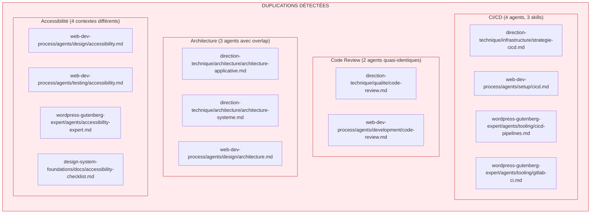
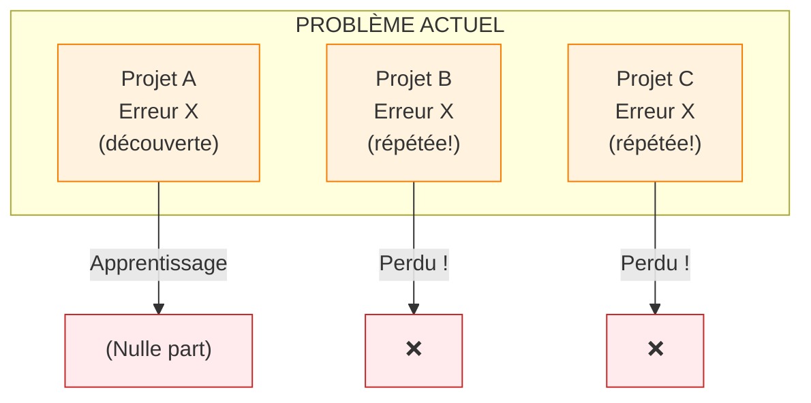
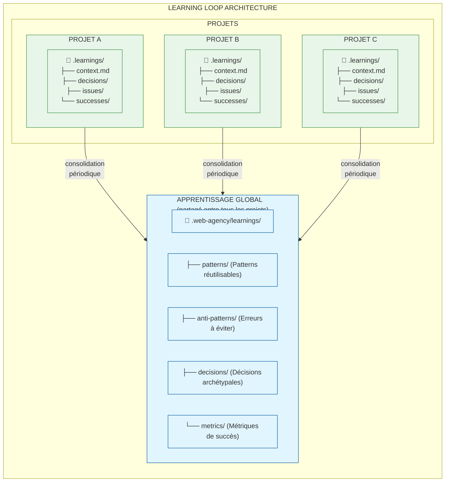
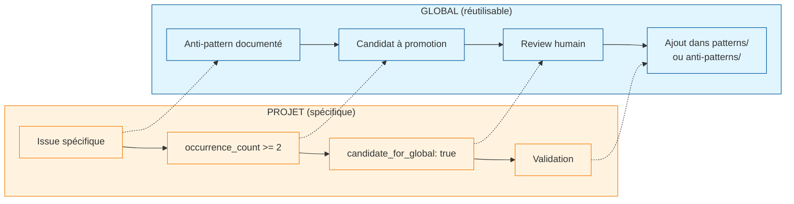
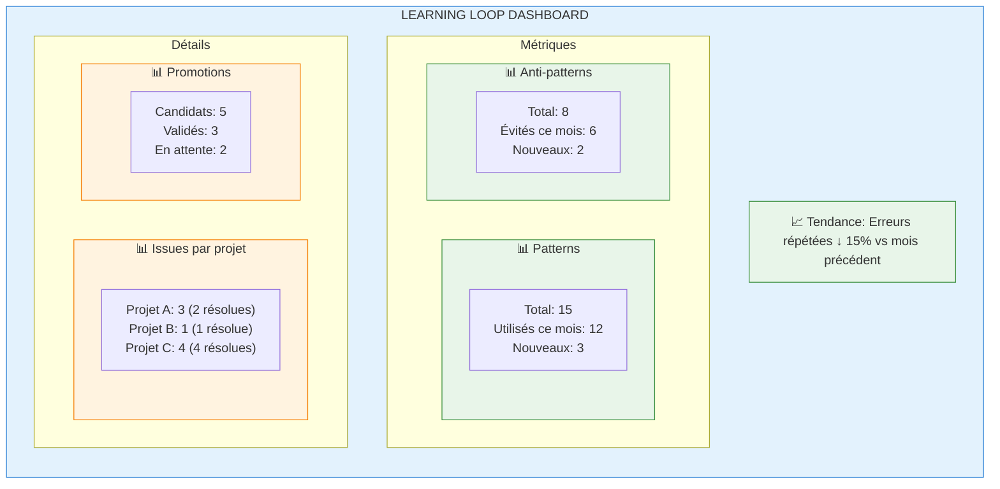

# Analyse et Améliorations des Agents Techniques

> **Date** : 2024-12-24
> **Version** : 1.0.0
> **Auteur** : Claude Code (analyse automatisée)

## Executive Summary

Cette analyse identifie les axes d'amélioration prioritaires pour les 3 skills techniques qui représentent le cœur du travail de l'agence :

| Skill | Agents | Maturité | Priorité d'amélioration |
|-------|--------|----------|-------------------------|
| `direction-technique` | 52 | 75% | 🔴 Haute |
| `web-dev-process` | 61 | 85% | 🟡 Moyenne |
| `wordpress-gutenberg-expert` | 41 | 80% | 🟡 Moyenne |

**Score global SRP** : 65/100 (excellent au niveau agents, problème au niveau inter-skills)

---

## 1. Problèmes Identifiés

### 1.1 Duplications Critiques Inter-Skills



### 1.2 Manque de Feedback Loop

**Actuellement, les agents ne peuvent pas :**
- Apprendre de leurs erreurs passées
- Capitaliser sur les succès des projets précédents
- Éviter de reproduire les mêmes erreurs
- S'adapter aux spécificités découvertes en cours de projet

### 1.3 Absence de Mémoire Contextuelle



### 1.4 Questions Insuffisantes au Niveau POURQUOI

L'analyse montre que `direction-technique` ne pose pas assez de questions de clarification avant de déléguer. Les agents passent trop vite au "comment" sans valider le "pourquoi".

---

## 2. Améliorations Proposées

### 2.1 Résolution des Duplications

#### CI/CD : Source Unique de Vérité

| Niveau | Skill | Responsabilité | Contenu |
|--------|-------|----------------|---------|
| POURQUOI | `direction-technique` | Stratégie CI/CD | Objectifs qualité, gates, SLA |
| QUOI | `web-dev-process` | Process CI/CD | Workflows, stages, validations |
| COMMENT | `wordpress-*` | Implémentation | YAML, scripts, configs |

**Action** : Supprimer le contenu d'implémentation de `direction-technique/infrastructure/strategie-cicd.md` et ajouter des références vers `web-dev-process`.

#### Code Review : Clarification des Rôles

```markdown
direction-technique/qualite/code-review.md
  → POLITIQUES de review (qui review quoi, critères de validation)
  → ESCALADES (quand demander un senior review)
  → DÉLÈGUE à web-dev-process pour le process

web-dev-process/agents/development/code-review.md
  → PROCESS de review (checklists, bonnes pratiques)
  → TEMPLATES (PR templates, commentaires types)
  → DÉLÈGUE à wordpress-* pour implémentation spécifique
```

### 2.2 Renforcement du Niveau POURQUOI

Ajouter à chaque agent `direction-technique` une section **Questions Obligatoires** :

```markdown
## Questions Obligatoires (à poser AVANT toute action)

### Contexte
- [ ] Quel est l'objectif business derrière cette demande ?
- [ ] Qui sont les parties prenantes ?
- [ ] Quelles sont les contraintes de délai ?

### Risques
- [ ] Qu'est-ce qui peut mal tourner ?
- [ ] Y a-t-il des dépendances critiques ?
- [ ] Quel est le plan B ?

### Validation
- [ ] Comment saura-t-on que c'est réussi ?
- [ ] Qui valide les livrables ?
- [ ] Quels sont les critères d'acceptance ?

⚠️ NE PAS DÉLÉGUER sans avoir obtenu des réponses à ces questions.
```

### 2.3 Amélioration des Tests

Ajouter un test de "profondeur de questionnement" :

```javascript
// tests/validate-questioning.test.js
const REQUIRED_QUESTION_SECTIONS = [
  'Questions Obligatoires',
  'Questions de Clarification',
  'Avant de Déléguer'
];

// Valider que chaque agent POURQUOI a ces sections
```

---

## 3. Architecture Learning Loop

### 3.1 Vue d'Ensemble



### 3.2 Structure des Fichiers

#### Apprentissage Global (`.web-agency/learnings/`)

```
.web-agency/learnings/
├── LEARNING-GUIDE.md           # Guide d'utilisation
├── patterns/
│   ├── INDEX.md                # Index des patterns
│   ├── wp-setup-optimal.md     # Pattern: Setup WP optimal
│   ├── cicd-wordpress.md       # Pattern: CI/CD WordPress
│   └── block-theme-structure.md
├── anti-patterns/
│   ├── INDEX.md                # Index des anti-patterns
│   ├── env-hardcoded.md        # Anti-pattern: Configs hardcodées
│   ├── no-staging.md           # Anti-pattern: Pas de staging
│   └── skip-tests.md
├── decisions/
│   ├── INDEX.md                # Index des décisions types
│   ├── when-wpenv-vs-docker.md # Décision: wp-env vs Docker
│   ├── when-acf-vs-native.md   # Décision: ACF vs meta natifs
│   └── when-gutenberg-vs-pagebuilder.md
└── metrics/
    ├── success-criteria.md     # Critères de succès standards
    └── red-flags.md            # Signaux d'alerte
```

#### Apprentissage Projet (`.learnings/` à la racine du projet)

```
.learnings/
├── context.md                  # Contexte projet (auto-généré)
├── decisions/
│   ├── 001-stack-choice.md     # Choix de stack
│   ├── 002-no-woocommerce.md   # Pourquoi pas WooCommerce
│   └── 003-custom-blocks.md
├── issues/
│   ├── 001-cors-staging.md     # Problème CORS rencontré
│   ├── 002-build-timeout.md    # Build timeout en CI
│   └── 003-image-optimization.md
├── successes/
│   ├── 001-fast-onboarding.md  # Onboarding dev < 10min
│   └── 002-zero-bugs-release.md
└── retrospectives/
    ├── sprint-1.md
    └── sprint-2.md
```

### 3.3 Format des Entrées

#### Pattern (modèle réutilisable)

```markdown
---
id: pattern-001
category: setup
tags: [wordpress, environment, performance]
created: 2024-12-24
validated: true
usage_count: 12
---

# Pattern: Setup Environnement WordPress Optimal

## Contexte
Quand utiliser ce pattern : [conditions]

## Solution

[Description de la solution]

## Bénéfices
- Bénéfice 1
- Bénéfice 2

## Projets ayant utilisé ce pattern
- Projet A (succès)
- Projet B (succès avec adaptation)

## Voir aussi
- [Anti-pattern: env-hardcoded](../anti-patterns/env-hardcoded.md)
```

#### Anti-Pattern (erreur à éviter)

```markdown
---
id: antipattern-001
severity: high
tags: [configuration, security]
first_occurrence: 2024-06-15
occurrence_count: 3
---

# Anti-Pattern: Configurations Hardcodées

## Symptôme
[Comment on détecte ce problème]

## Pourquoi c'est un problème
[Explication des conséquences]

## Solution
[Comment corriger]

## Projets impactés
- Projet X (juin 2024) - 2h de debug
- Projet Y (août 2024) - incident prod

## Prévention
[Comment éviter à l'avenir]
```

#### Issue Projet (problème spécifique)

```markdown
---
id: issue-001
project: client-xyz
date: 2024-12-20
status: resolved
resolution_time: 4h
root_cause: configuration
candidate_for_global: true
---

# Issue: CORS bloqué sur staging

## Contexte
[Description du contexte projet]

## Problème
[Description du problème]

## Investigation
[Étapes de debug]

## Solution
[Solution appliquée]

## Apprentissage
[Ce qu'on a appris]

## Action préventive
[Comment éviter à l'avenir]

## Promotion vers global ?
✅ Ce problème est suffisamment générique pour être documenté globalement.
→ Créer: `.web-agency/learnings/anti-patterns/cors-staging-misconfigured.md`
```

### 3.4 Mécanisme de Promotion



### 3.5 Intégration avec les Agents

#### Hook de Lecture (avant action)

Chaque agent technique doit consulter les learnings pertinents :

```markdown
## Avant de commencer

### 1. Consulter les learnings

- [ ] Vérifier `.web-agency/learnings/patterns/` pour des solutions existantes
- [ ] Vérifier `.web-agency/learnings/anti-patterns/` pour les pièges à éviter
- [ ] Vérifier `.learnings/context.md` du projet pour le contexte spécifique
- [ ] Vérifier `.learnings/issues/` pour les problèmes déjà rencontrés

### 2. Si un pattern existe
→ L'utiliser ou justifier pourquoi on s'en écarte

### 3. Si un anti-pattern existe
→ S'assurer qu'on ne le reproduit pas
```

#### Hook d'Écriture (après action)

```markdown
## Après avoir terminé

### 1. Documenter si applicable

- [ ] Problème rencontré ? → Créer `.learnings/issues/XXX.md`
- [ ] Nouvelle solution réussie ? → Créer `.learnings/successes/XXX.md`
- [ ] Décision importante ? → Créer `.learnings/decisions/XXX.md`

### 2. Évaluer la promotion

- [ ] Ce problème/solution est-il générique ?
- [ ] Pourrait-il aider d'autres projets ?
- [ ] Si oui, marquer `candidate_for_global: true`
```

---

## 4. Plan d'Implémentation

### Phase 1 : Fondations (immédiat)

| Action | Fichiers | Effort |
|--------|----------|--------|
| Créer structure learnings globale | `.web-agency/learnings/*` | 2h |
| Créer templates de learnings | `templates/*.md` | 1h |
| Documenter le guide | `LEARNING-GUIDE.md` | 1h |

### Phase 2 : Intégration agents (court terme)

| Action | Fichiers | Effort |
|--------|----------|--------|
| Ajouter hooks de lecture aux agents | `direction-technique/*` | 4h |
| Ajouter hooks d'écriture | `direction-technique/*` | 2h |
| Ajouter tests de conformité | `tests/validate-learning-hooks.test.js` | 2h |

### Phase 3 : Résolution duplications (moyen terme)

| Action | Impact | Effort |
|--------|--------|--------|
| Refactorer CI/CD | 4 agents | 4h |
| Clarifier Code Review | 2 agents | 2h |
| Résoudre Architecture | 3 agents | 3h |
| Consolider Accessibilité | 4 agents | 4h |

### Phase 4 : Automatisation (long terme)

| Action | Description | Effort |
|--------|-------------|--------|
| Script de promotion | Auto-promotion des patterns récurrents | 4h |
| Dashboard métriques | Visualisation des learnings | 8h |
| CI validation | Vérifier les learnings en CI | 2h |

---

## 5. Métriques de Succès

### KPIs à suivre

| Métrique | Baseline | Cible | Mesure |
|----------|----------|-------|--------|
| Erreurs répétées | Non mesuré | < 10% | Issues avec `repeated: true` |
| Réutilisation patterns | 0 | > 60% | `usage_count` des patterns |
| Temps de résolution | Non mesuré | -30% | `resolution_time` moyen |
| Onboarding dev | Variable | < 15min | Temps réel mesuré |
| Score SRP inter-skills | 65/100 | > 85/100 | Tests automatisés |

### Dashboard suggéré



---

## 6. Recommandations Immédiates

### Priorité 1 : Créer la structure Learning Loop

```bash
# Créer maintenant
.web-agency/learnings/
├── LEARNING-GUIDE.md
├── patterns/INDEX.md
├── anti-patterns/INDEX.md
├── decisions/INDEX.md
└── metrics/success-criteria.md
```

### Priorité 2 : Ajouter les hooks aux agents `direction-technique`

Chaque agent POURQUOI doit commencer par :
1. Consulter les learnings pertinents
2. Poser les questions obligatoires
3. Documenter après action

### Priorité 3 : Résoudre la duplication CI/CD

C'est le cas le plus flagrant avec 4 agents qui parlent du même sujet dans 3 skills différents.

---

## Annexes

### A. Checklist de Validation

- [ ] Structure learnings créée
- [ ] Templates documentés
- [ ] Hooks ajoutés aux agents
- [ ] Tests de conformité passent
- [ ] Duplications CI/CD résolues
- [ ] Métriques en place

### B. Références

- [ADR-005: Frontières de Responsabilités](../.web-agency/skills/web-agency/docs/adr/005-skill-responsibility-boundaries.md)
- [SRP-ANALYSIS.md](./SRP-ANALYSIS.md)
- [MIGRATION.md](./MIGRATION.md)
