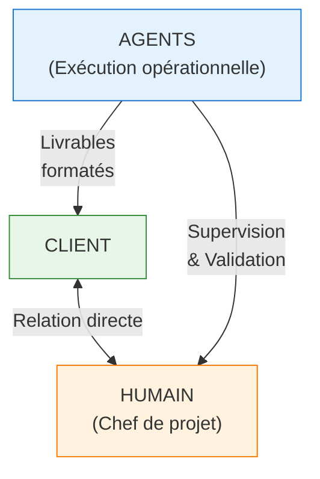

# Domaine 1 : Gestion de Projet & Relation Client

> **Objectif** : Automatiser les tâches opérationnelles de gestion de projet tout en gardant l'humain en supervision des décisions stratégiques et de la relation client.

---

## Vue d'ensemble

### Positionnement



### Principe de supervision

| Ce que fait l'agent | Ce que fait l'humain |
|---------------------|----------------------|
| Génère les documents | Valide et personnalise |
| Calcule les estimations | Ajuste selon l'expérience |
| Propose les plannings | Arbitre les priorités |
| Rédige les CR | Vérifie le ton et la pertinence |
| Alerte sur les risques | Décide des actions correctives |
| Prépare la facturation | Valide et envoie |

---

## Architecture des Agents

```
project-management/
├── orchestrator.md              # Routage principal
│
├── avant-projet/                # Phase commerciale
│   ├── orchestrator.md
│   ├── brief-client.md          # Collecte du brief
│   ├── estimation.md            # Chiffrage et devis
│   └── proposition.md           # Rédaction de la propale
│
├── pilotage/                    # Gestion en cours de projet
│   ├── orchestrator.md
│   ├── planning.md              # Planning et jalons
│   ├── suivi-avancement.md      # Reporting et alertes
│   ├── risques.md               # Gestion des risques
│   └── ressources.md            # Affectation équipe
│
├── communication/               # Relation client
│   ├── orchestrator.md
│   ├── compte-rendu.md          # CR de réunion
│   ├── email-client.md          # Rédaction emails
│   └── presentation.md          # Supports de présentation
│
├── livraison/                   # Clôture projet
│   ├── orchestrator.md
│   ├── recettage.md             # PV de recette
│   ├── documentation.md         # Doc de livraison
│   └── bilan.md                 # Bilan de projet
│
└── facturation/                 # Suivi financier
    ├── orchestrator.md
    ├── jalons-facturation.md    # Échéancier
    ├── facture.md               # Génération factures
    └── relance.md               # Relances impayés
```

---

## Détail des Agents

### 1. Orchestrateur Principal

**Fichier** : `project-management/orchestrator.md`

**Rôle** : Point d'entrée du domaine, route vers les sous-domaines.

**Règles de routage** :

| Mots-clés | Sous-domaine |
|-----------|--------------|
| brief, devis, estimation, propale, chiffrage | `avant-projet` |
| planning, jalon, avancement, risque, équipe | `pilotage` |
| email, CR, réunion, présentation, client | `communication` |
| recette, livraison, PV, bilan | `livraison` |
| facture, paiement, relance, échéancier | `facturation` |

---

### 2. Avant-Projet

#### 2.1 Brief Client (`brief-client.md`)

**Mission** : Structurer et formaliser le besoin client.

**Inputs attendus** :
- Notes de réunion brutes
- Emails du client
- Documents existants (RFP, CDC)

**Outputs produits** :
- Brief structuré (Markdown)
- Questions de clarification
- Identification des risques initiaux

**Template de sortie** :
```markdown
# Brief Client - [Nom Projet]

## Informations générales
- Client :
- Contact principal :
- Date brief :

## Contexte
[Situation actuelle, problème à résoudre]

## Objectifs
[Objectifs business et projet]

## Cibles
[Utilisateurs, personas]

## Périmètre fonctionnel
[Grandes fonctionnalités attendues]

## Contraintes
- Budget indicatif :
- Délai souhaité :
- Contraintes techniques :

## Questions en suspens
- [ ] Question 1
- [ ] Question 2

## Prochaines étapes
1. Clarifier les questions
2. Estimation
3. Proposition commerciale
```

---

#### 2.2 Estimation (`estimation.md`)

**Mission** : Produire une estimation des charges projet.

**Méthodes supportées** :
- **T-shirt sizing** : XS, S, M, L, XL
- **Points de complexité** : Fibonacci (1, 2, 3, 5, 8, 13)
- **Jours/Homme** : Estimation en JH par profil

**Inputs** :
- Brief client structuré
- Historique projets similaires
- Stack technique prévue

**Outputs** :
- Tableau des charges par lot/fonctionnalité
- Fourchette optimiste/pessimiste
- Hypothèses de chiffrage
- Risques identifiés

**Template de sortie** :
```markdown
# Estimation - [Nom Projet]

## Synthèse
| Métrique | Valeur |
|----------|--------|
| Charge totale | XX - YY JH |
| Durée estimée | X semaines |
| Équipe type | Dev senior, Dev junior, Intégrateur |

## Détail par lot

### Lot 1 : [Nom]
| Tâche | Complexité | JH Min | JH Max | Profil |
|-------|------------|--------|--------|--------|
| Task 1 | M | 2 | 3 | Dev Senior |
| Task 2 | S | 0.5 | 1 | Intégrateur |

**Sous-total Lot 1** : X - Y JH

### Lot 2 : [Nom]
...

## Hypothèses
- [ ] Client fournit les contenus
- [ ] Specs validées avant dev
- [ ] 2 itérations de recette max

## Risques sur l'estimation
| Risque | Impact JH | Probabilité |
|--------|-----------|-------------|
| Specs floues | +30% | Moyen |
| Intégration tierce | +5 JH | Faible |

## Recommandations
- Prévoir une marge de X%
- Proposer un lot optionnel pour [feature]
```

---

#### 2.3 Proposition Commerciale (`proposition.md`)

**Mission** : Générer une proposition commerciale structurée.

**Inputs** :
- Brief client
- Estimation validée
- Grille tarifaire agence

**Outputs** :
- Document de proposition (Markdown → PDF)
- Planning macro
- Conditions commerciales

**Structure type** :
1. Contexte et compréhension du besoin
2. Notre approche / méthodologie
3. Solution proposée
4. Planning prévisionnel
5. Investissement (budget)
6. Conditions (paiement, validité, CGV)
7. Équipe projet
8. Annexes (références, portfolio)

---

### 3. Pilotage

#### 3.1 Planning (`planning.md`)

**Mission** : Créer et maintenir le planning projet.

**Fonctionnalités** :
- Génération planning Gantt (Mermaid)
- Identification des dépendances
- Calcul du chemin critique
- Détection des conflits ressources

**Formats de sortie** :
- Diagramme Mermaid (Markdown)
- Liste des jalons
- Vue calendaire

**Template Mermaid** :
```markdown
gantt
    title Planning Projet [Nom]
    dateFormat  YYYY-MM-DD

    section Discovery
    Brief client           :done, brief, 2024-01-15, 2d
    Estimation            :done, estim, after brief, 2d

    section Design
    Wireframes            :active, wire, 2024-01-20, 5d
    Maquettes             :maq, after wire, 7d

    section Développement
    Setup projet          :setup, after maq, 2d
    Sprint 1              :sprint1, after setup, 10d
    Sprint 2              :sprint2, after sprint1, 10d

    section Recette
    Tests client          :test, after sprint2, 5d
    Corrections           :fix, after test, 3d

    section Livraison
    MEP                   :mep, after fix, 1d
```

---

#### 3.2 Suivi d'Avancement (`suivi-avancement.md`)

**Mission** : Produire des reportings réguliers sur l'état du projet.

**Métriques suivies** :
- Avancement global (%)
- Consommé vs Budget
- Vélocité de l'équipe
- Reste à faire
- Tendance (ETC, EAC)

**Alertes automatiques** :
- Dépassement de charge sur un lot
- Retard sur jalon critique
- Dérive du périmètre (scope creep)

**Template de reporting** :
```markdown
# Reporting Projet - [Nom] - Semaine XX

## État global
🟢 Projet on track / 🟡 Attention / 🔴 Critique

## Avancement
| Lot | Prévu | Réalisé | Écart |
|-----|-------|---------|-------|
| Lot 1 | 100% | 100% | ✅ |
| Lot 2 | 60% | 45% | ⚠️ -15% |

## Consommation budget
- Budget total : XX JH
- Consommé : YY JH (ZZ%)
- Reste à faire : WW JH

## Faits marquants
- [Fait 1]
- [Fait 2]

## Points d'attention
- ⚠️ [Risque ou problème]

## Prochaines étapes
- [ ] Action 1 - @personne - date
- [ ] Action 2 - @personne - date
```

---

#### 3.3 Gestion des Risques (`risques.md`)

**Mission** : Identifier, évaluer et suivre les risques projet.

**Matrice de risques** :

```mermaid
quadrantChart
    title Matrice de Risques (Impact vs Probabilité)
    x-axis Probabilité Faible --> Probabilité Élevée
    y-axis Impact Faible --> Impact Élevé
    quadrant-1 Critique (Éviter)
    quadrant-2 Élevé (Atténuer)
    quadrant-3 Faible (Accepter)
    quadrant-4 Modéré (Suivre)
```

| Impact ↓ / Probabilité → | Faible | Moyenne | Élevée |
|--------------------------|--------|---------|--------|
| **Élevé** | Modéré (Suivre) | Élevé (Atténuer) | Critique (Éviter) |
| **Moyen** | Faible (Accepter) | Modéré (Suivre) | Élevé (Atténuer) |
| **Faible** | Négligeable (Ignorer) | Faible (Accepter) | Modéré (Suivre) |

**Template registre des risques** :
```markdown
# Registre des Risques - [Projet]

| ID | Risque | Prob. | Impact | Criticité | Mitigation | Responsable | Statut |
|----|--------|-------|--------|-----------|------------|-------------|--------|
| R1 | Specs incomplètes | Haute | Fort | 🔴 | Atelier specs | PM | Ouvert |
| R2 | Indispo ressource | Moyenne | Moyen | 🟡 | Backup identifié | PM | Suivi |
```

---

### 4. Communication

#### 4.1 Compte-Rendu (`compte-rendu.md`)

**Mission** : Rédiger des comptes-rendus de réunion professionnels.

**Inputs** :
- Notes brutes de réunion
- Liste des participants
- Ordre du jour

**Template** :
```markdown
# Compte-Rendu de Réunion

**Projet** : [Nom]
**Date** : [Date]
**Participants** : [Liste]
**Rédacteur** : [Nom]

## Ordre du jour
1. Point 1
2. Point 2

## Discussions

### 1. [Sujet 1]
[Résumé des échanges]

**Décision** : [Décision prise]

### 2. [Sujet 2]
[Résumé des échanges]

## Actions
| Action | Responsable | Échéance | Statut |
|--------|-------------|----------|--------|
| Action 1 | @nom | JJ/MM | 🔲 |
| Action 2 | @nom | JJ/MM | 🔲 |

## Prochaine réunion
- **Date** : [Date]
- **Ordre du jour prévu** : [Points]
```

---

#### 4.2 Email Client (`email-client.md`)

**Mission** : Rédiger des emails professionnels adaptés au contexte.

**Types d'emails** :
- Relance client (en attente de retour)
- Demande de validation
- Annonce de livraison
- Notification de retard
- Demande d'informations
- Remerciements / clôture

**Paramètres** :
- Ton : Formel / Semi-formel / Décontracté
- Urgence : Basse / Normale / Haute
- Relation : Nouveau client / Client régulier

---

### 5. Livraison

#### 5.1 Recettage (`recettage.md`)

**Mission** : Structurer le processus de validation client.

**Outputs** :
- Plan de recette
- Grille de recette (test cases)
- PV de recette (signature)

**Template PV de recette** :
```markdown
# Procès-Verbal de Recette

**Projet** : [Nom]
**Version** : [X.Y]
**Date** : [Date]

## Périmètre recetté
- [x] Fonctionnalité 1
- [x] Fonctionnalité 2

## Résultats
| Test | Résultat | Commentaire |
|------|----------|-------------|
| Test 1 | ✅ Validé | |
| Test 2 | ✅ Validé | |
| Test 3 | ⚠️ Validé avec réserve | [Détail] |

## Réserves
- [ ] Réserve 1 - à corriger pour le [date]

## Décision
☐ Recette validée sans réserve
☐ Recette validée avec réserves mineures
☐ Recette refusée - nouvelle itération nécessaire

## Signatures
| Rôle | Nom | Date | Signature |
|------|-----|------|-----------|
| Client | | | |
| Chef de projet | | | |
```

---

### 6. Facturation

#### 6.1 Jalons de Facturation (`jalons-facturation.md`)

**Mission** : Définir et suivre l'échéancier de facturation.

**Modèles supportés** :
- **Forfait classique** : 30% / 40% / 30%
- **Régie** : Mensuel au consommé
- **Mixte** : Forfait + régie maintenance

**Template** :
```markdown
# Échéancier de Facturation - [Projet]

## Conditions
- Montant total : XX XXX € HT
- Modalité : Forfait / Régie
- Conditions de paiement : 30 jours

## Jalons

| # | Jalon | % | Montant HT | Condition | Statut |
|---|-------|---|------------|-----------|--------|
| 1 | Signature | 30% | XX XXX € | Bon de commande signé | 🟡 En attente |
| 2 | Livraison maquettes | 20% | XX XXX € | Maquettes validées | 🔲 À venir |
| 3 | Livraison v1 | 30% | XX XXX € | Recette validée | 🔲 À venir |
| 4 | MEP | 20% | XX XXX € | Mise en production | 🔲 À venir |

## Suivi
| Facture | Date émission | Montant | Date paiement | Statut |
|---------|---------------|---------|---------------|--------|
| FA-001 | 15/01/2024 | XX XXX € | | 🟡 En attente |
```

---

## Workflows types

### Workflow 1 : Nouveau projet (avant-vente)

```
1. Réception demande client
       ↓
2. Agent `brief-client` → Brief structuré
       ↓
3. HUMAIN valide la compréhension
       ↓
4. Agent `estimation` → Chiffrage détaillé
       ↓
5. HUMAIN ajuste selon expérience
       ↓
6. Agent `proposition` → Propale commerciale
       ↓
7. HUMAIN personnalise et envoie
       ↓
8. Négociation → Signature
```

### Workflow 2 : Suivi hebdomadaire

```
1. Collecte données (Jira, Tempo, Git)
       ↓
2. Agent `suivi-avancement` → Reporting
       ↓
3. Agent `risques` → Analyse des alertes
       ↓
4. HUMAIN valide le reporting
       ↓
5. Agent `email-client` → Email de suivi
       ↓
6. HUMAIN personnalise et envoie
```

### Workflow 3 : Réunion client

```
1. HUMAIN conduit la réunion (notes)
       ↓
2. Agent `compte-rendu` → CR structuré
       ↓
3. HUMAIN valide
       ↓
4. Agent `email-client` → Email + CR
       ↓
5. HUMAIN envoie
```

---

## Intégrations envisagées

| Outil | Usage | Priorité |
|-------|-------|----------|
| Jira / Linear | Récupérer l'avancement | Haute |
| Tempo / Harvest | Récupérer le temps passé | Haute |
| Google Agenda | Récupérer les réunions | Moyenne |
| Slack / Teams | Notifications | Moyenne |
| Pipedrive / HubSpot | CRM, opportunités | Basse |
| Pennylane / QuickBooks | Facturation | Basse |

---

## Points d'escalade humaine

L'agent DOIT solliciter l'humain dans ces situations :

| Situation | Raison |
|-----------|--------|
| Brief incomplet après 2 relances | Décision commerciale |
| Estimation hors fourchette habituelle | Validation stratégique |
| Dépassement > 20% du budget | Arbitrage |
| Conflit avec le client | Gestion relationnelle |
| Demande hors périmètre | Négociation commerciale |
| Retard > 1 semaine sur jalon | Communication client |
| Facture impayée > 60 jours | Recouvrement |

---

## Prochaines étapes

1. [ ] Créer la structure de dossiers
2. [ ] Rédiger l'orchestrateur principal
3. [ ] Développer les agents `avant-projet` en premier
4. [ ] Créer les templates associés
5. [ ] Tester sur un projet réel
